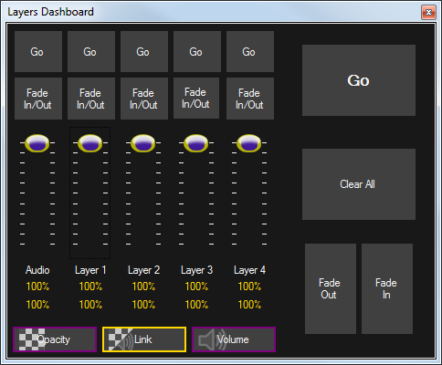

 
# Layers

The layers dashboard provides quick and easy control over all the layers during playback. It allows you to advance to the next clip in a sequence, clear all layers, fade layers in or out either individually or together. 

To open the layers dashboard click on the Layers button in the toolbar. The default view for the layers dashboard is a floating window as shown below but it is often helpful to dock it inside the main window so it is always visible.

  

1

Go

Plays the next clip on the specified layers. Pressing Shift and clicking Go will move to the previous clip. For example, if you click Go for layer 2, the next clip assigned to layer 2 is played.  
   

2

Fade In/Out

Clicking these buttons automatically Fades the layer in or out at the speed configured in the [Display Profile](../../Reference/Setup/DisplayProfiles.md) dialog.

3

Layer Opacity

The sliders allow you to adjust the current opacity of a layer. This is useful if you want to fade the layer out for any reason. This action can also be mapped to a MIDI controller with faders.

4

Master Go

Plays the next clip regardless of the layer it is assigned to. For example, perhaps you have the following setup.  
   

5

Clear All

Suppose you are playing clips on three of the four layers. Clicking Clear All will clear all layers.

6

Master Fade

Perhaps you are playing clips on all four layers. Two are visible and two are faded out. Clicking the Fade Out or Fade In will cause all layers to respect the action.

7

Adjustment Percentage

This area reports the actual percentage adjustment applied to the layer. Note that transparency and audio are reported separately.

8

Attribute Selection

The Opacity and Volume buttons allow you to choose whether to adjust layer Opacity (transparency) or layer audio Volume by clicking either button. the selected button has a Yellow outline.