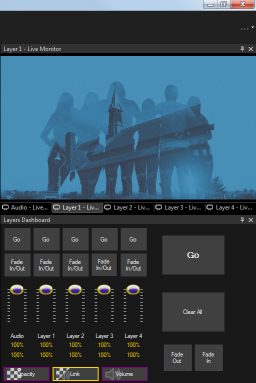

 
# Layers

The layers dashboard provides quick and easy control over all the [layers](../layers.md) during playback. It allows you to advance to the next clip in a sequence, clear all layers, and fade layers in or out either individually or together. 

To open the layers dashboard click on the Layers button in the toolbar. The default view for the layers dashboard is a floating window but it is often helpful to dock it inside the main window so it is always visible.

    
*Floating*
     
    
*Docked*

## Layer settings
The following options are available for each layer separately. Note that in addition to the special audio layer all other layers also have an audio (volume) component.

### Layer Go
Click to play the next clip. Shift+Click to play the previous clip.

### Layer Fade In/Out
Clicking these buttons automatically fades the layer in or out at the speed configured in the [Display Profile](display.md) dialog. If a Layer is faded out while a clip is playing then the clip will continue to play. 

### Layer Sliders
These sliders allow you to manually adjust the opacity/volume of a layer. This is useful if you want to fade the layer out manually or set a layer to be partially transparent. This action can also be mapped to a MIDI controller with faders.

## Global settings

### Fader Controls
There are three options for setting the mode of the faders. The selected button has a yellow outline.

- **Opacity** The fader adjusts opacity only
- **Link** The fader adjusts opacity and volume
- **Volume** The fader adjusts volume only

### Master Go
Plays the next clip regardless of the layer it is assigned to. For example, perhaps you have the following setup.

### Clear All
Suppose you are playing clips on three of the four layers. Clicking Clear All will clear all layers.

### Master Fades
Perhaps you are playing clips on all four layers. Two are visible and two are faded out. Clicking the Fade Out or Fade In will cause all layers to respect the action.

## Status

### Adjustment Percentage
This area reports the actual percentage adjustment applied to the layer. Note that opacity and volume are displayed separately.