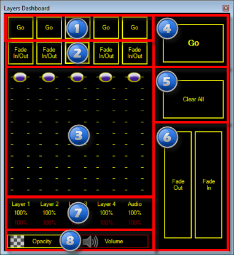
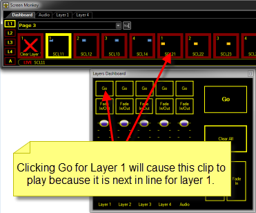
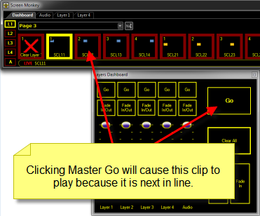

# Layers

The layers dashboard provides control 
 over the layers during playback. It allows you to manipulate things in 
 a variety of ways.

You may advance to the next clip 
 in a sequence, Clear all layers, Fade all layers out or in at the same 
 time or fade individual layers out or in as desired.

<table style="margin-left: 24px; border-collapse: separate; border-collapse: separate;" 
		 cellspacing="0" border="1">
	<col>
	<col>
	<col>
	<tr>
		<td class="hcp3">1</td>
		<td class="hcp3">Go</td>
		<td class="hcp3">Plays the 
		 next clip on the specified layers. Pressing Shift and 
		 clicking Go will move to the previous clip. For example, if 
		 you click Go for layer 2, the next clip assigned to layer 2 is 
		 played. 
		 &#160; 
		 </td>
	</tr>
	<tr>
		<td class="hcp3">2</td>
		<td class="hcp3">Fade 
		 In/Out</td>
		<td class="hcp3">Clicking these buttons automatically 
		 Fades the layer in or out at the speed configured 
		 in the <a href="../../Reference/Setup/DisplayProfiles.md">Display 
		 Profile</a> dialog.</td>
	</tr>
	<tr>
		<td class="hcp3">3</td>
		<td class="hcp3">Layer 
		 Opacity</td>
		<td class="hcp3">The sliders 
		 allow you to adjust the current opacity of a layer. This is useful 
		 if you want to fade the layer out for any reason. This action 
		 can also be mapped to a MIDI controller with faders.</td>
	</tr>
	<tr>
		<td class="hcp3">4</td>
		<td class="hcp3">Master 
		 Go</td>
		<td class="hcp3">Plays the next clip regardless 
		 of the layer it is assigned to. For example, perhaps you have 
		 the following setup. 
		 &#160; 
		 </td>
	</tr>
	<tr>
		<td class="hcp3">5</td>
		<td class="hcp3">Clear 
		 All</td>
		<td class="hcp3">Suppose you are playing clips 
		 on three of the four layers. Clicking Clear 
		 All will clear all layers.</td>
	</tr>
	<tr>
		<td class="hcp3">6</td>
		<td class="hcp3">Master 
		 Fade</td>
		<td class="hcp3">Perhaps you are playing clips 
		 on all four layers. Two are visible and two are faded out. Clicking 
		 the Fade Out or Fade In will cause all layers 
		 to respect the action.</td>
	</tr>
	<tr>
		<td class="hcp3">7</td>
		<td class="hcp3">Adjustment 
		 Percentage</td>
		<td class="hcp3">This area reports the actual percentage 
		 adjustment applied to the layer. Note that transparency and audio 
		 are reported separately.</td>
	</tr>
	<tr>
		<td class="hcp3">8</td>
		<td class="hcp3">Attribute 
		 Selection</td>
		<td class="hcp3">The Opacity and Volume buttons 
		 allow you to choose whether to adjust layer Opacity (transparency) 
		 or layer audio Volume by clicking either button. the selected 
		 button has a Yellow outline.</td>
	</tr>
</table>

