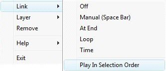

# Link

The link operation will mostly work the same in this mode but a few things behave differently.

In multi edit mode it may be possible to create a link list in a specific order. Select the clips in the order you want them to play and enable the link.

Once you have linked a clip it will not use the multi edit selection order to assign the link. So you need a way to force the clips to be linked in the selection order. You will notice when in multi edit mode the link menu has a different option.

If you select Play In Selection Order the links for the selected clips will be created in the order you selected them.