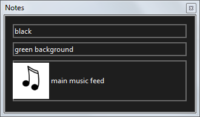

# Notes

Opens a window where you can view the [notes you have attached](../clipSettings/notes.md) to any currently live clips. This window can be moved, resized and docked as required.

Clicking notes in the toolbar or clicking the close button in the top right will close the window.

