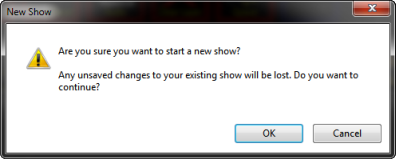
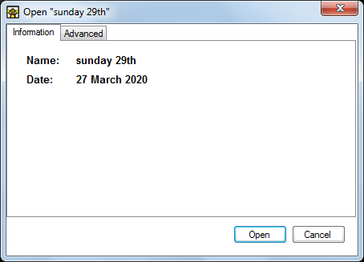
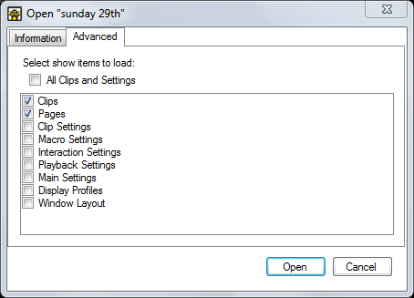
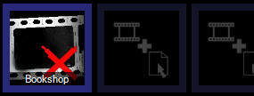

# Open

There are 4 sub items to this button which are described below. These items are also available by right clicking anywhere in the dashboard and choosing the ‘File’ menu item.

## New
To create an empty blank show in Screen Monkey choose ‘Open > New’. Screen Monkey will issue the following warning:

Click OK and all clips in the previous show will be removed. The new empty show is created and waiting for you to add Clips. It is a good idea to give your show a name and [save](save.md) it at this point.

## Open
If you wish to open a show or show package you previously saved, or import one from another computer, click on ‘Open’. This will show a standard Windows file open explorer window. Select a Screen Monkey show file (.smx, .smz, .xml) and click ‘Open’.

A dialog will then open with some basic information about the file.

If you click ‘Advanced’ a lot more options appear. Using these options you have full control over which sections of the show file are loaded into Screen Monkey. These options are generally used when moving files between computers as it allows you to leave some settings unchanged.

When you are happy with your selection click ‘Open’ and the clips will appear. If any media can’t be located it will be shown with a red cross and you may need to use the [‘Repair Media’](#repair-media) function.

## Open Recent
A list of recently opened shows will appear as a sub menu. This is a quick way of accessing show files.

## Repair Media
Screen Monkey does not store media inside the show file, it only stores a link to the media located elsewhere on your computer. If media is moved in Windows Explorer then Screen Monkey will not be able to find it and will show a red cross icon.

While you can repair individual clips by clicking on the thumbnail and locating the missing media this can be extremely time consuming. The ‘Repair Media’ function will repair *all* clips by searching recursively for files with matching names. All you need to do is tell Screen Monkey where to begin the search.

