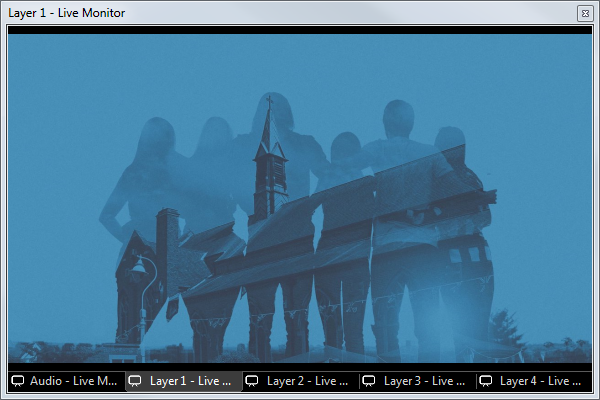
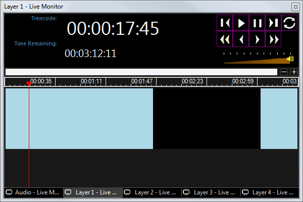

 
# Preview Live Monitor

The Live Monitor is used to preview and interact with the currently playing clip(s). It presents a representation of the current clip being played to the output. This may be helpful if you are not able to clearly view the actual Monitor or Projector where the media is appearing.

Click Preview in the toolbar to open the Live Monitor. The default is a floating live monitor window however it’s normally best to dock the live monitor at the right of the dashboard.

There is a separate Live Monitor for every layer including audio. The normal arrangement is to show the different layers as tabs along the bottom of the Live Monitor window however the tabs can be dragged into individual floating windows or docked separately as required.

To close all Live Monitor windows click on the Preview icon in the toolbar again.

Each clip type uses the Live Monitor in a different way. For a detailed explanation refer to the clip type pages of this guide.

## Examples
An Image clip will simply show the image:

A Song Words clip will show all song sections and allow you to choose the section to display and also a preview:

A Video clip will show a timeline, timecode, and video transport controls where you can control the playback:

