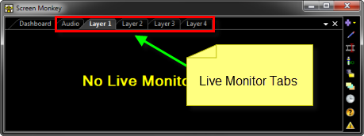
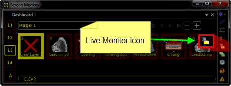
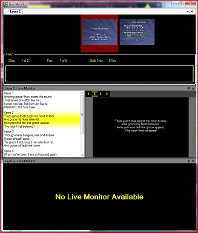
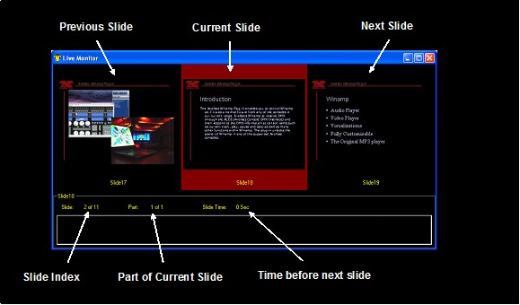
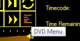
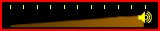
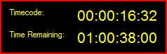

# Preview

When you enable the Live Monitor, the Dashboard 
 initially gains several additional tabs.

Clicking each tab reveals the Live Monitor for 
 that Layer. Note that you may click any of the tabs and drag it out to 
 become its own window.

The live monitor presents a representation of the 
 current clip being played to the screen. This may be helpful if you are 
 not able to clearly view the actual Monitor or Projector where the media 
 is appearing.

The live monitor is opened and closed by clicking 
 its icon on the right of the Main Screen Monkey window. 

As you play different clips the live monitor output 
 will change to represent the current screen output.

Inside the live monitor you can choose to watch 
 the monitor for any of the four layers.

You may also drag out the layers to arrange them 
 as you wish and provide quick viewing for all four layers if you wish.

The live monitor for a PowerPoint slide presents 
 images of the Previous, Current and Next slides. It shows the slide in 
 its completed form once all the animations have run.

<ol class="hcp5">
	<li value="1">Image Clip Live Monitor</li>
</ol>
<ol class="hcp5">
	<li value="1">Freeze Live Monitor</li>
</ol>

The freeze live monitor shows a representation 
 of the frozen screen image.

<ol class="hcp5">
	<li value="2">DVD and Video Live Monitor</li>
</ol>

When a DVD clip is playing, the live monitor gives 
 you an indication of the play position, the total time remaining and the 
 current timecode. It also provides some live controls which may be used 
 to control playback of the clip in real time.

<h2>Playback Controls:</h2>

	<table style="border-width: 0px; border-collapse: separate;" cellspacing="0">
		<tr class="hcp6">
			<td height="33" width="160" class="hcp7">

</td>
			<td height="33" width="112" class="hcp7">
To Start
</td>
			<td height="33" width="280" class="hcp7">
Jumps to the start 
			 of the video clip or if the In Time is locked then jumps to 
			 the In Time.
</td>
		</tr>
		<tr class="hcp6">
			<td width="160" class="hcp7">

</td>
			<td width="112" class="hcp7">
Play
</td>
			<td width="280" class="hcp7">
If the video clip is stopped or paused then 
			 will play the video clip.
</td>
		</tr>
		<tr class="hcp6">
			<td width="160" class="hcp7">

</td>
			<td width="112" class="hcp7">
Pause
</td>
			<td width="280" class="hcp7">
Pauses the video clip by holding it at its 
			 current position
</td>
		</tr>
		<tr class="hcp6">
			<td width="160" class="hcp7">

</td>
			<td width="112" class="hcp7">
To End
</td>
			<td width="280" class="hcp7">
Jumps to the end of the video clip or if the 
			 Out Time is locked then jumps to the Out Time.
</td>
		</tr>
		<tr class="hcp6">
			<td height="14" width="160" class="hcp7">

</td>
			<td height="14" width="112" class="hcp7">
Fast Reverse
</td>
			<td height="14" width="280" class="hcp7">
Rewinds the video 
			 clip by 10 seconds.
</td>
		</tr>
		<tr class="hcp6">
			<td width="160" class="hcp7">

</td>
			<td width="112" class="hcp7">
Frame Retard
</td>
			<td width="280" class="hcp7">
Rewinds the video clip by a single frame and 
			 Pauses playback.
</td>
		</tr>
		<tr class="hcp6">
			<td width="160" class="hcp7">

</td>
			<td width="112" class="hcp7">
Frame Advance
</td>
			<td width="280" class="hcp7">
Moves the clip forwards by a single frame and 
			 Pauses playback.
</td>
		</tr>
		<tr class="hcp6">
			<td width="160" class="hcp7">

</td>
			<td width="112" class="hcp7">
Fast Forwards
</td>
			<td width="280" class="hcp7">
Moves the clip forwards by 10 seconds.
</td>
		</tr>
		<tr class="hcp6">
			<td height="15" width="160" class="hcp7">

</td>
			<td height="15" width="112" class="hcp7">
Loop
</td>
			<td height="15" width="280" class="hcp7">
When loop is selected 
			 the video will return to the start and start playing when 
			 it reaches the end. When loop is active the icon will turn 
			 green. Setting the loop here will have no effect the next 
			 time the video is played.
</td>
		</tr>
		<tr class="hcp6">
			<td width="160" class="hcp7">

</td>
			<td width="112" class="hcp7">
DVD Root Menu
</td>
			<td width="280" class="hcp7">
When playing a DVD returns you to the DVDs 
			 root menu.
</td>
		</tr>
		<tr class="hcp6">
			<td width="160" class="hcp7">

</td>
			<td width="112" class="hcp7">
Volume
</td>
			<td width="280" class="hcp7">
Adjusts the volume level of the playing video. 
			 The adjusted volume is not saved and so will have no effect 
			 the next time the clip is played.

			
Use the cue dialog to permanently adjust 
			 the volume.
</td>
		</tr>
	</table>

<h2>Timecode:</h2>

Use this to view the elapsed time for the video as well as the remaining 
 time of the video. With a DVD video these times are referenced from the 
 start and end of a title.

