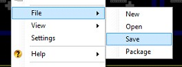
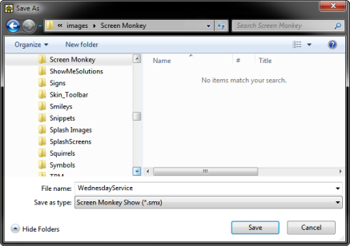

# Save

There are 3 sub menu items

## Save
## Save As
## Package

Screen Monkey is similar to PowerPoint in that the collection of Clips 
 is referred to as a &quot;Show&quot;. Just as PowerPoint allows you to 
 save a Slide Show you have created, Screen Monkey also allows you to save 
 your shows so that you may easily recall them later.

When you save a show it will store all the clips and settings in a show 
 file which can be loaded back into the software at a later date. It is 
 recommended to keep frequent saves of any shows to ensure you do not lose 
 any work.

A saved show does not store the original media files. It only stores 
 the clip settings. If you delete or move the original media files, the 
 show will no longer load successfully. For example, a video clip does 
 not store the original video file. It only contains a link to the video 
 file location.

To Save your show, right-click any clip slot and select File 
 &gt; Save.

The Save 
 As dialog will open. Navigate to and choose the folder where you 
 would like to save the show file. Type a name for the show and click Save.

<table style="margin-left: 12px; border-collapse: separate;" cellspacing="0" 
		 border="1">
	<col>
	<col>
	<tr>
		<td style="vertical-align: top;"></td>
		<td>
Screen Monkey shows are saved using a file extension of 
		 .SMX. 

		
Additionally, the Screen Monkey Settings has an &quot;Auto Save&quot; 
		 feature that is enabled by default.

		
The default increment is every 5 minutes, but you are able to 
		 change this to suit your taste. Choices vary from Never to 1 Hour.
</td>
	</tr>
</table>
