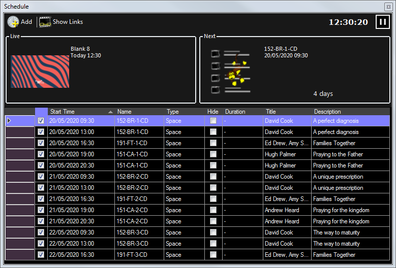
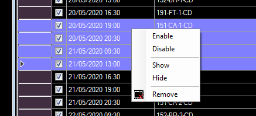

# Schedule

The schedule viewer is a valuable tool for shows where lots of clips play on scheduled time. It allows you to view the complete upcoming schedule, enable and disable items, manage the [on-screen schedule text clip](../clipTypes/Text/textSchedule.md), and add new schedules. It also has a button for pausing the scheduler.

Advanced users can [import a complete schedule](../Settings/scheduleSync.md) for multiple clips including titles and descriptions from a JSON API service.

To view the schedule window click Schedule in the toolbar. Click again to hide it. The schedule window can be docked in the main dashboard just like any other window.

## Schedule Viewer
The window is split into 3 areas. At the top is the toolbar, beneath that is the live/next status and at the bottom the table view showing all upcoming clips.

## Toolbar
Across the top of the window the following buttons are located.

### Add
Click the ‘Add’ button to quickly add a new item to the schedule. You will be asked to a select a clip from the clip browser, then click Enabled if required, specify the schedule time and a repeat interval if necessary. Alternatively you can right click on dashboard clips to [schedule them](../clipSettings/schedule.md).

### Show Links
Update the grid view to include all clips linked from scheduled items. Click again to hide linked clips.

### Clock
The current time is shown in 24-hour format. If the scheduler is paused this clock will stop and turn red.

### Pause
Click to pause the scheduler, click again to un-pause. No clips will run automatically when the scheduler is paused. When the scheduler is un-paused the most recent item whoose start time has passed will run. Any other older items will be skipped.

## Live/Next Status
The thumbnail, name and scheduled time for the currently live item is shown on the left. This will only show items played by the scheduler.

On the right the next scheduled item is shown together with a countdown clock which counts down to the start time of the next scheduled item.

## Table View
The table in the lower half of the window shows a row for every scheduled clip and has the following columns.

|Item|Description|
|-|-|
|Enabled|Clips can be scheduled but not enabled. This is useful when you want them to appear in the on-screen schedule but not run automatically. Click the checkbox to change it.|
|Start Time|Displays the date/time at which the clip will run (if it is enabled) and the date/time which will be used by the {date} and {time} placeholders in the on-screen schedule|
|Name|The name of the clip which has been scheduled|
|Type|The type of the clip which has been scheduled|
|Hide|Tick this box to prevent the clip appearing in the on-screen schedule. Click the checkbox to change it.|
|Duration|If applicble the duration of the clip will be shown|
|Title|The Title which will be used by the {title} placeholder in the on-screen schedule. This text can be edited by double clicking in the cell.|
|Description|The Description which will be used by the {description} placeholder in the on-screen schedule. This text can be edited by double clicking in the cell.|

## Row Context Menu
Left click on a row to select it. Use Shift+Click or Ctrl+Click if you wish to select multiple rows. Then right click to bring up a context menu. This menu allows you to Enable, Disable, Show, Hide or Remove the selected rows.

