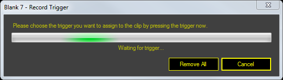

# Trigger

Triggers allow you to play clips by simply pressing a keyboard key that you assign to the clip. The triggers work even when Screen Monkey is minimised or not the active application.

## Trigger Edit Mode
To enter Trigger Edit mode click the trigger icon on the toolbar or press Ctrl+T. The dashboard will change to trigger display mode. Any clips with triggers assigned will show the trigger key above the thumbnail. Any clips without triggers assigned will have a grey border. In the example below the top row of clips have been assigned keys and the bottom row have not.

Left clicking on a clip will open the edit trigger dialog. Here you can either record a new trigger by pressing the required key or click ‘Remove All’ to delete an existing trigger.

Alternatively, whilst in trigger edit mode, you can hold down a key and then left click on a clip to assign that key as the trigger.

To leave trigger edit mode select a different mode from the toolbar.

## Global Settings
Triggers can also be viewed and configured in the [Mouse and Keyboard](../Settings/MouseandKeyboard.md) section of Screen Monkey settings. 