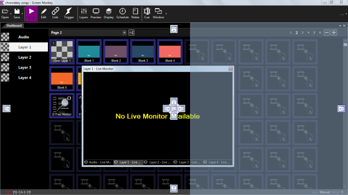
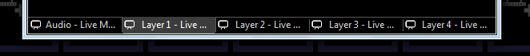
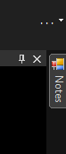
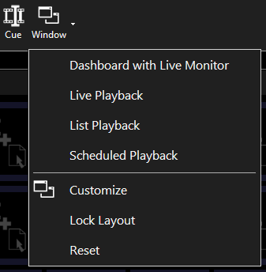
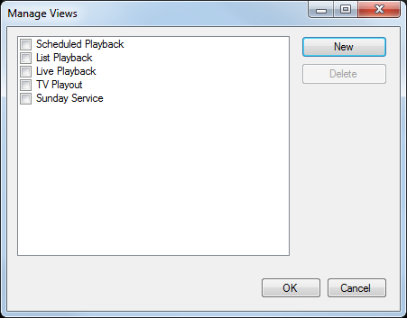

# Window

Screen Monkey allows you to show, hide, pin and dock almost any part of the user interface in any location. It is possible to make unlimited different views to suit any use case. The Window menu accessed from the toolbar allows you to recall, save and manage views.

To make it easy to switch between different layouts or restore a previous layout you can save your window positions to a view. It is then simple to restore those layouts with one button press. You restore a Window layout by selecting the desired view from the Window menu. All the windows move to the position at the point when you saved the view.

## Docking Windows
By default new windows float above the dashboard but they can be docked. To change the layout, drag the title bar of the window. As you drag the window you will see guides appear indicating where you can drop the window to dock it. 

Dropping the window in the center of the guide will cause it to become tabbed.

To view a window that is tabbed, click the tab to make it visible. 

You may also pin a window so that it is initially hidden but slides out when you hover on the pinned window icon. To pin a window, click the pin icon. When the window is pinned it will appear as a small button against the edge it has been pinned to. Click the pin again to un-pin.

You now have a great deal of flexibility to layout the different parts of Screen Monkey where you want them.

Some helpful tips: 

1. To change the layout drag and drop any panel title bar or any tab onto a blue indicator 
2. Close tabs or panels with the X in the top right 
3. Pin items to the side of the screen with the pin icon
4. Drop outside of any blue indicators to return to floating

## Window Menu items
Clicking on the Window toolbar icon will reveal a menu. Any user saved views will appear first followed by the items described below.

### Factory Default Views

- **Dashboard with Live Monitor** Recall a view with dashboard and live monitor.

- **Live Playback** Recall a view for live playback with dashboard, layers and live monitor.

- **List Playback** Recall a view for live playback in list form with live monitor.

- **Scheduled Playback** Recall a view for scheduled playback with dashboard, live monitor and schedule viewer.

## Customize
To save a view, arrange the windows in the positions you want, then click Window and choose Customize. The Manage Views dialog appears which allows you to add or remove your own saved views. To save the current view click ‘New’ and enter the name you want to give to the view. Your new view will now appear in the toolbar Window menu.

To remove views place a tick to the left of the view name you wish to remove and then press ‘Delete’.

## Lock Layout
Select this item to prevent windows from being moved or closed. To disable the lock select it again.

## Reset
Reset back to the default view as first installed. This is useful if the windows become jumbled or if you accidentally closed a window and can’t find it again.

