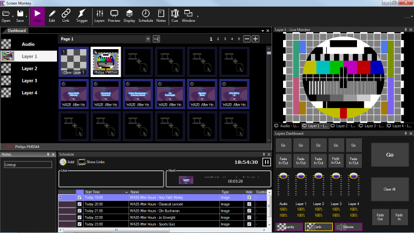

# Window

Screen Monkey allows you to show, hide, pin and dock almost any part of the user interface. It is possible to make unlimited different views to suit any application. 

Some helpful tips:

1. To change the layout drag and drop any panel title bar or tab onto a blue indicator
2. Close tabs or panels with the X in the top right
3. Pin items to the side of the screen with the Pin icon

To make it easy to switch between different layouts or restore a previous layout you can save your window positions to a view. It is then simple to restore those layouts with one button press.

There are a number of sub menus which are described below.

## Live Playback

## List Playback

## Scheduled Playback

## Customize
The view manager allows you to add or remove saved views. To save the current view click New and enter the name you want to give to the view.

To delete a view just check the views to delete and select Delete.

Once you have finished click OK.

## Lock Layout

## Reset
Reset back to the default view as first installed. This is useful if the windows become jumbled or if you accidentally closed a window and can’t find it again.

All your different layouts are managed from the view menu. Either open this from the icon on the dashboard or from the View menu that you get when right-clicking.

To save a view, arrange the windows in the positions you want, then click Views / Window Layout and choose Customize.

The Manage Views dialog opens.

 

Restore Window Layout

You restore a Window layout by selecting the desired view from the view menu (or the icon on the dashboard). All the windows should move to the position at the point when you saved the view.

