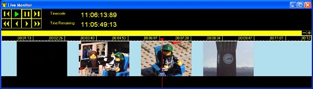
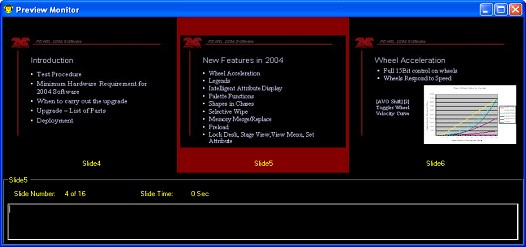
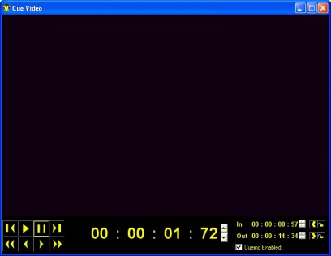
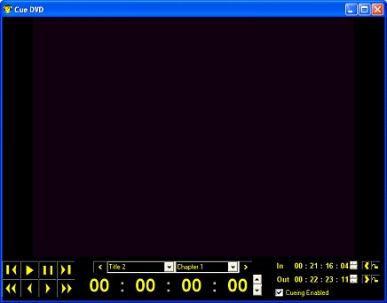

<h1>Version 2</h1>
<ul style="text-align:left; font-family:Arial;font-size:12pt;font-weight: normal;font-style: normal;text-decoration: none;"  >
 <li><a href="#MiniTOCBookMark2" class="hcp2">26th January 2007: Version 2</a>
</li>
 <li><a href="#MiniTOCBookMark3" class="hcp2">12th October 2006: Version 2</a>
</li>
 <li><a href="#MiniTOCBookMark4" class="hcp2">31st July 2006: Version 2</a>
</li>
 <li><a href="#MiniTOCBookMark5" class="hcp2">4th May 2006: Version 2</a>
</li>
 <li><a href="#MiniTOCBookMark6" class="hcp2">7th January 2006: Version 2</a>
</li>
</ul>
<h2>26th January 2007: Version 2</h2>
<ol>
	<li>
Page 
	 Up and Down <a href="../Reference/Hotkeys.md">Hotkey</a> 
	 
	Use the page up and page down keys to scroll through the clip pages 
	 in the main control window. This is not a global hotkey. The window 
	 must have focus for it to work.
</li>
	<li>
Assignable 
	 Clip <a href="../Reference/Hotkeys.md">Hotkeys</a> 
	 
	Assign a keyboard key to a specific clip and then run and control that 
	 clip from the keyboard. You do not need to be on the correct page 
	 as the key will run clips even if that page is not displayed. To assign 
	 a clip hotkey you must hold down the key you want to assign to the 
	 clip and then click on the clip. When you press a keyboard key and 
	 you have set clip names to be displayed the keyboard shortcut for 
	 all clips are displayed. You also have access to all the pause and 
	 continue functions by pressing the clip hotkey when the clip is running.
</li>
	<li>
<a 
	 href="../reference/clipTypes/LiveVideoClip.md">Live Video</a> 
	 Monitor 
	 
	The live video monitor allows you to see the progress and time remaining 
	 of a video clip that is currently playing. It provides you with controls 
	 to pause and play the video during live playback. You can also see 
	 the current play time and time remaining of the video. This gives 
	 you far more control over the video once playing and also gives you 
	 the ability to cue in the next clip from the time remaining time. 
	 A timeline is also displayed with captions taken from certain times 
	 throughout the video, this is too give you some indication of what 
	 is next. 
	 
	
</li>
	<li>
Improved 
	 Effects Settings 
	 
	The effects settings dialog has been improved to make it faster and 
	 easier to use.
</li>
	<li>
New 
	 Fade Wipe Effect 
	 
	A new effect has been added to allow that fades and wipes across the 
	 screen. You can set it to wipe in any direction.
</li>
	<li>
Effects 
	 Plug-in System 
	 
	The effects plug-in system provides third parties the ability to write 
	 there own custom effects. This allows Screen Monkey to be much more 
	 customizable allow new effects to be added giving more power and style 
	 to your shows. If you're interested in writing an effect plug-in for 
	 Screen Monkey then you need to download the SDK from the web site.
</li>
	<li>
Clip 
	 Plug-in System 
	 
	If you want to run a clip in Screen Monkey but that clip type is not 
	 currently supported then the clip plug-in system is for you. This 
	 allows third parties to write their own clips which will add to the 
	 comprehensive range already available. If you are interested in writing 
	 a clip plug-in for Screen Monkey then please download the SDK off 
	 the website.
</li>
	<li>
Clip 
	 File Not Found 
	 
	If when a clip is being loaded it is unable to find the file associated 
	 with that clip then a clip file not found icon is displayed in the 
	 clip panel. A more detailed description of the problem is logged in 
	 the event log.
</li>
	<li>
Clip 
	 Load Error 
	 
	If a clip fails to load for some reason then a clip error icon is displayed 
	 in the clip panel. A more detailed description of the error is logged 
	 in the event log. 
	 
	<a href="#"> Back to top</a>
</li>
</ol>

&#160;

<h2>12th October 2006: Version 2</h2>
<ol>
	<li>
Video 
	 Pausing 
	 
	When playing a <a href="../reference/clipTypes/VideoClip.md">video</a> 
	 or <a href="../reference/clipTypes/DVDClip.md">DVD</a> clip you 
	 can click on the clip again to pause the playback. To continue the 
	 playback click on the clip a further time. 
	 
	<a href="#"> Back to top</a>
</li>
</ol>

&#160;

<h2>31st July 2006: Version 2</h2>
<ol>
	<li>
<a href="../tutorials/WorkingWithShows/FlashShow.md">Flash Show</a> 
	 
	Create a flash show that can be incorporated onto a multimedia CD or 
	 put on the web from your PowerPoint presentation. The export function 
	 allows you to create a flash show that plays back audio of the presentation 
	 and changes the slides at the same point as in the live presentation.
</li>
	<li>
<a href="../tutorials/WorkingWithShows/EnhancedPodcast.md">Enhanced 
	 Podcast</a> 
	 
	Export all the files you need to create an enhanced podcast from any 
	 PowerPoint presentation. The files created are compatible with Apple's 
	 Chapter Tool for creating an Enhanced podcast which can be viewed 
	 in iTunes or on an iPod.
</li>
	<li>
<a href="../tutorials/WorkingWithShows/CueSheetExport.md">Cue Sheet 
	 Export</a> 
	 
	Want to record and save your PowerPoint transition times for later 
	 use? With cue sheet export you can save the times to an XML file for 
	 later use.
</li>
	<li>
Video 
	 Caption Timeline 
	 
	It can often be difficult to quickly find the right point in a video 
	 to start and stop. With the new timeline with image captions it is 
	 easy as you can now see captions taken from different points throughout 
	 the video. This allows you to quickly find the right point in the 
	 video.
</li>
	<li>
<a 
	 href="../reference/clipTypes/DVDClip.md">DVD</a> Cueing Timeline 
	 
	A timeline allows you to quickly and easily navigate through any movie. 
	 The DVD Cue window now provides a timeline to help you find the right 
	 start and stop point in the DVD.
</li>
	<li>
Automatic 
	 Error Handling 
	 
	No one likes to get an error message, least of all in the middle of 
	 an important show. That's why allot of effort is put into ensuring 
	 that Screen Monkey runs without problems, however if something should 
	 go wrong then it will now be handled automatically. Instead of showing 
	 an error message in the middle of a show, any errors are handled automatically 
	 and saved in a log for you to look at later. If an error does occur 
	 you will be notified by the appearance of an exclamation mark in the 
	 control panel. If a clip will not run or has problems loading then 
	 you can click on the exclamation to find out more about the problem. 
	 You can also save a copy of the log to send to Screen Monkey support 
	 and help prevent the problem occurring again. 
	 
	<a href="#"> Back to top</a>
</li>
</ol>

&#160;

<h2>4th May 2006: Version 2</h2>
<ol>
	<li>
Preview 
	 Monitor 
	 
	A new window can be launched from the control panel by clicking on 
	 the preview icon. This opens a new window that shows a preview of 
	 the PowerPoint slides. The default is to show the next and previous 
	 slides but this can be extended by re-sizing the window. The current 
	 slide is highlighted in red and any notes for that slide are shown 
	 in the bottom of the screen along with the slide number and time. 
	 
	 
	 
	Currently this feature only supports PowerPoint clips but it will be 
	 extended to support other clip types.
</li>
	<li>
Video 
	 Cueing 
	 
	This feature provides the ability to set a start and a stop time for 
	 any video clips. This allows you to easily select the section of a 
	 video that you want to show. The cue times are set using the Cue window 
	 which is displayed when you select right click on a video clip and 
	 select Cue. 
	 
	 
	 
	The Cue window contains the standard video controls necessary to set 
	 a start and a Stop time for the video. 
	 
	To find out more about this feature go to the <a href="../tutorials/WorkingWithClips/EditingClips.md">Cueing 
	 Clip</a> help topic.
</li>
	<li>
<a 
	 href="../reference/clipTypes/DVDClip.md">DVD</a> Cueing 
	 
	This provides you with the same ability as video cueing but for a DVD 
	 video. This means you can easily extract a section out of a DVD to 
	 show to your audience. So you can skip those annoying titles and go 
	 straight to the content. This feature gives you the ability to set 
	 a start and an end time for the DVD. 
	 
	 
	 
	To find out more about this feature go to the <a href="../tutorials/WorkingWithClips/EditingClips.md">Cueing 
	 Clip</a> help topic.
</li>
	<li>
ShockWave 
	 <a href="../reference/clipTypes/FlashClip.md">Flash</a> Support 
	 
	Support has been added for shockwave flash files. 
	 
	<a href="#"> Back to top</a>
</li>
</ol>

&#160;

<h2>7th January 2006: Version 2</h2>
<ol>
	<li>
<a 
	 href="../reference/clipTypes/PowerPointClip.md">PowerPoint</a> 
	 Resume 
	 
	You now have the option to remember the last slide being shown and 
	 to start from this point when you next load that PowerPoint. To enable 
	 this option; right click on the PowerPoint clip and under &quot;Playback 
	 Settings&quot; un-tick &quot;Auto Rewind&quot;. This will now prevent 
	 the presentation from rewinding back to the first slide. When running 
	 the presentation, if you wish to rewind it then you either hold down 
	 Ctrl while clicking on the clip to run it or you select the first 
	 slide by right clicking&#160;&#160;on the clip and selecting the first 
	 slide under &quot;Start Slide&quot;. You can also select any slide 
	 as the first slide to run by right clicking and selecting the desired 
	 slide under &quot;Start Slide&quot;. 
	 
	<a href="#"> Back to top</a>
</li>
</ol>
