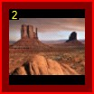
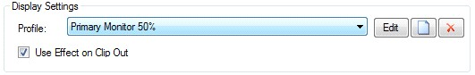
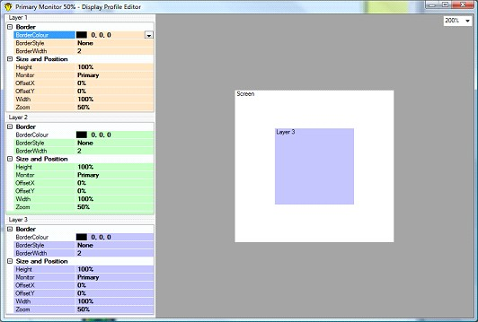
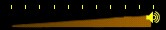
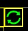

<!DOCTYPE HTML PUBLIC "-//W3C//DTD HTML 4.01 Frameset//EN">
<html>
<h1>Version 3</h1>
<ul style="text-align:left; font-family:Arial;font-size:12pt;font-weight: normal;font-style: normal;text-decoration: none;"  >
 <li><a href="#MiniTOCBookMark2" class="hcp2">2nd December 2007: Version 3</a>
</li>
 <li><a href="#MiniTOCBookMark3" class="hcp2">15th November 2007: Version 3</a>
</li>
 <li><a href="#MiniTOCBookMark4" class="hcp2">7th November 2007: Version 3</a>
</li>
 <li><a href="#MiniTOCBookMark5" class="hcp2">5th November 2007: Version 3</a>
</li>
 <li><a href="#MiniTOCBookMark6" class="hcp2">24th October 2007: Version 3</a>
</li>
 <li><a href="#MiniTOCBookMark7" class="hcp2">12th October 2007: Version 3</a>
</li>
 <li><a href="#MiniTOCBookMark8" class="hcp2">10th October 2007: Version 3</a>
</li>
 <li><a href="#MiniTOCBookMark9" class="hcp2">1st October 2007: Version 3</a>
</li>
 <li><a href="#MiniTOCBookMark10" class="hcp2">27th September 2007: Version 3</a>
</li>
 <li><a href="#MiniTOCBookMark11" class="hcp2">25th September 2007: Version 3</a>
</li>
 <li><a href="#MiniTOCBookMark12" class="hcp2">14th September 2007: Version 3</a>
</li>
 <li><a href="#MiniTOCBookMark13" class="hcp2">4th September 2007: Version 3</a>
</li>
 <li><a href="#MiniTOCBookMark14" class="hcp2">28th August 2007: Version 3</a>
</li>
 <li><a href="#MiniTOCBookMark15" class="hcp2">27th August 2007: Version 3</a>
</li>
 <li><a href="#MiniTOCBookMark16" class="hcp2">17th August 2007: Version 3</a>
</li>
 <li><a href="#MiniTOCBookMark17" class="hcp2">23rd July 2007: Version 3</a>
</li>
 <li><a href="#MiniTOCBookMark18" class="hcp2">24th June 2007: Version 3</a>
</li>
 <li><a href="#MiniTOCBookMark19" class="hcp2">22nd June 2007: Version 3</a>
</li>
 <li><a href="#MiniTOCBookMark20" class="hcp2">10th June 2007: Version 3</a>
</li>
 <li><a href="#MiniTOCBookMark21" class="hcp2">8th June 2007: Version 3</a>
</li>
 <li><a href="#MiniTOCBookMark22" class="hcp2">6th June 2007: Version 3</a>
</li>
 <li><a href="#MiniTOCBookMark23" class="hcp2">11th March 2007: Version 3</a>
</li>
</ul>
<h3>2nd December 2007: Version 3</h3>
<ol>
	<li>
MIDI 
	 and Keyboard Learn 
	 
	The MIDI and keyboard learn feature allows you to quickly and easily 
	 specify an action to go with a specific key press or MIDI note. Under 
	 the <a href="../Reference/Setup/Settings/MIDI.md">settings</a> in 
	 either MIDI or <a href="../Reference/Setup/Settings/MouseandKeyboard.md">keyboard 
	 settings</a> you will notice that it displays the last trigger to 
	 occur. You simply then need to click on the action in the tree to 
	 assign this trigger to that action. 
	 
	<a href="#"> Back to top</a>
</li>
</ol>

&#160;

<h3>15th November 2007: Version 3</h3>
<ol>
	<li>
Play 
	 In Selection Order 
	 
	If you are in multi edit mode and you want to link a series of clips 
	 together in a certain order then you can do this quickly by using 
	 &quot;Play In Selection Order&quot;. First you need to select the 
	 clips in the order you wish to play them. Now open the edit menu (right 
	 click on a selected clip) and under &quot;Link&quot; select &quot;Play 
	 In Selection Order&quot;, this will now assign the links in the order 
	 you selected the clips. You will still need to selected the link type 
	 separately. 
	 
	<a href="#"> Back to top</a>
</li>
</ol>

&#160;

<h3>7th November 2007: Version 3</h3>
<ol>
	<li>
Clip 
	 Rewind 
	 
	If you are playing video or flash you may want to rewind it back to 
	 the start either when it is playing or once it has finished playing. 
	 You can now do this by holding down the {Ctrl} key while clicking 
	 on the clip. If it is playing then it will immediately rewind back 
	 to the start and play again.
</li>
	<li>
Clear 
	 Layer Link 
	 
	You can now link a clip to a layer clear clip. This allows you to automatically 
	 clear the screen when a clip ends or if you press Go. 
	 
	<a href="#"> Back to top</a>
</li>
</ol>

&#160;

<h3>5th November 2007: Version 3</h3>
<ol>
	<li>
Clip 
	 Layer Indicator 
	 
	If you set a clip to be displayed on a certain layer it will now display 
	 the layer number in the top left corner of the clip panel. 
	 
	In the example below, the clip has been assigned to Layer 2. 
	 
	
</li>
	<li>
Multi 
	 Clip Edit 
	 
	You may find yourself wanting to change the settings of more than one 
	 clip at a time. <a href="../tutorials/WorkingWithClips/SelectingMultipleClips.md">Click 
	 here</a> to learn how to use Mulit-Clip Edit.
</li>
	<li>
Clip 
	 Play State Indicator 
	 
	If a clip supports playback control then it will now show the current 
	 playback state in the top left of the clip panel. Three icons indicate 
	 the three play states.. 
	 
	 
	 
	<a href="#"> Back to top</a>
</li>
</ol>

&#160;

<h3>24th October 2007: Version 3</h3>
<ol>
	<li>Google 
	 Earth Plugin 
	 
	A separate plugin is available to allow you to display and control 
	 Google Earth. 
	 
	<a href="http://www.screenmonkey.co.uk/DNN/Default.aspx?tabid=161" 
		 target="_blank">Click here</a> to visit the website for the plugin 
	 download. 
	 
	</li>
</ol>
<table style="margin-left: 41px; border-collapse: separate; border-collapse: separate;" 
		 cellspacing="0" border="1">
	<col>
	<col>
	<tr>
		<td></td>
		<td>You will need to be logged into the Screen Monkey site in order 
		 to visit the page where the download is.</td>
	</tr>
</table>

<a href="#"> Back to 
 top</a>

&#160;

<h3>12th October 2007: Version 3</h3>
<ol>
	<li>
Multiple 
	 File Drop 
	 
	You can now drag and drop multiple files from Windows Explorer into 
	 Screen Monkey. When you do this all the supported files are added 
	 as clips. 
	 
	<a href="#"> Back to top</a>
</li>
</ol>

&#160;

<h3>10th October 2007: Version 3</h3>
<ol>
	<li>
Display 
	 Profiles 
	 
	With the increased capability of layers came the need for an improved 
	 system to setup the screen. That new system is display profiles. A 
	 display profile is a pre-defined setup for the layers including the 
	 position and size of each layer. You can either select from a list 
	 of default profiles or create your own by clicking on the new profile 
	 button in the <a href="../Reference/Setup/Settings/Settings.md">Screen 
	 Monkey settings</a> window. 
	 
	
</li>
	<li>
This will open the profile editor which you can use to change 
	 the layers and screen to any desired layout. 
	 
	 
	 
	This replaces the monitor and zoom settings in previous releases. 
	 
	<a href="#"> Back to top</a>
</li>
</ol>

&#160;

<h3>1st October 2007: Version 3</h3>
<ol>
	<li>
Video 
	 and DVD Volume 
	 
	Change the volume of both a <a href="../reference/clipTypes/VideoClip.md">video</a> 
	 and <a href="../reference/clipTypes/DVDClip.md">DVD</a> clip. To 
	 change the volume open up the cue window for the clip and adjust the 
	 volume slider. 
	 
	 
	 
	This will adjust the volume used when playing the clip. You can also 
	 adjust the volume during playback in the live monitor but this only 
	 has an effect until the clip finishes. The next time the clip plays 
	 it will play at the volume set in the cue window.
</li>
	<li>
Loop 
	 Video 
	 
	You can now loop <a href="../reference/clipTypes/VideoClip.md">video</a> 
	 by turning on loop in the cue window. When loop is set the selected 
	 portion of the video will continuously play. It is worth noting that 
	 when looping a link set to At End will not function as the clip will 
	 never end. You can also set the video to loop in the live monitor 
	 but this only has a temporary effect until the clip is stopped. 
	 
	 
	 
	<a href="#"> Back to top</a>
</li>
</ol>

&#160;

<h3>27th September 2007: Version 3</h3>
<ol>
	<li>VMR9 
	 Upgrade 
	 
	<a href="../reference/clipTypes/VideoClip.md">Video</a> and <a href="../reference/clipTypes/DVDClip.md">DVD</a> 
	 clips have been upgraded to use VMR9 which gives enhanced performance 
	 and greater functionality. This means that the overlay technology 
	 in previous releases is no longer used. 
	 
	<a href="#"> Back to top</a></li>
</ol>

&#160;

<h3>25th September 2007: Version 3</h3>
<ol>
	<li>
Multiple 
	 Screen Layers 
	 
	This is an exciting new feature that has many possibilities. Essentially 
	 it allows you display multiple clips at the same time by showing them 
	 on separate layers. It has many applications and below I have tried 
	 to list a few. 

	<ol>
		<li>
Lower Third Overlay 
		 
		Display text in the bottom of the screen to caption live video 
		 or display messages.
</li>
		<li>
Picture In Picture 
		 
		Show images and video while still having your live camera feed 
		 in the bottom right of the screen.
</li>
		<li>
Multiple Monitors 
		 
		Place the layers on different monitors to control the output of 
		 more than one screen at a time.
</li>
	</ol></li>
</ol>

The layers are controlled by the layer buttons 
 on the left side of the dashboard. To change to a different layer simply 
 click on the layer you want to change to. Any clips you play will &#160;be 
 displayed on the current layer and you must be on that layer to clear 
 it again.

Normally a clip will display on the active 
 layer but you can set a clip to always display on a &#160;certain layer. 
 This is set in the clip menu under layers. This feature is especially 
 useful &#160;when using links.

<ol start="2">
	<li>
Transparent 
	 Clips 
	 
	Clips can now have constant transparent output to allow items such 
	 as text to be overlaid on top of other clips.
</li>
	<li>
<a 
	 href="../reference/clipTypes/TickerTapeClip.md">Ticker Tape</a> 
	 Clip 
	 
	A new ticker tape clip has been added. This clip will scroll specified 
	 text across the screen. My thanks goes to Adam Mummery-Smith for providing 
	 this clip plug-in. 
	 
	<a href="#"> Back to top</a>
</li>
</ol>

&#160;

<h3>14th September 2007: Version 3</h3>
<ol>
	<li>
Cue 
	 Clip Shortcut 
	 
	A shortcut icon for cue clip has been added to the icon bar. When you 
	 click on the icon, all available clips will start to flash, you can 
	 then select a clip to put it into cue mode. 
	 
	<a href="#"> Back to top</a>
</li>
</ol>

&#160;

<h3>4th September 2007: Version 3</h3>
<ol>
	<li>
Flash 
	 Not Installed 
	 
	A friendly error is now generated if you do not have Adobe Flash Player 
	 installed. 
	 
	<a href="#"> Back to top</a>
</li>
</ol>

&#160;

<h3>28th August 2007: Version 3</h3>
<ol>
	<li>
GoTo 
	 Page 
	 
	By double clicking on the page number you can type in a page number 
	 to jump to.
</li>
	<li>
Fade 
	 Effect on <a href="../reference/clipTypes/VideoClip.md">Video</a> 
	 Clip 
	 
	Removed effects inhibit on video clips to allow video clips to be faded 
	 on Windows Vista machines. 
	 
	<a href="#"> Back to top</a>
</li>
</ol>

&#160;

<h3>27th August 2007: Version 3</h3>
<ol>
	<li>
Vista 
	 Compatibility 
	 
	Minor changes have been made to improve the compatibility with Windows 
	 Vista. This includes changes to <a href="../reference/clipTypes/FlashClip.md">Flash</a> 
	 and <a href="../reference/clipTypes/DVDClip.md">DVD</a> clips. 
	 The program is now fully Vista compatible. 
	 
	<a href="#"> Back to top</a>
</li>
</ol>

&#160;

<h3>17th August 2007: Version 3</h3>
<ol>
	<li>
Clip 
	 Panel Sizes 
	 
	You now have the option of three panel sizes to be used in the dashboard. 
	 The three sizes are Small, Medium and Large which can be changed in 
	 the <a href="../Reference/Setup/Settings/Settings.md">Screen 
	 Monkey settings</a>.
</li>
	<li>
Winamp 
	 Plugin 
	 
	A separate plugin is available to allow you to display Winamp visualizations 
	 in Screen Monkey. 
	 
	<a href="#"> Back to top</a>
</li>
</ol>

&#160;

<h3>23rd July 2007: Version 3</h3>
<ol>
	<li>
Unlimited 
	 Pages 
	 
	The page limit of 10 previously present has now been removed. It is 
	 now unlimited although the actually number of clips you can load is 
	 restricted by the capabilities of your machine.
</li>
	<li>
Right 
	 Click Page Jump 
	 
	If you use the right mouse button to page up or down, it jumps by 10 
	 pages at a time.
</li>
	<li>
Resizable 
	 Dashboard 
	 
	The main window is now resizable to allow you to change the number 
	 of clips displayed on a single page. Please note that it is not resizable 
	 in toolbar mode. 
	 
	<a href="#"> Back to top</a>
</li>
</ol>

&#160;

<h3>24th June 2007: Version 3</h3>
<ol>
	<li>
Link 
	 Icon 
	 
	If a clip links to the next clip then this is indicated by a chain 
	 link icon in the top right of the clip panel. 
	 
	<a href="#"> Back to top</a>
</li>
</ol>

&#160;

<h3>22nd June 2007: Version 3</h3>
<ol>
	<li>
WPF 
	 Support 
	 
	Support has been added for Microsoft's latest display technology WPF. 
	 This brings the advanced capabilities of Windows Vista into Screen 
	 Monkey. 
	 
	<a href="#"> Back to top</a>
</li>
</ol>

&#160;

<h3>10th June 2007: Version 3</h3>
<ol>
	<li>
Save 
	 and Open 
	 
	Save your current show to an XML file which can be either loaded on 
	 a different computer or re-opened on the current machine. You can 
	 also click on new show to quickly clear all the clips.
</li>
	<li>
Multiple 
	 Instances 
	 
	The restriction of opening more than one copy of Screen Monkey on a 
	 single PC has been removed. This gives you the option to control more 
	 than 1 display on a single computer. When you open multiple copies, 
	 all the settings are saved separately so each instance will maintain 
	 its own settings even when closed. The settings are re-opened in the 
	 order you originally ran the application. 
	 
	<a href="#"> Back to top</a>
</li>
</ol>

&#160;

<h3>8th June 2007: Version 3</h3>
<ol>
	<li>
Interactions 
	 Plug-In Framework 
	 
	The interactions plug-in framework allows 3rd party developers to write 
	 Plug-Ins which control Screen Monkey. An interaction can perform functions 
	 such as change page, run clips, pause playback and much more. You 
	 can see any loaded interactions plug-ins by going to the Screen Monkey 
	 settings menu and clicking on the interactions.
</li>
	<li>
MIDI 
	 Control 
	 
	The new MIDI control interaction allows you to specify MIDI notes to 
	 perform certain actions within Screen Monkey. This gives you huge 
	 capability to connect external control surfaces and other MIDI devices 
	 such as lighting desks. The MIDI notes used to perform a specific 
	 action need to be setup in the settings window under MIDI before it 
	 will respond to MIDI notes. You will need a MIDI port connected to 
	 your computer or a MIDI to USB adapter.
</li>
	<li>
Mouse 
	 and Keyboard Interaction 
	 
	This feature was originally conceived out of a request to always have 
	 the mouse in control of a PowerPoint presentation. I wanted to allow 
	 one mouse to be assigned to Screen Monkey and the other left free 
	 to use in Windows. What resulted was an extremely powerful and flexible 
	 mouse and hotkey system. The principle is that you have actions you 
	 wish to perform in Screen Monkey like run a clip. This interaction 
	 allows you to assign any mouse or keyboard key to that action. So 
	 if you assign the right mouse key to play clip 1 it will play clip 
	 1 when you press the right mouse key. It gets better than that though 
	 as you can connect multiple mice and keyboards and assign different 
	 actions to keys on different keyboards. So you can have one keyboard 
	 dedicated to controlling Screen Monkey while the other keyboard has 
	 no effect on Screen Monkey. Best way to understand it is to have a 
	 play and do not forget you can always save and load the settings. 
	 When you first install Screen Monkey some defaults are setup, to change 
	 these select &quot;Mouse and Keyboard&quot; in the settings window.
</li>
	<li>
Repair 
	 Clip 
	 
	If a clip is unable to load for some reason, such as a missing file, 
	 it will display and error icon on the clip panel. When you click on 
	 the clip you will be asked if you want to repair the clip and in the 
	 case of a missing file you will be presented with an option to try 
	 and locate the missing file. This is specifically useful if you load 
	 the show in another computer which does not have your clip files located 
	 in the same place.
</li>
	<li>
Clearing 
	 Errors 
	 
	If an error occurs in Screen Monkey and you click on the error icon 
	 to view the error it will clear the error and the icon will disappear. 
	 
	<a href="#"> Back to top</a>
</li>
</ol>

&#160;

<h3>6th June 2007: Version 3</h3>
<ol>
	<li>
<a href="../tutorials/WorkingWithClips/LinkingClips.md">Link</a> 
	 
	This new feature allows you to link multiple clips together so that 
	 one clip will follow on from the current clip. This allows you to 
	 play a series of clips with a similar result to a cue list. You can 
	 set the link to on by right clicking on the clip and then selecting 
	 the Link menu. You are presented with three options: 
</li>
</ol>
<table style="margin-left: 60px; border-collapse: separate; border-collapse: separate;" 
		 cellspacing="0" border="1">
	<col>
	<col>
	<tr>
		<td>
Off
</td>
		<td>No clip fill follow.</td>
	</tr>
	<tr>
		<td>
Manual
</td>
		<td>The next clip will follow when you press the space bar.</td>
	</tr>
	<tr>
		<td>
At 
		 End
</td>
		<td>The next clip will follow when the current clip finishes. This 
		 option is only allowed on clips that actually finish like video 
		 or PowerPoint.</td>
	</tr>
	<tr>
		<td>
Time
</td>
		<td>The next clip will follow after a specified time. When you 
		 select this option you are presented with an option to enter the 
		 time.</td>
	</tr>
</table>

When you first set the link it will always 
 link to the adjacent clip but you can override this by clicking on the 
 clip name in this menu and selected another clip. 
 
<a href="#"> Back to top</a>

&#160;

<h3>11th March 2007: Version 3</h3>
<ol>
	<li>
<a 
	 href="../reference/clipTypes/FreezeClip.md">Freeze</a> Clip Live 
	 Monitor 
	 
	Freeze clips now have a live monitor that displays the image that is 
	 frozen.
</li>
	<li>
<a 
	 href="../reference/clipTypes/ImageClip.md">Image</a> Clip Live 
	 Monitor 
	 
	Image clips now have a live monitor that displays the image being shown 
	 on the screen.
</li>
	<li>
<a 
	 href="../reference/clipTypes/DVDClip.md">DVD</a> Clip Live Monitor 
	 
	DVDs have a live monitor which shows the current time, time remaining 
	 and allows you to play and pause the DVD during live playback.
</li>
	<li>
DVD 
	 Clip Cue Export and Import 
	 
	You can now Import and export the cue in time and out time of the DVD 
	 to and XML file. This allows you to save the settings for later or 
	 transfer the settings to another computer. Ideal for off site setup. 
	 
	<a href="#"> Back to top</a>
</li>
</ol>
