<h1>Version 3.1</h1>
<ul style="text-align:left; font-family:Arial;font-size:12pt;font-weight: normal;font-style: normal;text-decoration: none;"  >
 <li><a href="#MiniTOCBookMark2" class="hcp2">24th May 2008: Version 3.1</a>
</li>
 <li><a href="#MiniTOCBookMark3" class="hcp2">16th May 2008: Version 3.1</a>
</li>
 <li><a href="#MiniTOCBookMark4" class="hcp2">4th May 2008: Version 3.1</a>
</li>
 <li><a href="#MiniTOCBookMark5" class="hcp2">18th April 2008: Version 3.1</a>
</li>
 <li><a href="#MiniTOCBookMark6" class="hcp2">17th April 2008: Version 3.1</a>
</li>
 <li><a href="#MiniTOCBookMark7" class="hcp2">30th March 2008: Version 3.1</a>
</li>
 <li><a href="#MiniTOCBookMark8" class="hcp2">27th March 2008: Version 3.1</a>
</li>
 <li><a href="#MiniTOCBookMark9" class="hcp2">20th March 2008: Version 3.1</a>
</li>
 <li><a href="#MiniTOCBookMark10" class="hcp2">16th March 2008: Version 3.1</a>
</li>
</ul>
<h3>24th May 2008: Version 3.1</h3>
<ol>
	<li>
Clip 
	 Scheduler 
	 
	The scheduler allows you specify a time and date when a clip will be 
	 run. This is specifically useful if Screen Monkey is running unattended 
	 and you need to display videos or images at set times in the day such 
	 as with a local TV station. It also allows you to set a repeat time 
	 if you want to show a clip every 10min. 
	 
	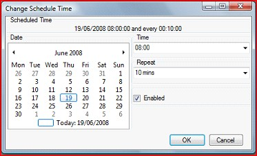
</li>
	<li>
<a 
	 href="../reference/clipTypes/FlashClip.md">Flash</a> Hotkey Inject 
	 
	The previous version allowed you to specify keys to send to a flash 
	 presentation for the purposes of navigation. This has been changed 
	 so the flash clip has a specific set of custom actions which you are 
	 allowed to assign key presses to. The only noticeable change is that 
	 instead of the assignments being listed under &quot;Custom Action&quot; 
	 it is now listed under &quot;Flash&quot;.
</li>
	<li>
<a 
	 href="../reference/clipTypes/Song/SongClip.md">Song</a> Words Transition 
	 Speed 
	 
	You can now set the time taken for the song words to transition from 
	 one verse to the next. You have four speed options &quot;No Transition&quot;, 
	 &quot;Fast Transition&quot;, &quot;Normal Transition&quot; and &quot;Slow 
	 Transition&quot;. To set the transition speed go to the song clip 
	 display style editor and select the speed you require. 
	 
	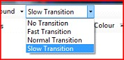
</li>
	<li>
Song 
	 Text Effects 
	 
	When displaying song words over an image background you often need 
	 an effect such as drop shadow or text outline to ensure the words 
	 stand out. The new song text effect does exactly this. It gives you 
	 the option to add both an outline and drop shadow to the text. Both 
	 effects are highly configurable to ensure you get exactly the effect 
	 you want. You change the text effect by selecting the Effect button 
	 in the display style editor and then adjusting the settings till you 
	 get the desired effect. 
	 
	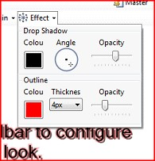 
	 
	<a href="#"> Back to top</a>
</li>
</ol>

&#160;

<h3>16th May 2008: Version 3.1</h3>
<ol>
	<li>
Quicktime 
	 <a href="../reference/clipTypes/VideoClip.md">Video</a> 
	 
	Now supports playback of quicktime video as long as you have a suitable 
	 <a href="../FAQ/VideoDecoder.md">CODEC</a> installed.
</li>
	<li>
Link 
	 At End 
	 
	When linking a clip at end it will now link clips on all layers and 
	 not just the clip on the active layer. 
	 
	<a href="#"> Back to top</a>
</li>
</ol>

&#160;

<h3>4th May 2008: Version 3.1</h3>
<ol>
	<li>
Info 
	 Bar 
	 
	The info bar displays information about a clip when the mouse passes 
	 over the clip. When not showing clip information it displays information 
	 about the live clip on the current layer. You can use this to see 
	 information such as the full clip name, duration, slides, link and 
	 effect. There is a user setting to hide the info bar if required. 
	 
	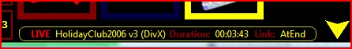
</li>
	<li>
Disable 
	 Thumbnail Generation 
	 
	There is now a new user setting to disable thumbnail generation in 
	 certain clips. This is to avoid problems with large numbers of video 
	 clips taking along time to load. The thumbnail will still be generated 
	 when you cue the clip.
</li>
	<li>
Clip 
	 Tooltip Length Limit 
	 
	The name of the clip in the tooltip is now limited to prevent names 
	 being ridiculously long. 
	 
	<a href="#"> Back to top</a>
</li>
</ol>

&#160;

<h3>18th April 2008: Version 3.1</h3>
<ol>
	<li>
Timeline 
	 Resize 
	 
	The timeline in <a href="../reference/clipTypes/VideoClip.md">video</a> 
	 and <a href="../reference/clipTypes/DVDClip.md">DVD</a> clips now 
	 resizes without losing the zoom buttons.
</li>
	<li>
Edit 
	 Mode Delete 
	 
	You can now use the delete key in edit mode to clear the selected clips 
	 or backspace to remove the selected clips.
</li>
	<li>
Hotkey 
	 Handled 
	 
	In previous versions of Screen Monkey any global <a href="../reference/Hotkeys.md">hotkeys</a> 
	 would always be routed to Screen Monkey. This prevented that key from 
	 being used in other applications. Now the key is only used in Screen 
	 Monkey if that operation is available. For example the next and previous 
	 slide hotkeys are only needed if a slide show is actually running. 
	 This key will now only be disabled in other applications if a slide 
	 clip is being displayed.
</li>
	<li>
Show 
	 Drop 
	 
	With show drop you can quickly add clips from other shows saved in 
	 Screen Monkey. All you do is drag the show file you want to add clips 
	 from into a panel. The clips in that show will then be added starting 
	 at this panel. You can use this to create new shows using components 
	 from old shows.
</li>
	<li>
Clip 
	 Forward and Reverse 
	 
	You may have added a number of clips and all you want to do is step 
	 through them. The Clip Forward function allows you to do this. When 
	 you select Clip Forward it will move to the next clip on the layer 
	 which is simply the clip in the next slot. This is different from 
	 the linked clip. To move back to the previous clip you just select 
	 Clip Reverse. You can either assign hotkeys to the these actions or 
	 press the Go button in the Layers Dashboard. By holding down shift 
	 and pressing Go it will move to the reverse clip. 
	 
	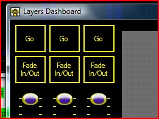 
	 
	<a href="#"> Back to top</a>
</li>
</ol>

&#160;

<h3>17th April 2008: Version 3.1</h3>
<ol>
	<li>
Insert 
	 Clip 
	 
	This is extremely useful and a feature that has been lacking in previous 
	 versions. You often want to add new clips into your play order at 
	 the last minute and until now there has been no easy way to do this. 
	 Now with insert clip you can add in a new clips and any adjacent clips 
	 will be shifted along. All you have to do is add the clip to the slot 
	 you want it to appear in. If a clip already exists in that slot then 
	 it will be moved to the slot on the right. Previously the clip would 
	 just have been deleted.
</li>
	<li>
Remove 
	 and Clear 
	 
	As well as inserting a clip you also need to be able to reverse this 
	 by removing a clip. So the remove function has now changed behavior. 
	 When you remove a clip any adjacent clips will be shifted into the 
	 empty slot. The old behavior of Remove is now Clear. When you select 
	 clear the clip will be deleted and an empty clot will be left.
</li>
	<li>
Docking 
	 Layer Monitor Windows 
	 
	The layer monitors are now all dockable allowing you to configure them 
	 in any display layout you wish. So if you want all you layer monitors 
	 in tabs on top of each other or all viewable in separate windows you 
	 can. This now gives you the ability to easily see what is going on 
	 in all the layers at once. To move the windows around just simply 
	 click and drag the tab of a layer out of the monitor window. 
	 
	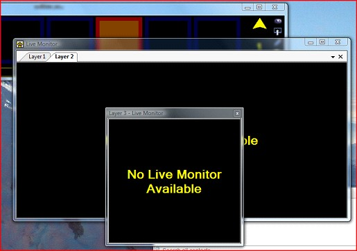 
	 
	<a href="#"> Back to top</a>
</li>
</ol>

&#160;

<h3>30th March 2008: Version 3.1</h3>
<ol>
	<li>
Clear 
	 Active Layer 
	 
	Added Clear Active Layer to the list of possible interactions assignable 
	 to a hotkey. This will now clear the active layer currently selected 
	 in the main window. This adds to the ability to clear all layers being 
	 displayed.
</li>
	<li>
Changing 
	 Keyboard Types Cleared Hotkey 
	 
	Fixed a bug where if you changed to a different keyboard type it would 
	 lose any hotkey settings.
</li>
	<li>
Song 
	 Clip Image Background 
	 
	You can now use an image as a background for the lyrics in a song clip. 
	 
	<a href="#"> Back to top</a>
</li>
</ol>

&#160;

<h3>27th March 2008: Version 3.1</h3>
<ol>
	<li>
Clip 
	 Interaction Interface 
	 
	Added new interface which clip plugins can implement to add custom 
	 interactions to the interaction interface. When a clip registers a 
	 custom action it allows hotkeys or MIDI notes to be assigned to that 
	 action. When the user then presses a key the clip is informed of the 
	 key press. This is useful if a clip has custom behavior that a user 
	 might want to assign to a keyboard key.
</li>
	<li>
Song 
	 Clip Jump to Verse Hotkey 
	 
	You can now assign a keyboard key to jump to specific verses in a song. 
	 This is useful when you are displaying songs and do not know what 
	 order the verses will be sung in. Now you can assign keys to all the 
	 verses and when that key is pressed it will jump straight to that 
	 verse.
</li>
	<li>
Song 
	 Clip Live Monitor 
	 
	Added a live monitor to the song clip which shows you the lyrics for 
	 the whole song and a preview of the current output. The current verse 
	 is highlighted and you can jump to verses simply by clicking on the 
	 verse lyrics. 
	 
	<a href="#"> Back to top</a>
</li>
</ol>

&#160;

<h3>20th March 2008: Version 3.1</h3>
<ol>
	<li>Song Clip 
	 
	A new type of clip to display song lyrics was added. This includes 
	 a song edittor to quickly enter the lyrics for the song you want to 
	 display. It also has the ability to easily see the lyrics you are 
	 displaying and skip to the correct verse in the song. A range of display 
	 options are available to customize how the lyrics look. You can also 
	 search a folder containing lyrics to easily add a song from a database 
	 of files. 
	 
	<a href="#"> Back to top</a></li>
</ol>

&#160;

<h3>16th March 2008: Version 3.1</h3>
<ol>
	<li>
Select 
	 MIDI Device 
	 
	In the MIDI settings window you can now click on the select MIDI device 
	 icon to open a new dialog which allows you to select any MIDI device 
	 connected to your system. This means that if more than one device 
	 is connected, you can choose which one Screen Monkey uses. Once you 
	 have selected the device you need to configure which notes perform 
	 which actions. 
	 
	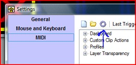
</li>
	<li>
Video 
	 Clip Thumbnail Caching 
	 
	With v3 when the application started it would always have to re-generate 
	 the thumbnail images for the video clips. This could be a slow process 
	 if you had lots of clips. Now the images are saved when the application 
	 closes so they do not have to be re-generated on start up.
</li>
	<li>
Video 
	 Options 
	 
	The video options dialog allows you to change how Screen Monkey plays 
	 your videos. The default settings have been chosen to give you the 
	 best quality and performance during playback. However sometimes due 
	 to hardware and system limitations you may experience problems. The 
	 options window allows you to change certain settings to give you the 
	 best chance of seeing your video. If you are not experiencing problems 
	 then it is best to leave these settings. The settings apply to all 
	 video clips.
</li>
	<li>
DVD 
	 Options 
	 
	The DVD options dialog allows you to change how Screen Monkey plays 
	 your DVDs. The default settings have been chosen to give you the best 
	 quality and performance during playback. However, sometimes due to 
	 hardware and system limitations you may experience problems. The options 
	 window allows you to change certain settings to give you the best 
	 chance of seeing your DVD. If you are not experiencing problems then 
	 it is best to leave these settings. The settings apply to all clips. 
	 
	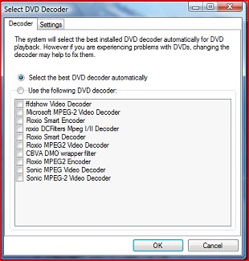
</li>
	<li>
DVD 
	 Audio Language and Special Feature Support 
	 
	You can now select Audio languages and special features such as directors 
	 commentary with DVD clips. To set the language you first need to move 
	 to a point in the DVD that supports languages. You can do this with 
	 the Cue control. Now right click on the clip and from the &quot;Audio 
	 Languages&quot; sub menu select the language you require. From now 
	 on that will be the language used. 
	 
	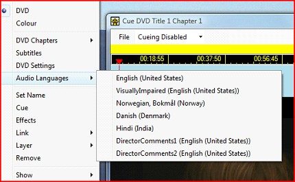
</li>
	<li>
DVD 
	 Menu Button 
	 
	You can click on the DVD menu button to quickly return to the DVD menu. 
	 
	
</li>
	<li>
Alpha 
	 Transparent Image Clips 
	 
	The image clip now supports transparent image formats such as PNG. 
	 Any areas in the image which are transparent will either show the 
	 desktop below or any layers beneath. This feature is really useful 
	 if you want to display a branding image on one of the top layers. 
	 You also need to select Transparent in the clip options.
</li>
	<li>
Image 
	 Clip Options 
	 
	Several options allow you to customize how images are displayed. Image 
	 re sizing allows you to either stretch the image to fit the screen 
	 or maintain the proportions and show a black border where the image 
	 does not fit the screen. You can also set the background to transparent 
	 which allows transparent images to display the layers beneath. You 
	 can apply the settings to all the images and specify whether these 
	 are the default settings applied to all future clips. 
	 
	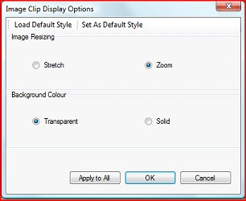
</li>
	<li>
Layer 
	 Control Dashboard 
	 
	The new layers control dashboard gives you quick access to the setup 
	 of the layer. You can change the layer transparency and the display 
	 profile currently in use by all the layers. To open the layer control 
	 you need to click on the layer icon in the main window. 
	 
	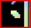 
	 
	You will then see the following window from which you can control all 
	 three layers. 
	 
	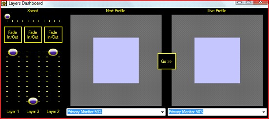
</li>
	<li>
Live 
	 Layer Transparency Control 
	 
	This allows you to change the transparency live of each layer. You 
	 can either use the faders in the Layers Dashboard or a MIDI device 
	 such as the Behringer B-Control to change the transparency. This gives 
	 you the ability to manually fade out media without assigning an effect. 
	 
	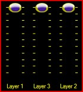
</li>
	<li>
Layer 
	 Fade In and Out 
	 
	These buttons allow you to quickly fade in and out a layer. They can 
	 be useful when quickly putting together a show and when you need to 
	 easily take information in and out from the screen while still maintaining 
	 the other layers. The speed with which the layer fades in and out 
	 is controlled by the speed fader. 
	 
	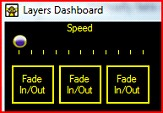
</li>
	<li>
Profile 
	 Transitions 
	 
	You may need to go from picture in picture to full screen during a 
	 live show. The profile transitions allow you to do that. You can change 
	 on the fly the display profile used and it will seamlessly change 
	 to that profile with the given speed. If the new layer position is 
	 different then the layer will travel to its new position and size. 
	 
	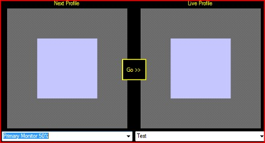 
	 
	The profile control shows you the current profile and the next profile 
	 to go to. An image representation of what the profile might look like 
	 is shown. Use the drop down lists to change either the live or the 
	 next profile. When you want to change the profile click on the go 
	 button and it will transition to the new profile. 
	 
	The speed of the transition is set using the speed fader. 
	 
	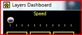 
	 
	Please note that some of the transitions are a bit steppy at this time. 
	 It is hoped this will be improved in future releases but it was still 
	 included to give you any benefits you may find.
</li>
	<li>
Previous 
	 Clip Action 
	 
	You can now configure a keyboard key to return to the previous clip. 
	 This will cause the current clip to stop and the previous clip to 
	 be re-run.
</li>
	<li>
Repair 
	 All 
	 
	The repair all will attempt to repair other clips of the same type 
	 with the information you provided to repair a clip. This is really 
	 handy if you have more than one media file that has been moved to 
	 a different folder. In this case it will search for other clips which 
	 may also have been moved to this folder and repair these as well.
</li>
	<li>
Layer 
	 Select Tool Tip 
	 
	The layer select in the main window now shows a tool tip describing 
	 what the buttons do.
</li>
	<li>
Per 
	 Layer Live Monitor 
	 
	The live monitor now shows the monitor for the active layer. This was 
	 an annoyance with v3 as it would only show the monitor for the last 
	 clip. Not allowing you to monitor the layers separately.
</li>
	<li>
Active 
	 Layer Clip Control 
	 
	A lot of the clip control actions such as next slide now work for the 
	 active layer. This gives you greater control over each individual 
	 layer.
</li>
	<li>
GoTo 
	 Slide Keyboard Action 
	 
	A new keyboard action has been added to allow you to type in a slide 
	 number and then hit a terminating key to goto that slide number. You 
	 need to define the terminating key in the keyboard settings and then 
	 simply type in a slide number followed by this key.
</li>
	<li>
Layer 
	 Transparency Indicator 
	 
	The background of the layer select buttons now fade to grey as the 
	 layer becomes transparent. When black the layer is fully visible. 
	 
	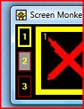
</li>
	<li>
Ticker 
	 Tape Setup Opens on New Clip 
	 
	The ticker tape setup dialog is now displayed as soon as you create 
	 a ticker tape clip. This was confusing before as you had to add some 
	 text in this dialog before the clip would work.
</li>
	<li>
Clip 
	 Unable to Stop - Bug Fix 
	 
	A bug was fixed where if you did not have &quot;Use effects on clip 
	 out&quot; selected in the settings it would cause clips not to stop 
	 when the clear screen button was pressed. After this any future clips 
	 would also not stop and lock on.
</li>
	<li>
Custom 
	 Layer Shape 
	 
	It is not always the case that your screen will be rectangular. Screen 
	 Monkey believes that you should not limit yourself to rectangles and 
	 that is why it now provides for shaped layers. You can create just 
	 about any shape of layer you want. 
	 
	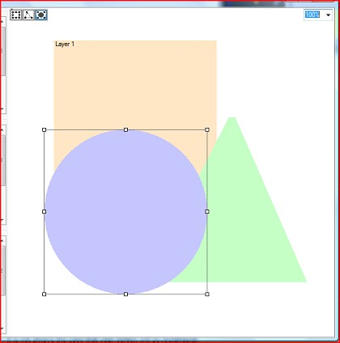 
	 
	In the profile editor you just need to select what shape you want from 
	 rectangle, polygon and circle. 
	 
	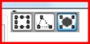 
	 
	Now just stretch and mold the layer to your desired shape. 
	 
	
</li>
	<li>
Events 
	 &amp; Errors Loading Animation 
	 
	The events and errors dialog now shows a loading animation while the 
	 events are being loaded. 
	 
	<a href="#"> Back to top</a>
</li>
</ol>
