<h1>Version 3.2</h1>
<ul style="text-align:left; font-family:Arial;font-size:12pt;font-weight: normal;font-style: normal;text-decoration: none;"  >
 <li><a href="#MiniTOCBookMark2" class="hcp2">8th March 2009: Version 3.2</a>
</li>
 <li><a href="#MiniTOCBookMark3" class="hcp2">6th March 2009: Version 3.2</a>
</li>
 <li><a href="#MiniTOCBookMark4" class="hcp2">15th February 2009: Version 3.2</a>
</li>
 <li><a href="#MiniTOCBookMark5" class="hcp2">2nd February 2009: Version 3.2</a>
</li>
 <li><a href="#MiniTOCBookMark6" class="hcp2">20th January 2009: Version 3.2</a>
</li>
 <li><a href="#MiniTOCBookMark7" class="hcp2">5th January 2009: Version 3.2</a>
</li>
 <li><a href="#MiniTOCBookMark8" class="hcp2">29th December 2008: Version 3.2</a>
</li>
 <li><a href="#MiniTOCBookMark9" class="hcp2">24th December 2008: Version 3.2</a>
</li>
 <li><a href="#MiniTOCBookMark10" class="hcp2">14th December 2008: Version 3.2</a>
</li>
 <li><a href="#MiniTOCBookMark11" class="hcp2">6th December 2008: Version 3.2</a>
</li>
 <li><a href="#MiniTOCBookMark12" class="hcp2">27th November 2008: Version 3.2</a>
</li>
 <li><a href="#MiniTOCBookMark13" class="hcp2">16th November 2008: Version 3.2</a>
</li>
 <li><a href="#MiniTOCBookMark14" class="hcp2">10th November 2008: Version 3.2</a>
</li>
 <li><a href="#MiniTOCBookMark15" class="hcp2">9th November 2008: Version 3.2</a>
</li>
 <li><a href="#MiniTOCBookMark16" class="hcp2">7th November 2008: Version 3.2</a>
</li>
 <li><a href="#MiniTOCBookMark17" class="hcp2">26th October 2008: Version 3.2</a>
</li>
 <li><a href="#MiniTOCBookMark18" class="hcp2">18th October 2008: Version 3.2</a>
</li>
 <li><a href="#MiniTOCBookMark19" class="hcp2">13th October 2008: Version 3.2</a>
</li>
 <li><a href="#MiniTOCBookMark20" class="hcp2">10th October 2008: Version 3.2</a>
</li>
 <li><a href="#MiniTOCBookMark21" class="hcp2">9th October 2008: Version 3.2</a>
</li>
</ul>
<h3>8th March 2009: Version 3.2</h3>
<ol>
	<li>
Web 
	 Browser Clip 
	 
	The web browser clip which was previously an optional plugin is now 
	 part of the main application.
</li>
	<li>
Schedule 
	 Clip Column 
	 
	Added a clip schedule time column to the grid when viewing clips in 
	 the list view. When you click on the calendar button you can edit 
	 the scheduled time and date for the clip. 
	 
	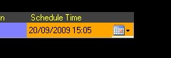
</li>
	<li>
Link 
	 Clip Column 
	 
	Added a link column to the grid when viewing clips in the list view. 
	 A drop down list can be used to set the link type. 
	 
	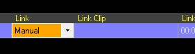 
	 
	<a href="#"> Back to top</a>
</li>
</ol>

&#160;

<h3>6th March 2009: Version 3.2</h3>
<ol>
	<li>
Live 
	 Video Letterboxing 
	 
	You can configure the live video to be either letterboxed to maintain 
	 aspect ratio or stretched to fit on the screen. 
	 
	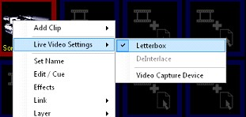
</li>
	<li>
Live 
	 Video De-Interlace Options 
	 
	Added options to configure the de-interlacing of live video. You can 
	 turn the interlacing on or off. 
	
</li>
	<li>
PNG 
	 Transparency Bug 
	 
	Fixed bug where PNG images would lose their transparency on layers 
	 1 and 2.
</li>
	<li>
Editing 
	 Display Profiles Updates Live 
	 
	If you are editing the live display profile then it now updates on 
	 the screen live. This can be useful if you are setting a screen mask 
	 as it allows you to tweak it and see your changes. 
	 
	<a href="#"> Back to top</a>
</li>
</ol>

&#160;

<h3>15th February 2009: Version 3.2</h3>
<ol>
	<li>
Cue 
	 Window Position 
	 
	The docking position of the cue window is now remembered so it opens 
	 in the same place. Each clip type has their own position.
</li>
	<li>
<a 
	 href="../reference/clipTypes/CueListSpaceClip.md">Space Clip</a> 
	 Quick Add 
	 
	You can now click on the background of the cue window to add a new 
	 clip to a space. An add clip icon on the background indicates this. 
	 
	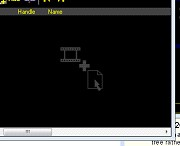
</li>
	<li>
Space 
	 Clip List Open 
	 
	After you have created a space clip it now automatically opens the 
	 cue window without you having to go to cue. 
	 
	<a href="#"> Back to top</a>
</li>
</ol>

&#160;

<h3>2nd February 2009: Version 3.2</h3>
<ol>
	<li>
Alt 
	 + Add Clip 
	 
	Holding the Alt key while creating a clip will create a new space and 
	 add the clip to that space. This provides a fast and easy way to create 
	 spaces. So when you are dragging in a number of files you can easily 
	 add those files to a new space by holding down the Alt key when you 
	 drop the files.
</li>
	<li>
Auto 
	 Edit Spaces 
	 
	When a space is created it now automatically opens the edit window 
	 so you can see the clips in the space. 
	 
	<a href="#"> Back to top</a>
</li>
</ol>

&#160;

<h3>20th January 2009: Version 3.2</h3>
<ol>
	<li>
Maximum 
	 Effects Speed 
	 
	Increased the maximum effects speed to 20 minutes. 
	 
	<a href="#"> Back to top</a>
</li>
</ol>

&#160;

<h3>5th January 2009: Version 3.2</h3>
<ol>
	<li>
DVD 
	 Chapter Tree 
	 
	When cueing a DVD you can now select the title and chapter from a tree 
	 rather than a drop down list. This makes it easier to find the chapter 
	 you want. 
	 
	 
	 
	The current title and chapter is now displayed above the timecode. 
	 
	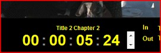
</li>
	<li>
Add 
	 Clip Wizard 
	 
	The add clip wizard allows you to click on an empty clip slot to add 
	 a new clip. Using the new wizard you can quickly select the type of 
	 clip you want to create or choose files from which to generate a clip. 
	 Instead of right clicking you just left click on an empty space. 
	 
	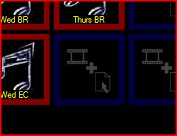 
	 
	The following window will open. 
	 
	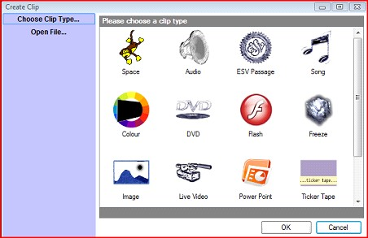 
	 
	Double-click on the type of clip you want to create or select &quot;Open 
	 File...&quot; to choose the files you want to create clips from. 
	 
	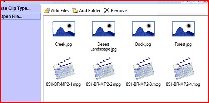
</li>
	<li>
Tidied 
	 up Add Clip Popup 
	 
	The list of clips in the popup menu is now under Add Clip and not in 
	 the main part of the menu. 
	 
	<a href="#"> Back to top</a>
</li>
</ol>

&#160;

<h3>29th December 2008: Version 3.2</h3>
<ol>
	<li>
WPF 
	 Renderer 
	 
	Enter the world of 3D with the WPF renderer. This renderer provides 
	 much smoother graphics along with 3D effects. The first installment 
	 only supports Image, Color, Song and Video clips but this will develop 
	 in the future. This is not the default renderer so you will need to 
	 enable it by going to settings and changing the &quot;Display Renderer&quot; 
	 to &quot;WPF&quot;. Once enabled you will see the extra effects available. 
	 
	Explosion 
	 
	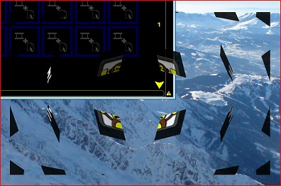 
	 
	Rotate 
	 
	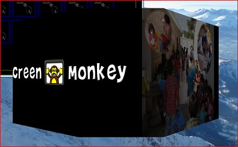
</li>
	<li>
ESV 
	 Clip Display Updated 
	 
	The ESV clip now benefits from the same display framework as songs. 
	 
	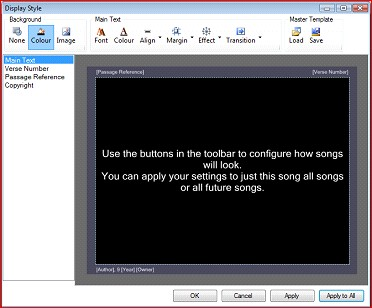 
	 
	<a href="#"> Back to top</a>
</li>
</ol>

&#160;

<h3>24th December 2008: Version 3.2</h3>
<ol>
	<li>Renderer 
	 Plugin System 
	 
	The rendering system which is what actually displays the clips of the 
	 screen has now been made pluginable. This opens up the way for different 
	 types of renderers which work on different operating systems. It allows 
	 the display to be easily extended and gives the user the ability to 
	 select which type of renderer to use. You can only use one renderer 
	 at a time and the user selects which renderer to use in the settings 
	 under &quot;Display Renderer&quot;. 
	 
	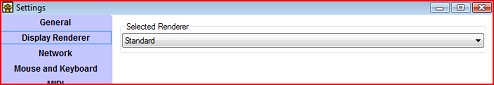 
	 
	Version 3.2 will be released with two renderers. The Standard and a 
	 new WPF renderer. 
	 
	With the WPF renderer you get the added capability of new 3D effects 
	 but this renderer does not support all clip types. Please note that 
	 when you change renderers the available effects may change. 
	 
	<a href="#"> Back to top</a></li>
</ol>

&#160;

<h3>14th December 2008: Version 3.2</h3>
<ol>
	<li>
Auto 
	 Save 
	 
	This is a much requested feature as you like to have the peace of mind 
	 that should something go wrong you will not lose your work. You can 
	 now create your show in the comfort that Screen Monkey is saving your 
	 changes in the background. You have the option of changing the Auto 
	 Save period or disabling it altogether. To setup auto save you go 
	 to Settings. 
	 
	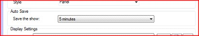
</li>
	<li>
ESV 
	 Clip Uses REST Interface 
	 
	Updated the ESV clip to use the new ESV REST interface provided by 
	 www.esv.org. This is where it gets the words for the passages from. 
	 
	<a href="#"> Back to top</a>
</li>
</ol>

&#160;

<h3>6th December 2008: Version 3.2</h3>
<ol>
	<li>
Cue/Edit 
	 PowerPoint Clips 
	 
	You can now edit PowerPoint clips by selecting the slides to be shown 
	 and change the transition time of each slide. This can now all be 
	 done from within PowerPoint. The edit window also offers a useful 
	 visual reference for what the PowerPoint contains as it displays all 
	 the slides and can be left open while the clip is live. 
	 
	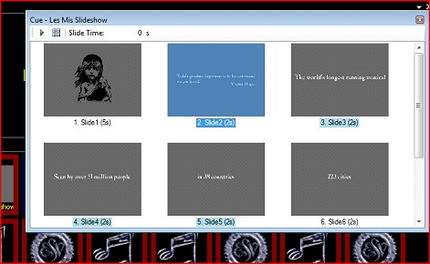 
	 
	The slides that will be shown are highlighted in blue and the live 
	 slide is highlighted in yellow. You can select a range of slides and 
	 by clicking the set slide range button you will set which slides are 
	 displayed during playback. Selecting a slide and clicking play will 
	 change the live slide (if the clip is live then the live output will 
	 change). When you select a slide you can also set a transition time 
	 for the slide. When you double click on a slide it will also set the 
	 live slide. 
	 
	<a href="#"> Back to top</a>
</li>
</ol>

&#160;

<h3>27th November 2008: Version 3.2</h3>
<ol>
	<li>
Moved 
	 Screen MonkeySettings.XML Location 
	 
	The settings file for Screen Monkey, used to be stored in the Program 
	 Files folder with the application. However when using a low privilege 
	 user account the application would be prevented from saving its settings. 
	 This file has now been moved to the Application Data folder which 
	 can be accessed by low privileged users.
</li>
	<li>
Hide 
	 Layer 
	 
	A layer can now be permanently hidden so that it is never displayed. 
	 This is useful if you want to run audio files which have no visible 
	 output and you want to ensure the black output is never displayed. 
	 To set to hidden go to the display profile editor and set Hidden to 
	 true for the layer you want to hide. 
	 
	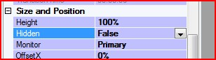 
	 
	<a href="#"> Back to top</a>
</li>
</ol>

&#160;

<h3>16th November 2008: Version 3.2</h3>
<ol>
	<li>
PowerPoint 
	 Auto Start 
	 
	When a PowerPoint is set to auto-transition it will start playing straight 
	 away instead of having to manually advance the first slide.
</li>
	<li>
Move 
	 Clip 
	 
	This is a long awaited feature and has been the subject of many requests. 
	 You have setup a series of clips but they are in the wrong order. 
	 Well now you can enter edit mode (click on the pencil icon) and drag 
	 any of the clips about. You can even drag clips between a space and 
	 the main dashboard. When in list view you just highlight the clip 
	 you want to move and drag it about, no need to enter edit mode.
</li>
	<li>
<a 
	 href="../reference/clipTypes/Song/SongClip.md">Song</a> Library 
	 Update 
	 
	When searching for songs in a folder, if you add a new song to that 
	 folder it will now include that in the search with no need to restart 
	 the application.
</li>
	<li>
Song 
	 License Text 
	 
	If when showing song clips you are required to show a license number 
	 (such as CCL) then you can do this by editing the song and selecting 
	 Tools &gt; License Text from 
	 the menu. Select &quot;Show license text&quot; and enter the license 
	 number in the text box. This will be appended to the copyright text. 
	 
	<a href="#"> Back to top</a>
</li>
</ol>

&#160;

<h3>10th November 2008: Version 3.2</h3>
<ol>
	<li>
Space 
	 Clip Interactions 
	 
	Two interactions are available for space clips which you can assign 
	 keyboard keys to. They are next and previous clip and change the live 
	 clip of the last space to be played.
</li>
	<li>
Clip 
	 List Toolbar 
	 
	A toolbar in the clip list allows you to add a new clip, cue the selected 
	 clip and change the live clip for the space. 
	 
	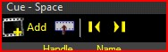 
	 
	<a href="#"> Back to top</a>
</li>
</ol>

&#160;

<h3>9th November 2008: Version 3.2</h3>
<ol>
	<li>
Docking 
	 Windows 
	 
	All the windows in Screen Monkey are now dockable. This offers an extremely 
	 powerful and flexible way of arranging all the different elements 
	 of the software. Where before all the windows would appear on-top 
	 of each other you can now arrange the elements in the layout you want. 
	 
	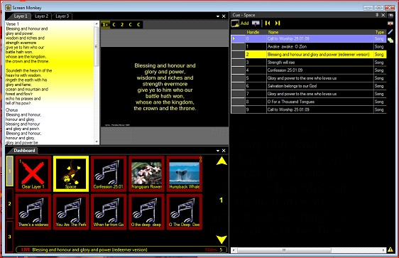 
	 
	To change the layout you drag the window to the position you want to 
	 move it. As you drag the window you will see guides appear indicating 
	 where you can drop the window to dock it. 
	 
	 
	 
	If you drag the window outside all the other windows then it will float. 
	 Dropping the window in the center of the guide will cause it to become 
	 tabbed. 
	 
	 
	 
	To view a window that is tabbed just click on the tab to make it visible. 
	 You can also pin a window so that it is hidden but slides out when 
	 you click on the window icon. To pin a window you click on the pin 
	 icon. 
	 
	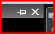 
	 
	Please note that the window must be docked and not tabbed to see this 
	 icon. When the window is pinned it will appear as a small button against 
	 the edge you pinned it to. 
	 
	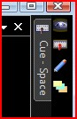 
	 
	You now have a great deal of flexibility to layout the different parts 
	 of Screen Monkey, where you want them. 
	 
	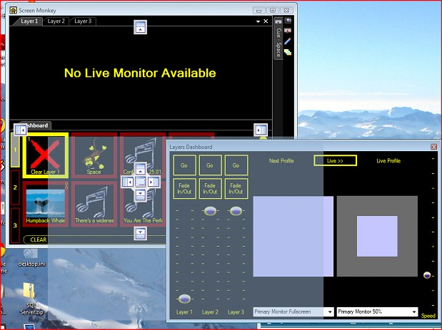
</li>
	<li>
Space 
	 Clip Live Item Highlight 
	 
	The space clip now highlights the live item in orange. This is different 
	 to the context item in purple which is the selected item you can edit 
	 or change. The live item is the clip that will be displayed when you 
	 play the space. When the space is actually live then the highlight 
	 changes to yellow. 
	 
	<a href="#"> Back to top</a>
</li>
</ol>

&#160;

<h3>7th November 2008: Version 3.2</h3>
<ol>
	<li>
Space 
	 Clip Next and Previous 
	 
	The next and previous interactions for the space clip will now move 
	 to the next and previous clip in the list of clips in the space. To 
	 move to the next clip just click on the clip and holding shift while 
	 clicking on the clip will move to the previous clip. These keys are 
	 also definable in the settings under &quot;<a href="../Reference/Setup/Settings/MouseandKeyboard.md">Mouse 
	 and Keyboard</a>&quot;.
</li>
	<li>
Mouse 
	 and Keyboard Interaction or MIDI Highlight 
	 
	When in either the &quot;Mouse and Keyboard&quot; or the &quot;MIDI&quot; 
	 settings. If an action has an input such as a key press assigned to 
	 it then it will now appear in bold in the list.
</li>
	<li>
<a 
	 href="../Reference/Setup/Settings/MouseandKeyboard.md">Mouse and 
	 Keyboard</a> Interaction or <a href="../Reference/Setup/Settings/MIDI.md">MIDI</a> 
	 Clear Button 
	 
	A new clear button has been added to the mouse and keyboard settings 
	 to allow you to un-assign a key press from an action. To un-assign 
	 an action you select the action so it is highlighted and click on 
	 the cross button. Pressing the Delete key will also have the same 
	 effect. 
	 
	<a href="#"> Back to top</a>
</li>
</ol>

&#160;

<h3>26th October 2008: Version 3.2</h3>
<ol>
	<li>
Song 
	 Clip Double Line Break 
	 
	Placing a double line break in a song will force the next text to be 
	 displayed on a separate slide.
</li>
	<li>
Cue 
	 / Edit Clip Shortcut  
	 
	You can now open the cue / edit clip window by pressing the middle 
	 mouse button while the mouse pointer is over the clip you want to 
	 edit. 
	 
	<a href="#"> Back to top</a>
</li>
</ol>

&#160;

<h3>18th October 2008: Version 3.2</h3>
<ol>
	<li><a 
	 href="../reference/clipTypes/Song/WorkingWithLabels.md">Song Clip 
	 Labels</a> 
	 
	You can now add a label to a song clip. This gives you the ability 
	 to tag similar songs with the same label and during searching you 
	 can only search for songs with a specific label.</li>
	<li>
<a 
	 href="../Reference/Setup/Settings/General.md#Style">Dashboard Style</a> 
	 
	It is now possible to change the style of the main dashboard. This 
	 changes the way clips are displayed in the main dashboard. You have 
	 two options: Panel and List. 
	
</li>
</ol>

<a href="#"> Back to 
 top</a>

&#160;

<h3>13th October 2008: Version 3.2</h3>
<ol>
	<li>
<a 
	 href="../reference/clipTypes/FlashClip.md">Flash clip</a> link 
	 
	Fixed bug where flash clips would not play when linked to with the 
	 timer. 
	 
	<a href="#"> Back to top</a>
</li>
</ol>

&#160;

<h3>10th October 2008: Version 3.2</h3>
<ol>
	<li><a href="../reference/clipTypes/CueListSpaceClip.md">Space 
	 Clip</a> 
	 
	A space clip is a clip which can store many other clips and play them 
	 back in a list form. 
	 
	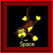 
	 
	<a href="#"> Back to top</a></li>
</ol>

&#160;

<h3>9th October 2008: Version 3.2</h3>
<ol>
	<li>
Command 
	 Line Arguments 
	 
	A range of command line arguments can be specified when running Screen 
	 Monkey to perform certain operations. See the <a href="..\FAQ\CommandLineArguments.md">Command 
	 Line Arguments</a> help topic under information for a full list of 
	 arguments and how to specify them. This feature is useful when trying 
	 to automate the software.
</li>
	<li>
File 
	 Associations 
	 
	You can now associate supported media files with Screen Monkey and 
	 open them directly. Once you have associated the file just double 
	 click on them in explorer and they will be added to the clip library 
	 and start playing straight away. By selecting and opening multiple 
	 files you can quickly add many files for playback. 
	 
	<a href="#"> Back to top</a>
</li>
</ol>
