<h1>Version 3.3</h1>
<ul style="text-align:left; font-family:Arial;font-size:12pt;font-weight: normal;font-style: normal;text-decoration: none;"  >
 <li><a href="#MiniTOCBookMark2" class="hcp2">2nd December 2009: Version 3.3</a>
</li>
 <li><a href="#MiniTOCBookMark3" class="hcp2">9th November 2009: Version 3.3</a>
</li>
 <li><a href="#MiniTOCBookMark4" class="hcp2">24th October 2009: Version 3.3</a>
</li>
 <li><a href="#MiniTOCBookMark5" class="hcp2">22nd October 2009: Version 3.3</a>
</li>
 <li><a href="#MiniTOCBookMark6" class="hcp2">20th October 2009: Version 3.3</a>
</li>
 <li><a href="#MiniTOCBookMark7" class="hcp2">18th October 2009: Version 3.3</a>
</li>
 <li><a href="#MiniTOCBookMark8" class="hcp2">15th October 2009: Version 3.3</a>
</li>
 <li><a href="#MiniTOCBookMark9" class="hcp2">8th October 2009: Version 3.3</a>
</li>
 <li><a href="#MiniTOCBookMark10" class="hcp2">1st October 2009: Version 3.3</a>
</li>
 <li><a href="#MiniTOCBookMark11" class="hcp2">21st September 2009: Version 3.3</a>
</li>
 <li><a href="#MiniTOCBookMark12" class="hcp2">19th September 2009: Version 3.3</a>
</li>
 <li><a href="#MiniTOCBookMark13" class="hcp2">25th August 2009: Version 3.3</a>
</li>
 <li><a href="#MiniTOCBookMark14" class="hcp2">20th August 2009: Version 3.3</a>
</li>
 <li><a href="#MiniTOCBookMark15" class="hcp2">1st August 2009: Version 3.3</a>
</li>
 <li><a href="#MiniTOCBookMark16" class="hcp2">30th July 2009: Version 3.3</a>
</li>
 <li><a href="#MiniTOCBookMark17" class="hcp2">4th July 2009: Version 3.3</a>
</li>
 <li><a href="#MiniTOCBookMark18" class="hcp2">3rd March 2009: Version 3.3</a>
</li>
</ul>
<h3>2nd December 2009: Version 3.3</h3>
<ol>
	<li>
Load 
	 Show Advanced 
	 
	Allows you to load settings and display profiles from a saved. show. 
	 So now as well as transferring the clips between computers you can 
	 also transfer all your settings. When you load a show you are presented 
	 with a dialog telling you the show name. If you select the advanced 
	 tab then you can select which sections of a show you want to load. 
	 
	 
	 
	<a href="#"> Back to top</a>
</li>
</ol>

&#160;

<h3>9th November 2009: Version 3.3</h3>
<ol>
	<li>
Seamless 
	 Video Looping 
	 
	You can now loop videos seamlessly without any pause or stutter as 
	 the video rewinds. You can now use special video lops for backgrounds 
	 to show.
</li>
	<li>
Seamless 
	 Audio Looping 
	 
	Audio will now loop seamlessly with no gap when rewinding to the start.
</li>
	<li>
Audio 
	 Clip 64 Bit Support 
	 
	The audio clip now works on 64bit windows platforms. Previously a bug 
	 in the .net framework meant that audio would fail when run on a 64Bit 
	 operating system.
</li>
	<li>
Multiple 
	 Action Triggers 
	 
	The mouse, keyboard and midi actions all now support multiple action 
	 triggers. This means you can assign more than one key to any action. 
	 This is useful when for example you want a PowerPoint slide to transition 
	 on the arrow keys as well as the next slide button on your wireless 
	 remote. 
	 
	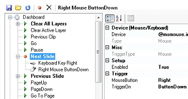 
	 
	<a href="#"> Back to top</a>
</li>
</ol>

&#160;

<h3>24th October 2009: Version 3.3</h3>
<ol>
	<li>
Software 
	 De-Interlacing 
	 
	Added the ability to de-interlace live video using a software filter. 
	 This is used if the hardware does not support de-interlacing. If this 
	 is the case the software will appear in brackets next to the option.
</li>
	<li>
Fixed 
	 PowerPoint Pausing 
	 
	I think I have finally fixed a long standing bug where when you have 
	 a PowerPoint running and you click on another window it pauses the 
	 PowerPoint presentation.
</li>
	<li>
Developer 
	 Console 
	 
	A new developer console has been added to make it easier for people 
	 developing plugins. The console allows you to write debug messages 
	 using SmConsole.WriteLine() and they will appear on startup. The developer 
	 console can be shown by using the command line switch /debug. 
	 
	<a href="#"> Back to top</a>
</li>
</ol>

&#160;

<h3>22nd October 2009: Version 3.3</h3>
<ol>
	<li>Screen 
	 Saver Clip 
	 
	Added a new screen saver clip which allows you to play any of the installed 
	 Windows screen savers within Screen Monkey. <a href="../reference/clipTypes/ScreenSaverClip.md">Click 
	 here</a> for more information. 
	 
	<a href="#"> Back to top</a></li>
</ol>

&#160;

<h3>20th October 2009: Version 3.3</h3>
<ol>
	<li>
ArtNet 
	 
	ArtNet is an Ethernet protocol which allows lighting consoles that 
	 output DMX to stream that data over a network. The new ArtNet interaction 
	 allows lighting consoles and other ArtNet devices (such as remotes) 
	 to control Screen Monkey. Please note that this plug-in is not free 
	 and must be purchased separately for a small charge. When you first 
	 go into settings and select ArtNet you will be presented with a screen 
	 which asks you to activate the plug-in. Once the plug-in is activated 
	 you will be able to control the layer opacity, play state and select 
	 clips on each layer. This is really useful if you are controlling 
	 your show from a lighting desk and do not want to have a separate 
	 operator. 
	 
	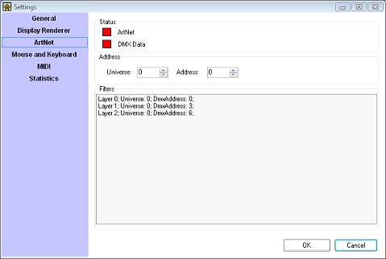 
	 
	In the settings window there are two indicators, the ArtNet indicator 
	 shows whether any ArtNet is being received and the DMX Data indicator 
	 shows whether DMX is being received on the correct universe. You can 
	 also change the DMX Address and ArtNet Universe that the layers listen 
	 on. Each layer has separate control and the channel layout is shown 
	 below.
</li>
</ol>
<table style="border-width: 0px; margin-left: 54px;" cellspacing="0">
	<tr class="hcp6">
		<td width="88" class="hcp7">
Control
</td>
		<td width="136" class="hcp7">
Function
</td>
		<td width="82" class="hcp7">
DMX 
		 Offset
</td>
		<td width="82" class="hcp7">
DMX 
		 Range
</td>
	</tr>
	<tr class="hcp6">
		<td width="88" class="hcp7">&#160;</td>
		<td width="136" class="hcp7">&#160;</td>
		<td width="82" class="hcp7">&#160;</td>
		<td width="82" class="hcp7">&#160;</td>
	</tr>
	<tr class="hcp6">
		<td width="88" class="hcp7">
Layer 
		 Opacity
</td>
		<td width="136" class="hcp7">
Opacity
</td>
		<td width="82" class="hcp7">
0
</td>
		<td width="82" class="hcp7">
0-255
</td>
	</tr>
	<tr class="hcp6">
		<td width="88" class="hcp7">&#160;</td>
		<td width="136" class="hcp7">&#160;</td>
		<td width="82" class="hcp7">&#160;</td>
		<td width="82" class="hcp7">&#160;</td>
	</tr>
	<tr class="hcp6">
		<td width="88" class="hcp7">
Playback
</td>
		<td width="136" class="hcp7">
Clear 
		 Layer
</td>
		<td width="82" class="hcp7">
1
</td>
		<td width="82" class="hcp7">
0-2
</td>
	</tr>
	<tr class="hcp6">
		<td width="88" class="hcp7">&#160;</td>
		<td width="136" class="hcp7">
Play 
		 Clip
</td>
		<td width="82" class="hcp7">&#160;</td>
		<td width="82" class="hcp7">
3-5
</td>
	</tr>
	<tr class="hcp6">
		<td width="88" class="hcp7">&#160;</td>
		<td width="136" class="hcp7">
Pause 
		 Clip
</td>
		<td width="82" class="hcp7">&#160;</td>
		<td width="82" class="hcp7">
6-8
</td>
	</tr>
	<tr class="hcp6">
		<td width="88" class="hcp7">&#160;</td>
		<td width="136" class="hcp7">&#160;</td>
		<td width="82" class="hcp7">&#160;</td>
		<td width="82" class="hcp7">&#160;</td>
	</tr>
	<tr class="hcp6">
		<td width="88" class="hcp7">
Clip 
		 Select
</td>
		<td width="136" class="hcp7">
Index 
		 / Handle
</td>
		<td width="82" class="hcp7">
2,3
</td>
		<td width="82" class="hcp7">
0-65535
</td>
	</tr>
	<tr class="hcp6">
		<td height="20" width="88" class="hcp7">&#160;</td>
		<td height="20" width="136" class="hcp7">&#160;</td>
		<td height="20" width="82" class="hcp7">&#160;</td>
		<td height="20" width="82" class="hcp7">&#160;</td>
	</tr>
</table>

<a href="#"> Back to 
 top</a>

&#160;

<h3>18th October 2009: Version 3.3</h3>
<ol>
	<li>
Bold 
	 Font in Song Clip 
	 
	Fixed a bug where setting the font for a song clip to bold was not 
	 being saved in a show. This meant that when the software re-started 
	 it had the font you chose but not in bold. 
	 
	<a href="#"> Back to top</a>
</li>
</ol>

&#160;

<h3>15th October 2009: Version 3.3</h3>
<ol>
	<li>
Layer 
	 List in Profile Editor 
	 
	A list of layers has been added to the display profile editor to make 
	 it easy to select the layer you want to edit. It was difficult before 
	 if a layer was underneath another layer to select it and make changes. 
	 The layer list makes it simple to select a layer for editing. The 
	 layer properties changes to display the properties for the selected 
	 layer. &#160; 
	 
	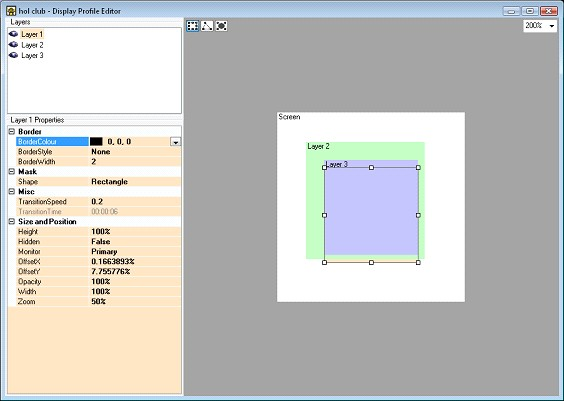
</li>
	<li>
Hide 
	 Layers in Profile Editor 
	 
	You can now toggle the visibility of a layer in the profile editor 
	 to hide layers you are not working on. This allows you to see layers 
	 beneath other layers to make changes. 
	 
	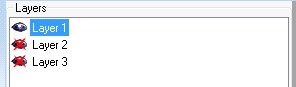 
	 
	<a href="#"> Back to top</a>
</li>
</ol>

&#160;

<h3>8th October 2009: Version 3.3</h3>
<ol>
	<li>
Rubber 
	 Band Selection in Edit Mode 
	 
	You can now select clips in edit mode by clicking and dragging the 
	 mouse to create a box inside which the clips are selected. This makes 
	 it easy to select multiple clips in edit mode using the mouse. You 
	 enter the edit mode by clicking on the edit icon in the toolbar. You 
	 can still use the Shift and Control keys to add to an existing selection. 
	 
	
</li>
	<li>
Move 
	 Multiple Clips 
	 
	You can now move all the selected clips instead of just a single clip 
	 at a time. To move a range of clips, select the clips you want to 
	 move and then drag the clips to their new location.
</li>
	<li>
Green 
	 Panel Border in Edit Mode 
	 
	The clip panel border now turns green in edit mode to indicate that 
	 you are in edit mode and you cannot run a clip by clicking on it.
</li>
	<li>
Toggle 
	 Edit Mode Shortcut Key 
	 
	The keyboard shortcut Ctrl+E will toggle the edit mode on and off. 
	 You can change the shortcut key under Settings &gt; Mouse and Keyboard.
</li>
	<li>
Effects 
	 Clip 
	 
	The effects clip allows you to generate animations with a simple scripting 
	 syntax. For those less adventurous it includes a number of presets 
	 from which you can create animated graphics to go with your presentation. 
	 
	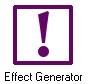 
	 
	To add a new effect, click on an empty clip slot and select the Effect 
	 Generator clip type. This will open the effect library from which 
	 you can choose a number of default effects. 
	 
	 
	 
	For those more adventurous you can select &quot;Create new effect...&quot;. 
	 This will open an editor where you use a simple scripting language 
	 to create effects. 
	 
	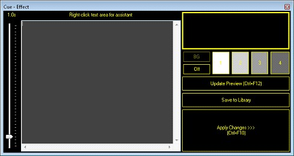  
	 
	When you right click in the grey area it opens a helper dialog which 
	 will get you started creating your own effects. Also in this window 
	 is a preview window to see the effect you are creating and a speed 
	 slider to change the speed of the animation. Very quickly you can 
	 create good looking animations to put under song text or show on your 
	 screen. 
	 
	 
	 
	<a href="#"> Back to top</a>
</li>
</ol>

&#160;

<h3>1st October 2009: Version 3.3</h3>
<ol>
	<li>
Create 
	 Clips Sorted by Last Used 
	 
	The clip types when creating clips are now sorted by last used date. 
	 This means that the most recently used clips will appear first in 
	 the list. 
	 
	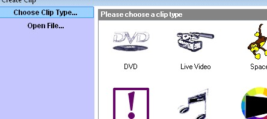 
	 
	<a href="#"> Back to top</a>
</li>
</ol>

&#160;

<h3>21st September 2009: Version 3.3</h3>
<ol>
	<li>
DVD 
	 Drive Quick Play 
	 
	When you create a DVD clip instead of you having to browse to the DVD 
	 files it now asks you if you want to play the disc in the DVD drive. 
	 You can still select &quot;Browse&quot; to browse to the files as 
	 before. It makes it a lot easier for unfamiliar users to play DVD 
	 discs. 
	 
	 
	 
	<a href="#"> Back to top</a>
</li>
</ol>

&#160;

<h3>19th September 2009: Version 3.3</h3>
<ol>
	<li>
Audio 
	 Clip Play State 
	 
	The audio clip now shows the play state icon in the top right of the 
	 panel.
</li>
	<li>
Live 
	 Video Audio Input 
	 
	You can now select an audio input to use with a live video clip. If 
	 you have a live video source which also has an audio feed through 
	 the sound card you can now tie it to the live video clip. This means 
	 that the audio will be faded with the clip and so transitioning from 
	 a live source to another clip means the audio will also fade. 
	 
	 
	 
	You set the audio source when creating the live video clip by selecting 
	 from the drop down list of audio devices. Just select the audio input 
	 you wish to use. 
	 
	<a href="#"> Back to top</a>
</li>
</ol>

&#160;

<h3>25th August 2009: Version 3.3</h3>
<ol>
	<li>
Dashboard 
	 Toolbar Single Click 
	 
	In previous versions if the main dashboard toolbar containing Live 
	 Monitor, Layers Control icons would require a double click to open 
	 the windows. It now only requires a single click.
</li>
	<li>
View 
	 Profiles 
	 
	View profiles allow you to save the current window layout and state 
	 so they can be restored at a later date. This is useful if you have 
	 a default window layout which you want to go back to. To load a window 
	 layout select the layout icon and choose the state you want. 
	 
	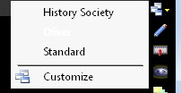 
	 
	To save a layout select &quot;Customize&quot; and then new. This will 
	 save the current layout and will appear in the list of layouts with 
	 the name you chose. 
	 
	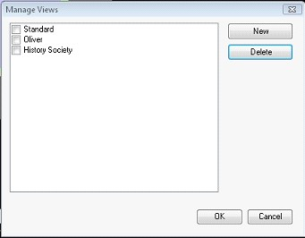 
	 
	<a href="#"> Back to top</a>
</li>
</ol>

&#160;

<h3>20th August 2009: Version 3.3</h3>
<ol>
	<li>
Audio 
	 Volume Fader 
	 
	Improved the smoothness of the audio clip volume fader.
</li>
	<li>
WMA 
	 Audio Support 
	 
	Added support for WMA audio files. These can now be played by the audio 
	 clip. 
	 
	<a href="#"> Back to top</a>
</li>
</ol>

&#160;

<h3>1st August 2009: Version 3.3</h3>
<ol>
	<li>
MIDI 
	 Trigger Levels 
	 
	The MIDI trigger level allows you to specify whether data2 is ignored 
	 or used in matching the trigger. This is useful if you want to change 
	 the behavior for different MIDI devices. If we have a MIDI trigger 
	 Command = NoteOn, data1 = 16, data2 = 32 and we get a MIDI NoteOn 
	 data1 = 16, data2 = 42. With the level set to data1 the action would 
	 be executed because the disparity in data2 is ignored. If the level 
	 was set to data2 then the action would not occur because the two data2 
	 values are different. 
	 
	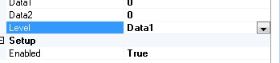
</li>
	<li>
Ticker 
	 Tape Settings 
	 
	Each ticker tape clip can now has individual settings. Previously each 
	 clip would share settings.
</li>
	<li>
Custom 
	 Verse Tags 
	 
	You can now add your own verse tags to use when entering songs. This 
	 allows you to customize the default tags of Verse 1-9, Chorus and 
	 Bridge. To create your own tags open the song for editing and from 
	 the Tools menu select &quot;Song Tags&quot;. You have the option to 
	 add new tags or edit old ones. 
	 
	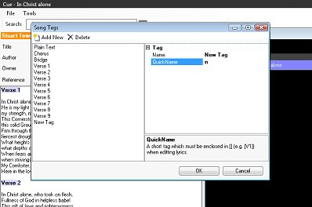
</li>
	<li>
Search 
	 Label Filter 
	 
	The new song label filter allows you to narrow down the search for 
	 a specific song to only those with the label you apply. This provides 
	 an easy means to categorize your songs. You may want to apply a label 
	 such as &quot;Christmas Songs&quot; so you can search for only songs 
	 related to Christmas. 
	 
	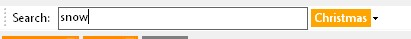 
	 
	<a href="#"> Back to top</a>
</li>
</ol>

&#160;

<h3>30th July 2009: Version 3.3</h3>
<ol>
	<li>
Song 
	 Clip Lyrics Edit Copy/Paste Popup 
	 
	A popup menu has been added to the lyrics editor of a song clip. When 
	 you right click in the edit area it displays a copy and paste menu. 
	 The keyboard shortcuts Ctrl+C, Ctrl+V work as before. 
	 
	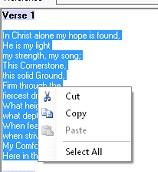
</li>
	<li>
Pasting 
	 Lyrics Removes Rich Text Formatting 
	 
	When you paste into the lyrics edit area it now removes any rich text 
	 formatting. Before it could be annoying if you pasted lyrics with 
	 a large font as it made it difficult to edit the song.
</li>
	<li>
Clip 
	 Interaction Additions 
	 
	The following interaction functions have been added to the interface 
	 for developers.
</li>
</ol>
<ul type="disc">
	<ul type="disc">
		<li>notification when a clip starts to play.</li>
		<li>information about a clip in the library.</li>
	</ul>
</ul>

<a href="#"> Back to 
 top</a>

&#160;

<h3>4th July 2009: Version 3.3</h3>
<ol>
	<li>
Cue 
	 Audio Clip 
	 
	The audio clip now has a cue control which allows you to specify a 
	 start and stop time for the audio clip. The play controls and timeline 
	 allow you to navigate the audio to find the in and out points you 
	 want. You then select the set In/Out point buttons to play just the 
	 clip you want. The loop button can be pressed to create an audio loop. 
	 
	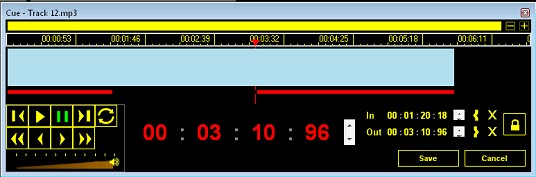
</li>
	<li>
Audio 
	 Clip Album Art 
	 
	The thumbnail in an audio clip is now automatically generated from 
	 the album art in the ID3 tag. If your MP3 contains album art in the 
	 ID3 tag then you will see that image instead of the default audio 
	 clip logo. Before it used to search the internet for a suitable image 
	 but this has been removed. 
	 
	<a href="#"> Back to top</a>
</li>
</ol>

&#160;

<h3>3rd March 2009: Version 3.3</h3>
<ol>
	<li>
Play 
	 Clip on Layer MIDI Command 
	 
	A new MIDI command has been added to play a clip on a specified layer. 
	 The new command can be found under the layer playback group. The data1 
	 parameter is the index of the clip to play on that layer.
</li>
	<li>
Cannot 
	 select DVD chapters 
	 
	Fixed a bug where you could not select the DVD chapter to play from 
	 the popup menu. The only way to cue a DVD was through the cue window. 
	 
	<a href="#"> Back to top</a>
</li>
</ol>
