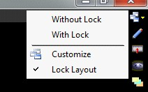
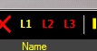
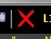
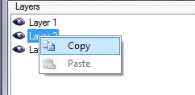
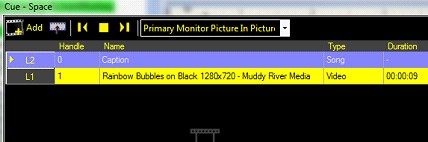
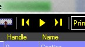
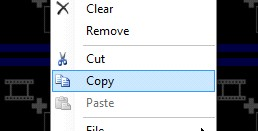
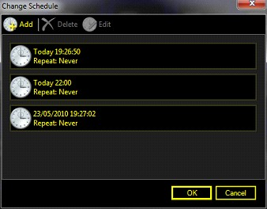
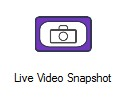

<h1>Version 3.4</h1>
<ul style="text-align:left; font-family:Arial;font-size:12pt;font-weight: normal;font-style: normal;text-decoration: none;"  >
 <li><a href="#MiniTOCBookMark2" class="hcp2">June 2010: Version 3.4</a>
</li>
 <li><a href="#MiniTOCBookMark3" class="hcp2">May 2010: Version 3.4</a>
</li>
 <li><a href="#MiniTOCBookMark4" class="hcp2">March 2010: Version 3.4</a>
</li>
 <li><a href="#MiniTOCBookMark5" class="hcp2">February 2010: Version 3.4</a>
</li>
 <li><a href="#MiniTOCBookMark6" class="hcp2">January 2010: Version 3.4</a>
</li>
</ul>
<h3>June 2010: Version 3.4</h3>
<ol>
	<li>
Additional 
	 ArtNet Channels 
	 
	Two new channels have been added to a master section of the ArtNet 
	 interaction. The channel assignment for the new master section is 
	 listed bellow. The new section appears before the layers. 
	
</li>
</ol>
<table style="border-width: 0px; margin-left: 55px;" cellspacing="0">
	<tr class="hcp4">
		<td width="142" bgcolor="#C0C0C0" class="hcp5">
Control
</td>
		<td width="82" bgcolor="#C0C0C0" class="hcp5">
Function
</td>
		<td width="82" bgcolor="#C0C0C0" class="hcp5">
DMX 
		 Offset
</td>
		<td width="82" bgcolor="#C0C0C0" class="hcp5">
DMX 
		 Range
</td>
	</tr>
	<tr class="hcp4">
		<td width="142" class="hcp7">&#160;</td>
		<td width="82" class="hcp7">&#160;</td>
		<td width="82" class="hcp7">&#160;</td>
		<td width="82" class="hcp7">&#160;</td>
	</tr>
	<tr class="hcp4">
		<td width="142" class="hcp7">
Display 
		 Profile Select
</td>
		<td width="82" class="hcp7">
Index 
		 1
</td>
		<td width="82" class="hcp7">
0
</td>
		<td width="82" class="hcp7">
0-2
</td>
	</tr>
	<tr class="hcp4">
		<td width="142" class="hcp7">&#160;</td>
		<td width="82" class="hcp7">
Index 
		 2
</td>
		<td width="82" class="hcp7">&#160;</td>
		<td width="82" class="hcp7">
3-5
</td>
	</tr>
	<tr class="hcp4">
		<td width="142" class="hcp7">&#160;</td>
		<td width="82" class="hcp7">
etc
</td>
		<td width="82" class="hcp7">&#160;</td>
		<td width="82" class="hcp7">
...
</td>
	</tr>
	<tr class="hcp4">
		<td width="142" class="hcp7">&#160;</td>
		<td width="82" class="hcp7">&#160;</td>
		<td width="82" class="hcp7">&#160;</td>
		<td width="82" class="hcp7">&#160;</td>
	</tr>
	<tr class="hcp4">
		<td width="142" class="hcp7">
Display 
		 Profile
</td>
		<td width="82" class="hcp7">
Transition 
		 Speed
</td>
		<td width="82" class="hcp7">
1
</td>
		<td width="82" class="hcp7">
0-255
</td>
	</tr>
</table>
<ol start="2">
	<li>
Added 
	 De-interlace filter settings 
	 
	A new setting has been added to the application configuration file 
	 that allows you to change the de-interlace filter when you have software 
	 de-interlacing selected. The default is to use the DScalar filter.
</li>
	<li>
Custom 
	 Song Tag Interactions 
	 
	You can now assign interactions to custom song tags which you create 
	 in the song clips. 
	 
	<a href="#"> Back to top</a>
</li>
</ol>

&#160;

<h3>May 2010: Version 3.4</h3>
<ol>
	<li>
Lock 
	 Layout 
	 
	A new option in the view menu has been added to lock the layout and 
	 prevent any docking windows from being accidentally moved. This also 
	 prevents any windows from being closed. This ensures that windows 
	 are not closed accidentally. When you save a view the lock state is 
	 also saved. 
	 
	
</li>
	<li>
Live 
	 Video Snapshot Export Image 
	 
	You can now export images to a file captured with the live video snapshot 
	 clip. Once you have created a live video snapshot you can right click 
	 on the clip and select Export. You can export to JPEG, PNG, BMP or 
	 TIFF format.
</li>
	<li>
Space 
	 Active Layer 
	 
	New controls have been added to the space clip to allow you to set 
	 the active layer. This is the layer clips will be played on if set 
	 to run on the active layer. 
	 
	
</li>
	<li>
Space 
	 Clip Clear Layer 
	 
	A new clear layer button has been added to the space clip. The new 
	 control will clear any clips on the active layer. 
	 
	 
	 
	<a href="#"> Back to top</a>
</li>
</ol>

&#160;

<h3>March 2010: Version 3.4</h3>
<ol>
	<li>
Statistics 
	 
	The new statistics interaction allows you to log information on the 
	 playback and save to a CSV file. <a href="../Reference/Setup/Settings/Statistics.md">Click 
	 here</a> for more information on Statistics.
</li>
	<li>
Clear 
	 Clip 
	 
	A new clear clip type has been added. This allows you to add clear 
	 screen as a normal clip in addition to the standard layer clear buttons. 
	 You now have the flexibility to place and link to clear screen anywhere.
</li>
	<li>
Next 
	 Schedule Time in Info Bar 
	 
	The next schedule time for a clip now appears in the info bar when 
	 you hover the mouse over a clip.
</li>
	<li>
Clip 
	 List Duration Column 
	 
	A clip duration column has been added to the grid when viewing clips 
	 in a list.
</li>
	<li>
Space 
	 Clip Link At End 
	 
	A space clip can now be linked using the AtEnd event. The event will 
	 occur when all the clips in the space finish playing.
</li>
	<li>
Space 
	 Clip Auto Rewind 
	 
	A space clip can now be configured to auto rewind so it returns to 
	 playing the first clip when the space clip is stopped. The default 
	 is for the space clip to remain on the last played clip. This function 
	 is useful when playing a series of images which need to reset to the 
	 beginning each time you play them.
</li>
	<li>
Linked 
	 video loop freeze 
	 
	Fixed bug where leaving two video clips to link to each other for more 
	 than 24 hours would cause the software to freeze.
</li>
	<li>
PowerPoint 
	 Play at Start 
	 
	Fixed bug where a PowerPoint clip would not play when started. 
	 
	<a href="#"> Back to top</a>
</li>
</ol>

&#160;

<h3>February 2010: Version 3.4</h3>
<ol>
	<li>
Layer 
	 Dimensions in Pixels 
	 
	The layer dimensions can now be set in pixels as well as a percentage. 
	 This helps with setup of LED video walls.
</li>
	<li>
Copy 
	 and paste display style layer settings 
	 
	The settings of one layer can be copied to another layer for faster 
	 setting up of display profiles. 
	 
	
</li>
	<li>
Cued 
	 Video Volume not taking effect 
	 
	Fixed bug where cued video volume would not have any effect.
</li>
	<li>
Multi 
	 Layered Spaces 
	 
	This hugely increases the potential of layers and removes the limitation 
	 of just three layers. Now you can have a limitless number of layers 
	 simply by adding more spaces. As well as the standard 3 layers you 
	 can also have 3 layers per space clip. Each space could include a 
	 complicated multi layered scene which only takes up a single layer 
	 on the main dashboard. Each space can be configured to have its own 
	 display profile which is used when displaying clips in that space. 
	 
	 
	 
	 
	 
	Using layers within spaces the text caption on top of this video only 
	 takes a single layer in the main dashboard. 
</li>
	<li>
Play 
	 and Stop buttons in spaces 
	 
	A new play and stop button has been 
	 added to the space clip. This allows you to highlight a clip and play 
	 it by clicking on this button. Double clicking on a clip in a list 
	 will also have the same effect. 
	 
	
</li>
	<li>
Copy 
	 and Paste Clip 
	 
	Clips in the dashboard and spaces 
	 can now be copied and pasted. This immensely reduces the time to build 
	 a show. 
	 
	
</li>
	<li>
Live 
	 Layer Indicator 
	 
	In the clip list the current layer a clip is live on is displayed in 
	 the row header.
</li>
	<li>
Multiple 
	 schedule times for a clip 
	 
	Each clip can now have more than one schedule time. Each clip now shows 
	 a list of times which it is scheduled for. Select Add to schedule 
	 the clip to play at a specific time. 
	 
	
</li>
	<li>
DVD 
	 Link At End 
	 
	You can now link at the end of a <a href="../reference/clipTypes/DVDClip.md">DVD 
	 clip</a>. This means you can now select clips to follow on from DVD 
	 playback. 
	 
	<a href="#"> Back to top</a>
</li>
</ol>

&#160;

<h3>January 2010: Version 3.4</h3>
<ol>
	<li>
Live 
	 Video Snapshot Clip 
	 
	This clip type allows you to quickly and easily take freeze frame images 
	 from <a href="../reference/clipTypes/LiveVideoClip.md">live video</a>. 
	 You can then display those images within Screen Monkey. 
	 
	
</li>
	<li>
Live 
	 Video Upgraded to use VMR9 
	 
	The <a href="../reference/clipTypes/LiveVideoClip.md">live video 
	 clip</a> rendering has been upgraded to use the improved functionality 
	 of VMR9.
</li>
	<li>
Automatic 
	 Seamless Loop Disable 
	 
	Certain clip types do not support seamless loop. This was causing the 
	 clips not to play. The function is now disabled for these video types 
	 so the video can still be played but without seamless loop.
</li>
	<li>
Faster 
	 video clip thumbnail generation 
	 
	The generation of video clip thumbnails has now been made faster.
</li>
	<li>
User 
	 Settings File Location 
	 
	The location of the settings file is now stored in the ScreenMonke.exe.config 
	 file in the install directory. This allows you to specify a different 
	 path for portable applications.
</li>
	<li>
Script 
	 Errors in Web Browser Suppressed 
	 
	Any web page script errors are now suppressed in the web browser clip 
	 type. This allows the pages to load normally.
</li>
	<li>
Scheduled 
	 clips occasionally missed 
	 
	Fixed a bug where items in the scheduler where occasionally missed.
</li>
	<li>
Video 
	 Live Monitor not Appearing 
	 
	Fixed bug where live monitor for a video clip would not appear when 
	 the clip was run for a second time.
</li>
	<li>
FLV 
	 video format not stopping at cue point 
	 
	Fixed bug where FLV video files would not stop at the cue point. 
	 
	<a href="#"> Back to top</a>
</li>
</ol>
