<h1>Version 3.5</h1>
<ul style="text-align:left; font-family:Arial;font-size:12pt;font-weight: normal;font-style: normal;text-decoration: none;"  >
 <li><a href="#MiniTOCBookMark2" class="hcp2">November 2010: Version 3.5</a>
</li>
 <li><a href="#MiniTOCBookMark3" class="hcp2">October 2010: Version 3.5</a>
</li>
 <li><a href="#MiniTOCBookMark4" class="hcp2">September 2010: Version 3.5</a>
</li>
 <li><a href="#MiniTOCBookMark5" class="hcp2">August 2010: Version 3.5</a>
</li>
 <li><a href="#MiniTOCBookMark6" class="hcp2">July 2010: Version 3.5</a>
</li>
</ul>
<h3>November 2010: Version 3.5</h3>
<ol>
	<li>
Extra 
	 Assignable Actions 
	 
	Four new assignable actions have been added which replace Go and Previous 
	 Clip on the Dashboard. The new actions can be found under <a href="../Reference/Setup/Settings/MouseandKeyboard.md">Keyboard 
	 and Mouse Settings</a> within the dashboard section.
</li>
</ol>
<table style="margin-left: 54px; border-collapse: separate; border-collapse: separate;" 
		 cellspacing="0" border="1">
	<col>
	<col>
	<tr>
		<td>
Go
</td>
		<td>Runs the next clip in handle order regardless of which layer 
		 the clip is assigned to.</td>
	</tr>
	<tr>
		<td>
Previous 
		 Clip
</td>
		<td>Runs the previous clip in handle order regardless of which 
		 layer the clip is assigned to.</td>
	</tr>
	<tr>
		<td>
Link 
		 Go
</td>
		<td>Runs the next clip in link order. Only clips which are set 
		 to manual link will play. Only links on the active layer will 
		 respond to this action.</td>
	</tr>
	<tr>
		<td>
Back
</td>
		<td>Plays the last clip to run on the active layer.</td>
	</tr>
</table>

&#160;

<ol start="2">
	<li>
Next 
	 and Previous in Spaces 
	 
	The next and previous clip actions within spaces now apply to clips 
	 on all layers, not just the active layer. The clips will play in handle 
	 order.
</li>
	<li>
Clear 
	 Clip now visible in lists 
	 
	The clear clip will now be displayed when you are in list mode.
</li>
	<li>
Extra 
	 Event Log Information 
	 
	When you save the error log to a file it now includes information about 
	 your system such as Windows version to help with debugging.
</li>
	<li>
Select 
	 Profile to Edit 
	 
	You can now change the display profile you want to edit directly from 
	 the display profile editor. This avoids the profile having to be live 
	 to edit it.
</li>
	<li>
Remove 
	 Old Settings Install Option 
	 
	A new option has been added to the setup which allows you to delete 
	 any previous settings when installing a new version. This can be useful 
	 if you have upgraded Screen Monkey and it wont run. Deleting old settings 
	 will ensure that the fault is not related to an old settings file.
</li>
	<li>
Package 
	 Show 
	 
	The package feature allows you to save your show and also embed any 
	 related files which are required to run that show. This feature is 
	 invaluable when moving a show between computers as it guarantees that 
	 you will always have the video and image files you need for your show. 
	 
	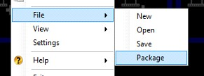 
	 
	The package option is available when you go to save your show and by 
	 selecting it will create a show file that includes any media you have 
	 loaded into clips.
</li>
	<li>
Rotate 
	 and Flip Layer 
	 
	You can now rotate and flip layers to create a great effect or line 
	 up your media to a piece of scenery. The layer can be rotated by any 
	 angle through the display profile editor. 
	 
	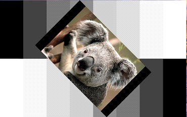
</li>
	<li>
No 
	 Output Warning 
	 
	A warning is now presented when you try and play a clip on a monitor 
	 which is not connected. This could be confusing before since it did 
	 nothing and would appear as if the clip was not working.
</li>
	<li>
Layer 
	 Size and Position DMX Control 
	 
	You can now edit the layers size and position through DMX control. 
	 When ArtNet is activated it creates a new display profile. If you 
	 then select this profile then you can edit the layers settings through 
	 DMX.
</li>
	<li>
Schedule 
	 1 min Repeat 
	 
	Added a repeat time option in the scheduler of 1 min.
</li>
	<li>
Song 
	 Clip Improvements 
	 
	Selecting a verse in the live monitor now jumps to the correct verse 
	 if the verse occurs more than once. Clicking on apply when editing 
	 a clip will not now exit the dialog without saving. Using Ctrl+V to 
	 paste song words will now remove the formatting. 
	 
	<a href="#"> Back to top</a>
</li>
</ol>

&#160;

<h3>October 2010: Version 3.5</h3>
<ol>
	<li>
NEW 
	 Audio Layer 
	 
	A new audio layer has been added specifically for the purpose of playing 
	 audio only audio media. This layer has no visual output making it 
	 much easier to play audio through Screen Monkey. When you add new 
	 audio clips they are automatically be assigned to the audio layer. 
	 
	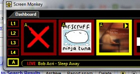
</li>
	<li>
Extra 
	 Layer Added 
	 
	An extra video layer has been added to further extend the potential 
	 of Screen Monkey. That brings the total number of video layers up 
	 to 4. Don't forget though that the number of layers can be further 
	 expanded by adding space clips.
</li>
	<li>
Test 
	 Card Clip 
	 
	The test card clip contains a library of video test cards. <a href="../reference/clipTypes/TestCardClip.md">Click 
	 here</a> for more information. 
</li>
	<li>
SVG 
	 Support 
	 
	The image clip now supports the open standard Scalable Vector Graphics 
	 format. This allows you to display vector graphics directly in Screen 
	 Monkey and not worry about losing quality when you enlarge the image 
	 as vector graphics always look good whatever the size. This is the 
	 perfect format for overlay graphics!!
</li>
	<li>
Settings 
	 Window and Profile Editor 
	 
	These windows used to be modal and prevent you from playing clips while 
	 adjusting settings. This is no longer the case and both can now be 
	 carried out at the same time.
</li>
	<li>
Scribble 
	 Clip 
	 
	The scribble clip allows you to freehand draw on the screen. <a href="../reference/clipTypes/ScribbleClip.md">Click 
	 here</a> for more information.
</li>
	<li>
Large 
	 Toolbox Icons 
	 
	A new user setting allows you to enlarge the toolbox icons. This is 
	 especially useful when using Screen Monkey on a touch screen. 
	 
	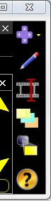
</li>
	<li>
New 
	 Toolbox Icons 
	 
	Some of the toolbox icons have been changed to improve their look.
</li>
</ol>
 

<table style="border-width: 0px; border-collapse: collapse; margin-left: 60px;" 
		 cellspacing="0">
	<tr class="hcp7">
		<td width="76" class="hcp8">
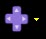
</td>
		<td width="388" class="hcp9">
Window Layout
</td>
	</tr>
	<tr class="hcp7">
		<td width="76" class="hcp8">

</td>
		<td width="388" class="hcp9">
Edit Mode
</td>
	</tr>
	<tr class="hcp7">
		<td width="76" class="hcp8">
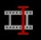
</td>
		<td width="388" class="hcp9">
Cue Clip
</td>
	</tr>
	<tr class="hcp7">
		<td width="76" class="hcp8">

</td>
		<td width="388" class="hcp9">
Open Program 
		 Output
</td>
	</tr>
	<tr class="hcp7">
		<td width="76" class="hcp8">
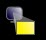
</td>
		<td width="388" class="hcp9">
Open Layer Previews
</td>
	</tr>
</table>
<ol start="9">
	<li>
New 
	 Effect Generator Shapes 
	 
	The following new <a href="../reference/clipTypes/EffectsGenerator/EffectsGeneratorClip.md">effect 
	 generator</a> shapes have been added.
</li>
</ol>
<ul type="disc">
	<ul type="disc">
		<li>
Rotor
</li>
		<li>
Radar
</li>
		<li>
Block
</li>
		<li>
Confetti
</li>
	</ul>
</ul>

As well as the new shapes, the following 
 parameters have been added for existing shapes x and y position.

<ul type="disc">
	<ul type="disc">
		<li>
center
</li>
		<li>
fix.
</li>
	</ul>
</ul>
<ol start="10">
	<li>
Custom 
	 Images in Effect Generator 
	 
	You can now apply custom images to some of the <a href="../reference/clipTypes/EffectsGenerator/EffectsGeneratorClip.md">effect 
	 generator</a> shapes. This allows you to do silly things like have 
	 a picture of your face falling like a leaf but it also has some very 
	 powerful capabilities. To add an image you simply define the image 
	 clip you want to use and then include it as a script using the image() 
	 tag.
</li>
	<li>
Effect 
	 Generator Rate 
	 
	The rate of the <a href="../reference/clipTypes/EffectsGenerator/EffectsGeneratorClip.md">effects 
	 generator</a> can now be controlled from the preview window. This 
	 allows live control of the speed from fully stopped to stupidly fast. 
	 
	<a href="#"> Back to top</a>
</li>
</ol>

&#160;

<h3>September 2010: Version 3.5</h3>
<ol>
	<li>
Pixel 
	 Mapper 
	 
	A new pixel mapping renderer has been added which allows you to map 
	 the output of Screen Monkey onto LED fixtures. Using the mapper you 
	 can configure the positions of LEDs within the display and output 
	 the RGB values via ArtNet. When combined with the <a href="../reference/clipTypes/EffectsGenerator/EffectsGeneratorClip.md">Effects 
	 Generator</a> this allows for some very powerful effects. 
	 
	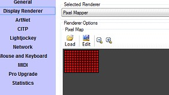 
	 
	To start using the pixel mapper select &quot;Pixel Mapper&quot; from 
	 the list of renderers in display renderers. When the pixel mapper 
	 is enabled, the output of Screen Monkey will be sent to the LED fixtures 
	 via ArtNet instead of to the screen
</li>
	<li>
Clone 
	 Clip 
	 
	The clone clip allows you to duplicate the output of one layer on another. 
	 
	
</li>
	<li>
Color 
	 Scheme Control 
	 
	The new color scheme control is specifically for controlling Screen 
	 Monkey via ArtNet. It lets a lighting console specify a color scheme 
	 which can then be used by clips within Screen Monkey. The color scheme 
	 supports 5 colors, a background color and the 4 key colors. At the 
	 moment only the effects clip supports the color scheme. You can refer 
	 to the DMX protocol for a channel listing of how to change the colors.
</li>
	<li>
Disable 
	 ArtNet Filter 
	 
	You can now disable individual filters in ArtNet by double-clicking 
	 on the appropriate filter. When paused you can no longer control those 
	 settings via ArtNet. A paused icon appears next to any filter that 
	 is disabled. 
	 
	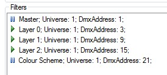
</li>
	<li>
Display 
	 Style Editor Improvements 
	 
	The following improvements have been made to the display style editor.
</li>
	<ul type="disc">
		<li>
Nudge the selected point using the arrow keys for precision 
		 control.
</li>
		<li>
Use the delete key to delete any created points.
</li>
		<li>
The selected point is now highlighted.
</li>
		<li>
Any changes made will be directly applied to the live output.
</li>
		<li>
Edited points are not messed up when resizing a layer.
</li>
	</ul>
	<li>
Program 
	 Monitor 
	 
	A new program monitor has been added which shows the current live output 
	 from the display renderer. You can access this by clicking on the 
	 program monitor icon in the main toolbox. 
	 
	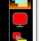 
	Please note that the icon is only visible if the selected renderer 
	 supports a program monitor. You can see bellow the program monitor 
	 for the pixel mapper which also supports zooming. 
	 
	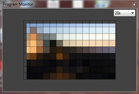
</li>
	<li>
Clip 
	 Rate Control 
	 
	A new clip rate control has been added to both MIDI and ArtNet. This 
	 allows you to slow down and speed up a clip when it is running. 
	 
	<a href="#"> Back to top</a>
</li>
</ol>

&#160;

<h3>August 2010: Version 3.5</h3>
<ol>
	<li>
Mozilla 
	 Firefox Web Browser 
	 
	The web browser clip allows you to choose between Internet Explorer 
	 and Gecko web browsers. <a href="../reference/clipTypes/WebBrowserClip.md#FFOrIE">Click 
	 here</a> for more information.
</li>
	<li>
Link 
	 At Start 
	 
	You can now choose to <a href="../tutorials/WorkingWithClips/LinkingClips.md">link</a> 
	 at the start of a clip. This means the link will occur when the clip 
	 starts playing. This is useful when linking to clips on other layers.
</li>
	<li>
Song 
	 Thumbnail Update 
	 
	The song clip thumbnail will now update when you change the text color. 
	 
	<a href="#"> Back to top</a>
</li>
</ol>

&#160;

<h3>July 2010: Version 3.5</h3>
<ol>
	<li>
Text 
	 Clip 
	 
	The Text Clip allows you to display text on the screen using pre-created 
	 templates. <a href="../reference/clipTypes/Text/TextClip.md">Click here</a> 
	 for more information.
</li>
	<li>
CITP/MSEX 
	 
	CITP is a network protocol which allows communication between media 
	 servers and lighting consoles. Any supporting lighting console will 
	 be able to detect and patch Screen Monkey as well as display thumbnail 
	 images of media within Screen Monkey. This is helpful when controlling 
	 Screen Monkey via ArtNet.
</li>
	<li>
Changes 
	 to ArtNet 
	 
	The following changes where made to the way ArtNet works. DMX addresses 
	 are now indexed from 1 not 0 to comply with other DMX devices. The 
	 clip selection hi and low bytes are in network byte order.
</li>
	<li>
WMA 
	 and M4A Audio Support 
	 
	You can now play WMA and M4A files with the audio clip. 
	 
	<a href="#"> Back to top</a>
</li>
</ol>

