<h1>Version 3.6</h1>
<ul style="text-align:left; font-family:Arial;font-size:12pt;font-weight: normal;font-style: normal;text-decoration: none;"  >
 <li><a href="#MiniTOCBookMark2" class="hcp2">June 2011: Version 3.6</a>
</li>
 <li><a href="#MiniTOCBookMark3" class="hcp2">May 2011: Version 3.6</a>
</li>
 <li><a href="#MiniTOCBookMark4" class="hcp2">April 2011: Version 3.6</a>
</li>
 <li><a href="#MiniTOCBookMark5" class="hcp2">March 2011: Version 3.6</a>
</li>
 <li><a href="#MiniTOCBookMark6" class="hcp2">February 2011: Version 3.6</a>
</li>
 <li><a href="#MiniTOCBookMark7" class="hcp2">January 2011: Version 3.6</a>
</li>
</ul>
<h3>June 2011: Version 3.6</h3>
<ul>
	<li>
Package 
	 Image Clips 
	 
	Image clips now save correctly when packaging your show allowing you 
	 to easily take the images to other computers.
</li>
	<li>
Fixed 
	 Page Width 
	 
	You can now fix the page width to set the number of clips per page. 
	 This ensures that when changing page the clip alignment is not lost. 
	 The options are Dynamic, 100 and 255 clips. The 255 clip option is 
	 specifically useful when controlling via DMX as it ensures that each 
	 page fits on a DMX channel. This is configured in the <a href="../Reference/Setup/Settings/Settings.md">Screen 
	 Monkey Settings</a>.
</li>
	<li>
Pixel 
	 Mapper DMX Merge 
	 
	The pixel mapper can now merge its DMX output with another universe. 
	 This allows mixed control of the fixture between the pixel mapper 
	 and a lighting console. The merge is only supported through the Pixel 
	 Map XML at this point.
</li>
	<li>
Page 
	 Up and Down 
	 
	Some major improvements have been added to the page navigation to help 
	 you get to the correct page faster. You still have the page up add 
	 down buttons with the go to page by clicking on the current page number. 
	 However in addition you will see the next and previous four page numbers 
	 which you can click on to jump straight to that page. 
	 
	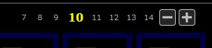
</li>
</ul>
<ul>
	<li>
Page 
	 Bookmarks 
	 
	With a large show containing many clips it can be difficult to find 
	 the page containing the clip you want. Page bookmarks make it much 
	 faster to find the correct page by allowing you to bookmark and name 
	 your most commonly used pages. <a href="../tutorials/WorkingWithClips/OrganizingClips.md#Bookmarking_Pages">Click 
	 here</a> for a step-by-step process for using Bookmarks.
</li>
</ul>
<ul>
	<li>
CITP/DMX 
	 Pages 
	 
	The CITP interaction now reports the clips in pages with the bookmarked 
	 name appearing as the page name. This makes it much easier to select 
	 clips via DMX as it categories the clips.
</li>
	<li>
Pixel 
	 Mapper DMX Address 
	 
	The pixel mapper DMX address now indexes from 1 and not zero to make 
	 it more consistent with other DMX applications. The ArtNet universe 
	 still indexes from zero.
</li>
	<li>
ArtNet 
	 Output Display 
	 
	You can now see in the ArtNet settings all DMX outputs as well as inputs. 
	 The outputs are assigned by the PIxel Mapper but the output list is 
	 a useful tool to ensure everything is setup correctly. 
	 
	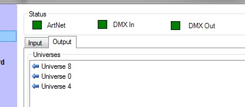 
	 
	A new &quot;DMX Out&quot; indicator shows that everything is working 
	 correctly.
</li>
</ul>
<ul>
	<li>
Load 
	 Show Select All 
	 
	When <a href="../tutorials/WorkingWithShows/LoadAShow.md">loading 
	 a saved show</a>, this option makes it easy to load not just the clips 
	 but also all the settings stored in the show. When you select this 
	 option everything including all settings are loaded and existing settings 
	 will be lost. 
	 
	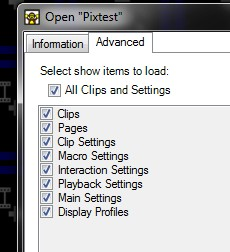
</li>
</ul>
<ul>
	<li>
M2V 
	 and M4V Video Files 
	 
	The <a href="../reference/clipTypes/VideoClip.md">video clip</a> 
	 now supports M2Vand M4V video file extensions.
</li>
	<li>
Dmx 
	 Zoom, PanX and PanY 
	 
	You can now use DMX to control the magnification and position of a 
	 clip within a layer. This does not change the layer size but does 
	 allow you to zoom in on a clip which is being displayed on a layer.
</li>
	<li>
Song 
	 Clip Search Focus 
	 
	The search entry is now focused when you add a song clip. This makes 
	 it simpler to quickly search for existing songs.
</li>
	<li>
Lock 
	 Pixel Map Group 
	 
	A pixel map group can now be locked to prevent the cells being accidentally 
	 changed. To lock a group, right-click on the group and select &quot;Lock 
	 Cells&quot;.
</li>
	<li>
Pixel 
	 Mapper Fixture Library 
	 
	A fixture library is now included with Pixel Mapper to help you get 
	 started. 
	 
	<a href="#"> Back to top</a>
</li>
</ul>

&#160;

<h3>May 2011: Version 3.6</h3>
<ul>
	<li>
Swap 
	 Media 
	 
	This is a new clip option that applies to any clips which play files 
	 stored on your system. It allows you to change the file the clip references. 
	 So you can change to a different video file or image. It is specifically 
	 handy when copy and pasting clips as the settings are maintained but 
	 the file can be changed. To swap the video file of a clip, right-click 
	 on the clip and select &quot;Swap Media&quot;. 
	 
	 
	 
	You will now need to select the video file you want to swap with the 
	 existing video. Once finished the clip will play the new video file.
</li>
</ul>
<ul>
	<li>
FFDShow 
	 Decoder Preference 
	 
	It is now possible to specify that when playing video it should choose 
	 the ffdshow decoder over other installed decoders. For greater video 
	 format support and reliability it is recommended that you choose this 
	 option. It is only if you are experiencing problems playing videos 
	 that you may choose to change this setting. To turn on the option, 
	 right-click a <a href="../reference/clipTypes/VideoClip.md">video 
	 clip</a> and choose &quot;Video Options&quot;. 
	 
	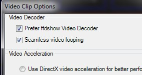 
	 
	The setting is global, so once set, it will apply to all video clips.
</li>
</ul>
<ul>
	<li>
RS232 
	 Macro 
	 
	This macro allows you to send serial commands via the RS232 port on 
	 your computer. <a href="../reference/Macros/RS232Macro.md">Click 
	 here</a> for more information. 
</li>
</ul>
<ul>
	<li>
TCP 
	 Macro 
	 
	This macro allows you to send TCP commands over a network for the control 
	 of other devices. <a href="../reference/Macros/TCPMacro.md">Click 
	 here</a> for more information. 
</li>
</ul>
<ul>
	<li>
Schedule 
	 Clip Dialog displays Clip Name 
	 
	The schedule clip dialog now displays the clip name in the header to 
	 remind you which clip you are editing.
</li>
	<li>
AAC 
	 Audio Files 
	 
	The <a href="../reference/clipTypes/AudioClip.md">audio clip</a> 
	 now supports audio files in AAC format.
</li>
	<li>
DMX 
	 Colour Control 
	 
	You can now control the brightness, contrast, red, green and blue of 
	 each layer through DMX.
</li>
	<li>
Random 
	 Clip Link 
	 
	When you <a href="../tutorials/WorkingWithClips/LinkingClips.md">link</a> 
	 a clip you can now choose to link to a Random clip. 
	 
	<a href="#"> Back to top</a>
</li>
</ul>

&#160;

<h3>April 2011: Version 3.6</h3>
<ul>
	<li>
Pair 
	 Clip 
	 
	You can now pair two clips together so if one plays the other also 
	 plays on another layer. <a href="../tutorials/WorkingWithClips/LinkingClips.md">Click 
	 here</a> for more information on linking.
</li>
</ul>
<ul>
	<li>
Image 
	 Clip JPEG Extension 
	 
	The image clip now recognizes the file extension JPEG as well as .JPG.
</li>
	<li>
Video 
	 Clip Volume Fixed 
	 
	The volume control of a video clip had no effect when live. This has 
	 now been fixed.
</li>
	<li>
Foreign 
	 Character Sets in Songs 
	 
	Added support for foreign character sets when saving songs.
</li>
	<li>
Shows 
	 Saved in Multiple Instances 
	 
	A show that has been saved in one instance will now load into any instance.
</li>
	<li>
Audio 
	 Mute 
	 
	A new option has been added to clips with audio to mute the clip. The 
	 option appears in the clip context menu if it supports it. 
	 
	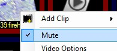
</li>
</ul>
<ul>
	<li>
Colour 
	 Clip Live Monitor 
	 
	The live monitor for the color clip shows you information about the 
	 color being displayed on the screen. This helps in prompting you to 
	 know what the live output is on that layer. 
	 
	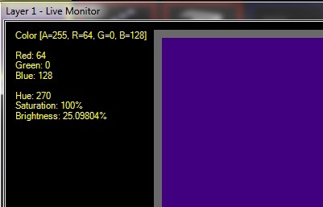 
	 
	<a href="#"> Back to top</a>
</li>
</ul>

&#160;

<h3>March 2011: Version 3.6</h3>
<ul>
	<li>
Interaction 
	 Macro 
	 
	This macro allows you to add Screen Monkey controls to the clip slots. 
	 <a href="../reference/Macros/InteractionMacro.md">Click 
	 here</a> for more on Interaction Macro.
</li>
</ul>
<ul>
	<li>
Audio 
	 EQ 
	 
	This is a new shape type within the <a href="../reference/clipTypes/EffectsGenerator/EffectsGeneratorClip.md">effects 
	 generator</a> that allows you to write effects which respond to a 
	 live audio input. The eq looking effect will respond to signals through 
	 the line in of your computer and animate in time to the music. To 
	 get started add the EQ effect by adding a new Effect Generator clip 
	 and selecting EQ from the library. You can customize the effect to 
	 your precise needs. 
	 
	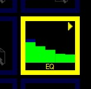
</li>
</ul>
<ul>
	<li>
Separate 
	 Layer and Display Dashboards 
	 
	The layers dashboard and display profiles dashboard are now two distinct 
	 windows you give you more flexibility. The display dashboard has also 
	 been simplified to make it easier to use and select the correct display. 
	 
	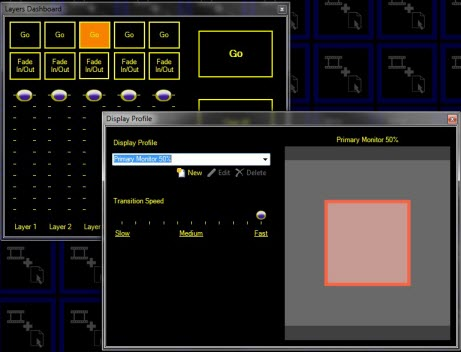
</li>
	<li>
Fade 
	 All Layers from Layer Dashboard 
	 
	few extra buttons have been added to the layers dashboard to control 
	 all the layers together.
</li>
</ul>
<table style="margin-left: 60px; border-collapse: separate; border-collapse: separate;" 
		 cellspacing="0" border="1">
	<col>
	<col>
	<col>
	<tr>
		<td rowspan="4">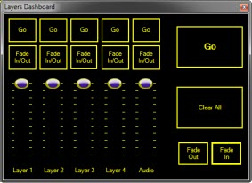</td>
		<td>
Go
</td>
		<td>Performs a go on the active layer</td>
	</tr>
	<tr>
		<td>
Clear All 
		 
</td>
		<td>Clears all the layers</td>
	</tr>
	<tr>
		<td>
Fade Out
</td>
		<td>Fades out all the layers together</td>
	</tr>
	<tr>
		<td>
Fade In
</td>
		<td>Fades in all the layers together</td>
	</tr>
</table>

&#160;

<ul>
	<li>
Schedule 
	 Clip Dashboard 
	 
	The schedule dashboard makes it easy to see which clips you have scheduled 
	 to play and check on the running order. You open the dashboard by 
	 clicking on the clock icon in the main tools menu. 
	 
	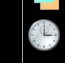 
	 
	The dashboard contains a list of clips which are scheduled to play, 
	 the current live clip and the next clip which is scheduled. A count 
	 down shows you exactly how long until the next scheduled item. 
	 
	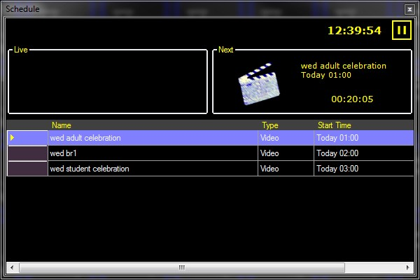 
	 
	Next to the current time you will notice a pause button. This allows 
	 you to pause the scheduler and prevent the next clip from running. 
	 When the scheduler is paused the button turns red. 
	 
	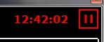 
	 
	When you un-pause the scheduler it will continue by playing the next 
	 scheduled item.
</li>
</ul>
<ul>
	<li>
Double 
	 Click to Play 
	 
	A new user setting allows you to specify whether a user must double 
	 click the mouse to play a clip. The default is for a single click 
	 to play the clip but to avoid accidents you may want to specify double 
	 click.
</li>
	<li>
Multi-edit 
	 in Space 
	 
	The spaces clip list now allows multi select so you can edit many clips 
	 at once. This makes for much faster working when editing many clips 
	 at once. To select multiple rows, click on the row header and drag 
	 the mouse over the clips you want to select. Also supports Ctrl and 
	 Shift selection modifiers.
</li>
	<li>
Sort 
	 Spaces by Schedule Time 
	 
	You can now sort the spaces list by schedule time.
</li>
	<li>
Last 
	 Link Time Fill 
	 
	When you specify a new timed link it automatically fills in the link 
	 time with the last used time. This can make it easier when specifying 
	 timed links with the same time. 
	 
	<a href="#"> Back to top</a>
</li>
</ul>

&#160;

<h3>February 2011: Version 3.6</h3>
<ul>
	<li>Snakes 
	 
	A new type of shape has been added to the <a href="../reference/clipTypes/EffectsGenerator/EffectsGeneratorClip.md">effects 
	 generator</a> which creates a snakes effect. 
	 
	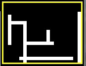 
	 
	<a href="#"> Back to top</a></li>
</ul>

&#160;

<h3>January 2011: Version 3.6</h3>
<ul>
	<li>
Transitions 
	 and Effects 
	 
	In previous versions transitions were called effects. Transitions now 
	 specify how two clips transition between each other. The new effects 
	 are applied to an individual clip and allow you to change the properties 
	 of that clip for the duration of its playback. <a href="../reference/clipTypes/EffectsGenerator/EffectsGeneratorClip.md">Click 
	 here</a> to learn more about Effects.
</li>
</ul>
<ul>
	<li>
Macros 
	 
	Macros allow you to combine actions or commands into your existing 
	 show. <a href="../reference/Macros/Macros.md">Click here</a> 
	 for more information on Macros.
</li>
</ul>
<ul>
	<li>
Shell 
	 Macro 
	 
	The shell macro allows you to run windows shell commands from within 
	 Screen Monkey. <a href="../reference/Macros/ShellMacro.md">Click 
	 here</a> for more information on Shell Macros.
</li>
</ul>
<ul>
	<li>
Layer 
	 Transition Speed (Fast, Medium and Slow Shortcuts) 
	 
	To make it quicker and easier to change the transition speed of the 
	 display profile three speed shortcuts have been added. 
	 
	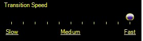
</li>
</ul>
<ul>
	<li>
CITP 
	 Update Message 
	 
	The CITP interaction now supports the layer update message so clients 
	 are informed of any changes to your show. 
	 
	<a href="#"> Back to top</a>
</li>
</ul>
