<h1>Version 3.7</h1>
<ul style="text-align:left; font-family:Arial;font-size:12pt;font-weight: normal;font-style: normal;text-decoration: none;"  >
 <li><a href="#MiniTOCBookMark2" class="hcp2">October 2011: Version 3.7</a>
</li>
 <li><a href="#MiniTOCBookMark3" class="hcp2">December 2011: Version 3.7</a>
</li>
 <li><a href="#MiniTOCBookMark4" class="hcp2">January 2012: Version 3.7</a>
</li>
 <li><a href="#MiniTOCBookMark5" class="hcp2">February 2012: Version 3.7</a>
</li>
 <li><a href="#MiniTOCBookMark6" class="hcp2">March 2012: Version 3.7</a>
</li>
 <li><a href="#MiniTOCBookMark7" class="hcp2">July 2012: Version 3.7</a>
</li>
</ul>
<h3>October 2011: Version 3.7</h3>
<ol type="1">
	<li class="hcp3">
Streaming 
	 <a href="../Glossary.md#ACN">ACN</a> (Pro Feature) 
	 
	Added support for streaming ACN 
	 between a lighting console or other control device and Screen Monkey. 
	 This allows <a href="javascript:void(0);" id="a2" onmouseover="if (parseInt(navigator.appVersion) >= 4 &amp;&amp; typeof(BSPSPopupOnMouseOver) == 'function') BSPSPopupOnMouseOver(event);" class="BSSCPopup" onclick="BSSCPopup('../Glossary.md#DMX',400,120);return false;">DMX</a> 
	 to be sent over a network. For you to use this, your lighting console 
	 must also support Streaming ACN. The control channels follow the standard 
	 DMX control channels as detailed in the Screen Monkey manual. 
	 
	 
	 
	You can configure the Streaming 
	 ACN universe from the ACN tab in the <a href="../Reference/Setup/Settings/ACN.md" class="hcp7">settings</a>. 
	 You will also see other options here such as an indicator to tell 
	 you if you are receiving DMX and the ability to disable certain layers 
	 from Streaming ACN control.
</li>
	<li class="hcp3">
RDM 
	 (Pro Feature) 
	 
	<a href="javascript:void(0);" id="a1" onmouseover="if (parseInt(navigator.appVersion) >= 4 &amp;&amp; typeof(BSPSPopupOnMouseOver) == 'function') BSPSPopupOnMouseOver(event);" class="BSSCPopup" onclick="BSSCPopup('../Glossary.md#RDM',400,275);return false;">RDM</a> was developed 
	 by the lighting industry to allow discovery and control of lighting 
	 fixtures over DMX. It is also applicable to Screen Monkey as it allows 
	 lighting consoles to discover Screen Monkey and tell what universe 
	 it is receiving DMX on and what personality to use to control the 
	 software. The RDM support is currently only over ArtNet but will be 
	 added to ACN soon. 
	 
	With RDM support you will be able to use features such as auto address 
	 and identify from lighting consoles that also support RDM. This simplifies 
	 the process of patching and configuring with a lighting console. 
	 
	The following RDM messages are supported along with mandatory messages. 
	 
	Device Information
</li>
</ol>
<ol start="3" type="1">
	<ul type="disc">
		<li>
Device Model Description
</li>
		<li>
Manufacturer Label
</li>
		<li>
Software Version Label
</li>
		<li>
Device Model Description
</li>
		<li>
Dmx Personality
</li>
		<li>
Dmx Personality Description
</li>
		<li>
Device Hours
</li>
		<li>
Lamp Hours
</li>
		<li>
Lamp Strikes Hours
</li>
	</ul>
	<li class="hcp3">
Clear 
	 <a href="../tutorials/WorkingWithClips/OrganizingClips.md">Page 
	 Bookmarks</a> on New Show 
	 
	The page bookmarks are now cleared 
	 when you start a new show. Before the bookmarks would be left from 
	 the previous show.
</li>
	<li class="hcp3">
Fixed 
	 Page Sizes 
	 
	A new <a href="../Reference/Setup/Settings/General.md">user 
	 setting</a> allows you to configure fixed page sizes. This can make 
	 it simpler when laying out your show as it ensures that the first 
	 item on page 2 is always the first item. Previously, the page sizes 
	 would change to fit the Window size. If the items on a single page 
	 exceed the number that can be displayed, a scroll bar appears. 
	 
	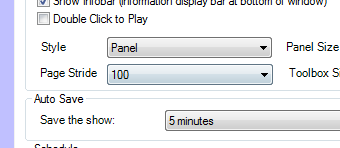 
	 
	From the settings you can select 
	 a number of different page sizes. If you are controlling via DMX then 
	 the page size is automatically set to 255 clips per page to make it 
	 easier to control.
</li>
	<li class="hcp3">
SmNet 
	 Clip Control (Pro Feature) 
	 
	Added much greater support to SmNet 
	 for control of your clips over a network. The most notable change 
	 is the addition of clip events that notify a remote client when a 
	 clip is played or deleted as well as other state notifications. 
	 
	The networking interfaces have been condensed into the ScreenMonkey.Net.dll 
	 and all you have to do to control Screen Monkey over a network is 
	 reference this assembly. For more information about developing SmNet 
	 applications please visit http://screenmonkey.codeplex.com. 
	 
	Other SmNet additions in this version:
</li>
	<ul type="disc">
		<li class="hcp8">
Layer Opacity Control
</li>
		<li class="hcp8">
Layer Volume Control
</li>
		<li class="hcp8">
Bookmarks and Pages
</li>
		<li class="hcp8">
Clip Play State
</li>
		<li class="hcp8">
Load SMX and SMZ files over 
		 the network
</li>
	</ul>
</ol>

<a href="#"> Back to 
 top</a>

<h3>&#160;</h3>
<h3>December 2011: Version 3.7</h3>
<ol type="1">
	<li class="hcp3">
MIDI 
	 Macro (Pro Feature) 
	 
	The MIDI macro allows you to send 
	 MIDI commands from Screen Monkey for the control of other devices. 
	 
	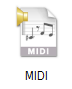 
	 
	Using the macro you can schedule 
	 or link macro commands in your show to give greater integration between 
	 your video and other devices. 
	 
	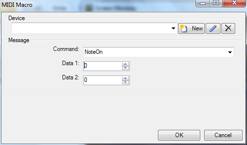 
	 
	Included is support for all standard 
	 MIDI commands and any number of MIDI devices can be connected.
</li>
	<li class="hcp3">
<a 
	 href="../reference/clipTypes/Song/SongClip.md">Song Clip</a> High 
	 CPU 
	 
	Fixed bug where song clips with 
	 no transition would require a large amount of CPU to display. 
	 
	<a href="#"> Back 
	 to top</a>
</li>
</ol>
<h3>&#160;</h3>
<h3>January 2012: Version 3.7</h3>
<ol type="1">
	<li class="hcp3">
Select 
	 Network Adapter (Pro Feature) 
	 
	You can now select which network 
	 adapter is used for ArtNet and ACN traffic. 
	 
	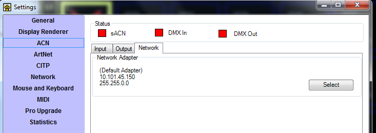 
	 
	Go to settings and select either 
	 the ArtNet or ACN tab. Click the Network tab and click Select to change 
	 the adapter. The currently selected adapter will be displayed.
</li>
	<li class="hcp3">
Grass 
	 Valley Triton Router Macro (Pro Feature) 
	 
	The Triton Routing Macro allows 
	 you to control any Grass Valley Triton router through the Screen Monkey 
	 software. Using the macro you can configure the audio and video cross-points 
	 separately or together. This allows you to incorporate video switching 
	 into any Screen Monkey show. 
	 
	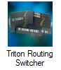 
	 
	The router must be connected via 
	 a RS232 port and any number of connected routers is supported. 
	 
	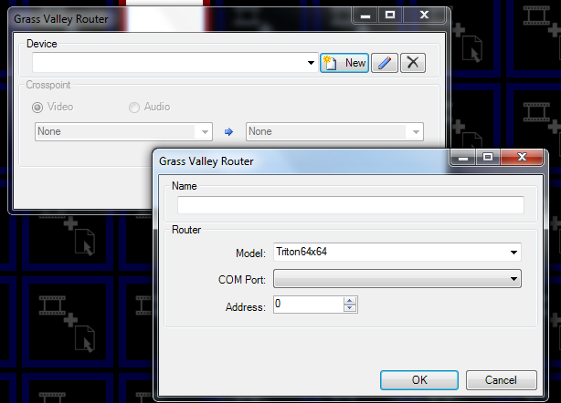 
	 
	As well as controlling the router, 
	 the macro also supports feedback from the router and will indicate 
	 the selected cross-points even when changed from the router's hardware 
	 switches.
</li>
	<li class="hcp3">
LightwaveRF 
	 Macro (Pro Feature) 
	 
	Lightwave RF is a home lighting 
	 automation control protocol which allows control of light dimmers, 
	 relays and socket power. Its applications go beyond home use and could 
	 be used for raising and lowering screens or anywhere where control 
	 of low power (13A) devices is required. To use this macro you must 
	 purchased a LightwaveRF Wifi router which connects to your network 
	 with Screen Monkey. 
	 
	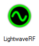 
	 
	Using this macro you can change 
	 light dimer levels, select pre-configured moods and turn 13A Sockets 
	 On and Off. A relay unit is also available. 
	 
	Once you add the macro it can be incorporated into your normal Screen 
	 Monkey show. Once your command has been setup you can click on the 
	 &quot;Try Command&quot; button to check that everything is working. 
	 
	To setup your LightwaveRf devices. please visit the <a href="http://www.lightwaverf.com/manager.php" target="_blank" class="hcp7">LightwaveRF 
	 website</a>. 
	 
	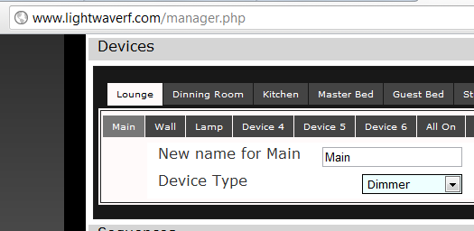 
	
</li>
	<li class="hcp3">
<a 
	 href="../reference/clipTypes/Text/TextClip.md">Text Clip</a> Objects 
	 
	Your basic text clip function just 
	 got so much better. It now allows you to display a vast array of different 
	 text items on the screen and these can be added to your template along 
	 with other text items to build up an information screen that dynamically 
	 updates. Each text object you add can be styled to give you the precise 
	 layout and look you want. <a href="../reference/clipTypes/Text/TextClipObjects.md" class="hcp7">Click 
	 here</a> for more on the Text Clip Objects.
</li>
	<li class="hcp3">
Schedule 
	 Dashboard 24Hour Clock 
	 
	The schedule dashboard now shows 
	 a 24 hour clock instead of a 12 hour clock. 
	 
	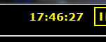 
	
</li>
	<li class="hcp3">
Schedule 
	 Wait For Break 
	 
	You can now set the scheduler to 
	 wait for a break in the program before running a scheduled item. This 
	 ensures that the scheduler waits for the playing clip to finish before 
	 running the next item. You can choose to enable this through the settings. 
	 
	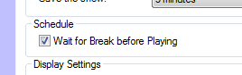
</li>
	<li class="hcp3">
Clip 
	 Schedule Indicator 
	 
	Displays a click icon in all clips 
	 that are scheduled to play. 
	 
	 
	
</li>
	<li class="hcp3">
Multiple 
	 Clip Links 
	 
	You can now link a clip to multiple items rather than just a single 
	 clip as before. The default as before is to link to just a single 
	 clip but if you select either &quot;More Options&quot; or the &quot;Link&quot; 
	 option from the clip menu it will allow you to specify additional 
	 links. <a href="../tutorials/WorkingWithClips/LinkingClips.md#Using_Multiple_Clip_Links" class="hcp7">Click here</a> for more on 
	 this feature.
</li>
	<li class="hcp3">
Clip 
	 Templates 
	 
	Using templates you can export any 
	 existing clip as a template to create new clips. The template includes 
	 all clip settings and allows you to quickly and easily duplicate the 
	 clip settings. <a href="../reference/clipTypes/ClipTemplates.md" class="hcp7">Click here</a> for 
	 more on Clip Templates.
</li>
	<li class="hcp3">
Links in 
	 Tooltip Text 
	 
	The clip links are now displayed 
	 in the clip tooltip. 
	 
	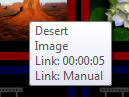
</li>
	<li class="hcp3">
Live 
	 Audio Clip 
	 
	You can use the live audio clip 
	 to play audio from any sound card input. This is useful if you want 
	 to automatically switch between live and pre-recorded content or you 
	 want to mix live audio with content from Screen Monkey. <a href="../reference/clipTypes/LiveAudioClip.md" class="hcp7">Click here</a> for more.
</li>
	<li class="hcp3">
<a 
	 href="../reference/Macros/Macros.md">Macros</a> in Space 
	 Clips 
	 
	Macros now work from space clips.
</li>
	<li class="hcp3">
Schedule 
	 Clips from Schedule Dashboard 
	 
	Using the schedule dashboard you 
	 can directly add clips using the Add button. 
	 
	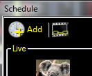 
	 
	You can then select a clip and choose 
	 the schedule time to add it to the scheduler.
</li>
	<li class="hcp3">
Show 
	 Linked Clips in Scheduler 
	 
	This option allows you to display 
	 any linked clips along with any scheduled items is the same schedule 
	 dashboard. This makes it easier when setting up complex scheduled 
	 shows. To display the linked clips click on the links icon. 
	 
	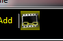 
	 
	This will show any linked clips 
	 in grey. 
	 
	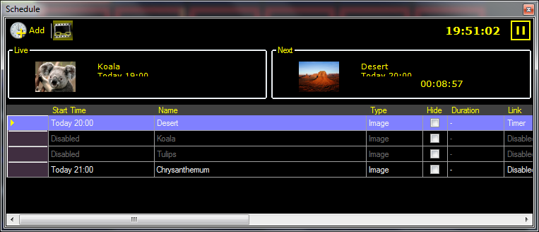 
	<a href="#"> Back 
	 to top</a>
</li>
</ol>
<h3>&#160;</h3>
<h3>February 2012: Version 3.7</h3>
<ol type="1">
	<li class="hcp3">
Exempt 
	 Clip Schedule from Copy/Paste 
	 
	Stopped a clip's schedule settings 
	 from being copied with copy and paste.
</li>
	<li class="hcp3">
Repair 
	 All Clips 
	 
	Allows you to repair all clips in 
	 a show not just a single clip. Using this function you can specify 
	 a folder path to be searched for all the media in the show. If the 
	 missing file is found it will be assigned to any broken clips. The 
	 selected folder is searched recursively for media files. 
	 
	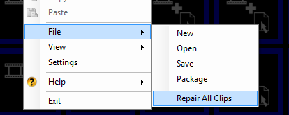
</li>
	<li class="hcp3">
Resolved 
	 <a href="../reference/clipTypes/LiveVideoClip.md">Live Video</a> 
	 and <a href="../reference/clipTypes/DVDClip.md">DVD Clips</a> on 
	 x64 
	 
	You may now use Live Video and DVD 
	 clips on all x64 systems.
</li>
	<li class="hcp3">
Link 
	 Column added to Schedule Dashboard 
	 
	A link column has been added to 
	 the Schedule dashboard.
</li>
	<li class="hcp3">
Search Clip 
	 
	A search field has been added to 
	 the select clip dialog to make it easier to find the clip you want. 
	 
	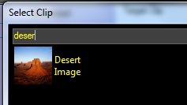
</li>
	<li class="hcp3">
Link Clip Edit Tool 
	 
	A new dashboard edit tool has been 
	 added to make it easier to create links between clips. To enter the 
	 link edit mode select the link tool from the main dashboard toolbar. 
	 
	 
	 
	Once you enter the mode, select a clip with links. 
	 
	The selected clip with links will 
	 be highlighted with a blue border. The linked clips will be highlighted 
	 with green borders and all other clips will be have gray borders. 
	 
	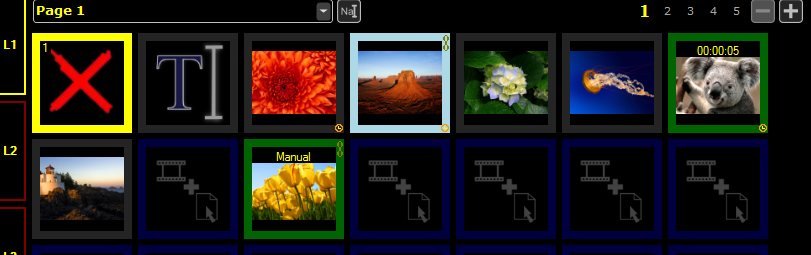 
	 
	You can now select on any clip to 
	 edit or add a link from the selected clip. The link type is shown 
	 in the clip panel. 
	 
	Using this tool it is much easier to create and view complicated links.
</li>
	<li class="hcp3">
New 
	 <a href="../Reference/Hotkeys.md">Hotkeys</a> Added
</li>
</ol>
<table cellspacing="0" border="1" class="hcp11">
	<col>
	<col>
	<tr>
		<td>Home</td>
		<td>Goto Page 1</td>
	</tr>
	<tr>
		<td>PageUp</td>
		<td>Next Page</td>
	</tr>
	<tr>
		<td>PageDown</td>
		<td>Previous Page</td>
	</tr>
	<tr>
		<td>Ctrl + P</td>
		<td>Playback/Live Mode</td>
	</tr>
	<tr>
		<td>Ctrl + E</td>
		<td>Edit Mode</td>
	</tr>
	<tr>
		<td>Ctrl + L</td>
		<td>Link Edit Mode</td>
	</tr>
</table>
<ol start="8" type="1">
	<li class="hcp3">
New 
	 Mouse Shortcuts
</li>
</ol>
<table cellspacing="0" border="1" class="hcp11">
	<col>
	<col>
	<tr>
		<td>Alt + Right Click</td>
		<td>Edit Links</td>
	</tr>
	<tr>
		<td>Ctrl + Right Click</td>
		<td>Edit Schedule</td>
	</tr>
</table>
<ol start="9" type="1">
	<li class="hcp3">
Text 
	 Clip Background Image Aspect Ratio 
	 
	The image background of a text clip 
	 will now obey the aspect ratio settings specified for a layer. Previously 
	 the image would always be stretched.
</li>
	<li class="hcp3">
Macros 
	 Logged in Statistics 
	 
	Macro events are now logged in the 
	 statistics output along with standard media clips.
</li>
	<li class="hcp3">
User 
	 Clip Thumbnails 
	 
	You may now add your own thumbnail 
	 images to clips rather than having to use the default images. To change 
	 the thumbnail, right click the clip and choose Rename. this will open 
	 a dialog that allows you to rename the clip and choose a clip thumbnail. 
	 
	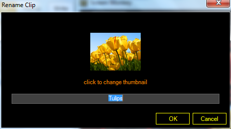 
	<a href="#"> Back 
	 to top</a>
</li>
</ol>

&#160;

<h3>March 2012: Version 3.7</h3>
<ul type="disc">
	<li class="hcp8">
Multi Line in Text Clip 
	 
	You may add multiple lines to text clip items by using Shift+Enter.
</li>
	<li class="hcp8">
Fix for Web Browser on 64Bit Systems 
	 
	On 64 bit systems there was previously no option for using the 
	 <a href="../reference/clipTypes/WebBrowserClip.md" class="hcp7">Web 
	 Browser clip</a>. Version 3.7 corrects this issue. 
	 
	<a href="#"> Back to top</a>
</li>
</ul>

&#160;

<h3>July 2012: Version 3.7</h3>
<ol type="1">
	<li class="hcp3">
New 
	 and Improved Setup 
	 
	Created a new setup process to ensure 
	 Screen Monkey is always installed correctly every time.
</li>
	<li class="hcp3">
Live 
	 Stream Clip 
	 
	You can use the Live Stream clip 
	 to display live video streams across the internet. <a href="../reference/clipTypes/LiveStream.md" class="hcp7">Click 
	 here</a> for more.
</li>
	<li class="hcp3">
Blackmagic 
	 DeckLink Renderer (Pro Feature) 
	 
	Support has been added for the Blackmagic 
	 DeckLink Renderer. <a href="../Reference/Setup/BlackMagicDeckLink.md" class="hcp7">Click here</a> 
	 for more.
</li>
	<li class="hcp3">
New Help 
	 File  
	 
	The help system has experienced 
	 a major overhaul and should now be more up to date and more accurately 
	 reflect Screen Monkey functionality.
</li>
	<li class="hcp3">
Dashboard 
	 Changes 
	 
	The <a href="../tutorials/WorkingWithClips/MainWindow.md">Main 
	 Dashboard</a> has experienced some cosmetic changes as well as some 
	 new functionality.
</li>
	<li class="hcp3">
<a href="../Glossary.md#RelativePathing">Relative 
	 Paths</a> 
	 
	Screen Monkey has been modified 
	 so that inside the show file relative paths to the media are written. 
	 This means that when you move the show between computers Screen Monkey 
	 will be able to find the correct media files.
</li>
	<li class="hcp3">
<a 
	 href="../Glossary.md#MIDI">MIDI</a> Show Control 
	 
	Screen Monkey now supports MIDI 
	 Show Control Protocol. 
	 
	<a href="http://en.wikipedia.org/wiki/MIDI_Show_Control" target="_blank">Click 
	 here</a> for more via the Internet. 
	 
	<a href="#"> Back 
	 to top</a>
</li>
</ol>
