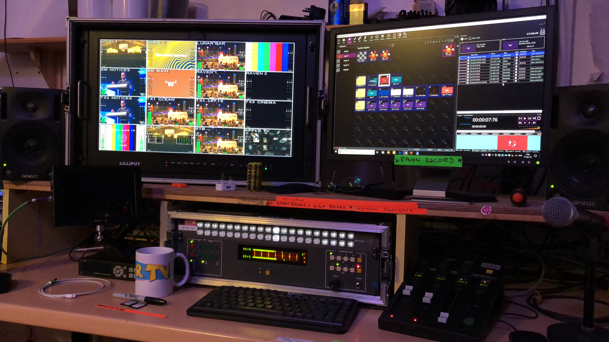

# Running a TV Station

Screen Monkey has been used to successfully run a 24h TV station. This can be achieved through use of the schedule feature and macros for external device control.

The solution will vary depending on the exact requirements and equipment available. Here are some ideas to get you started.

- Clips can be [scheduled](../reference/toolbar/schedule.md) to play un-attended
- Schedule time and date data can be [synchronized](../reference/Settings/scheduleSync.md) with an online JSON feed
- An [on-screen 'Coming Up' schedule](../reference/clipTypes/Text/TextClipObjects.md#schedule) can be created which automatically updates and receives titles and descriptions from an external JSON feed
- By using [macros](../reference/macros/Macros.md) external broadcast hardware such as routers, vision mixers, playout servers and anything with a simple TCP/IP or Serial API can be controlled by Screen Monkey
- The [ticker tape](../reference/clipTypes/TickerTapeClip.md) can show a scrolling messages across the bottom of the screen
- [Folder search](../reference/clipTypes/folderSearch.md) allows you to setup a network share or sync folder for other team members to submit slides for automatic display
- A [realtime clock](../reference/clipTypes/Text/TextClipObjects.md#datetime) can be superimposed
- [Logging](../reference/Settings/Statistics.md) is available to verify everything went to plan

