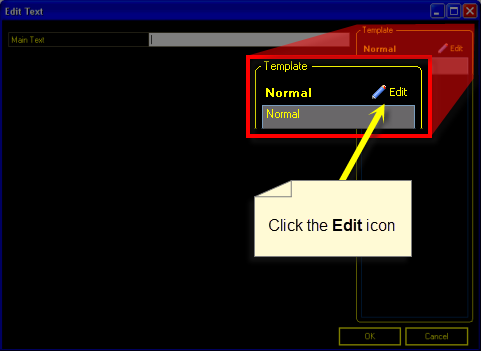
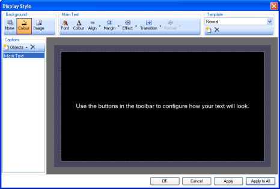
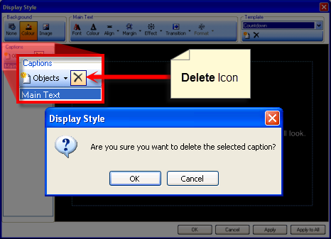
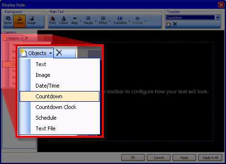
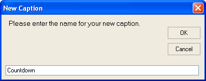
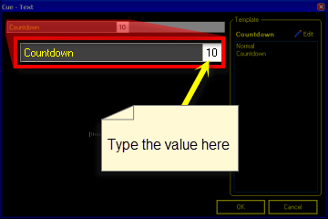

<h1>Creating a Countdown</h1>

Sometimes you want to present a simple countdown. 10, 9, 8, 7... and 
 so on. Screen Monkey allows you to do this but it's not exactly intuitive 
 as to how you go about making it happen.

<ol type="1">
	<li>
You begin by adding a Text clip.
</li>
	<li>
Next, you click the Edit 
	 icon in the Template area. 
	 
	
</li>
	<li>
The Display Style dialog 
	 should open.  
	 
	
</li>
	<li>
At this point it would likely be a good idea to create a new 
	 template. Click the New icon 
	 and the New Template dialog should present itself prompting you for 
	 the name of the template. 
	 
	
</li>
	<li>
Type the name you wish to use to identify the template and click 
	 OK.
</li>
	<li>
If all you want is a simple countdown, you may wish to remove 
	 the Main Text that will be present. This will help avoid confusion. 
	 Click the item labeled Main Text to select it, then click the Delete 
	 icon. You will be prompted if you are sure. Just click OK. 
	 
	
</li>
	<li>
Click the Objects drop-down 
	 and choose Countdown. 
	 
	
</li>
	<li>
The New Caption dialog pops up prompting for a name.
</li>
	<li>
Type a Name to identify your Countdown area and configure any 
	 alignment options. 
	 
	
</li>
	<li>
Click OK to dismiss 
	 the dialog.
</li>
	<li>
Screen Monkey will present Invalid Countdown. Don't worry, we 
	 will configure this later.
</li>
	<li>
Click OK to dismiss 
	 the dialog.
</li>
	<li>
Click OK to dismiss 
	 the Edit Text dialog.
</li>
	<li>
Right-Click the clip in the dashboard and choose Edit 
	 / Cue. 
	 
	
</li>
	<li>
Type the countdown value into the field and click OK. 
	 
	
</li>
	<li>
Now all you have to do is play the clip to see the countdown!
</li>
</ol>

