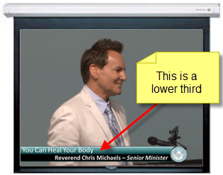
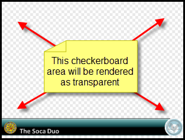
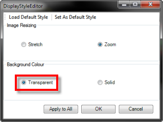

<h1>Creating and using Lower Thirds</h1>
<h2>What are Lower Thirds?</h2>

When you watch television news and other shows, you often see images 
 with titles and names superimposed in the lower area of the screen to 
 advise the viewer as to who or what exactly is on screen. 

One example is shown below:

Older televisions and Computer resolutions used what is called a 4x3 
 Aspect Ratio. This means that the area is four units wide by three units 
 tall. Because of the three units, the term &quot;thirds&quot; is used. 
 And because these normally appear in that lower most unit, they are called 
 &quot;lower thirds&quot; because they appear in the bottom third area 
 of the display.

&#160;

<h2>Creating Lower Thirds for use with Screen Monkey</h2>

The first step is to determine the exact resolution used by the screens 
 you present the media on. For example, many projection systems use 1024 
 pixels x 768 pixels. In this case you would create images sized exactly 
 at 1024x768 pixels.

<table style="margin-left: 12px; border-collapse: separate; border-collapse: separate;" 
		 cellspacing="0" border="1">
	<col>
	<col>
	<tr>
		<td></td>
		<td>If you create your image at a different size, Screen Monkey 
		 will scale it when it appears and you won't get the result you 
		 want. Any scaling of images will typically result in degradation 
		 of quality.</td>
	</tr>
</table>

There are many different applications that may be used to create these 
 images.

Just to name a few of the better known applications:

<ul type="disc">
	<li>
Adobe Photoshop
</li>
	<li>
GIMP (Freeware)
</li>
	<li>
Microsoft Paint (Installed on virtually every copy of Windows)
</li>
	<li>
Microsoft PowerPoint
</li>
</ul>

The trick to creating these types of images is to ensure most of the 
 screen area is transparent. This means the final image format will generally 
 need to be either .GIF or .PNG. 

Below is a scaled down sample of a Lower Third to provide a visual to 
 illustrate the concept.

&#160;

<h2>Configuring and using these in Screen Monkey</h2>

Once the images have been created with the necessary settings and at 
 the size that is needed, add them to Screen Monkey as an Image. After 
 they have been added to Screen Monkey, right-click them and choose Display Options.

Ensure the Background Colour 
 area is configured for Transparent. 
 If this option isn't set properly, even though your image background has 
 been configured in the Image Editor as transparent, Screen Monkey won't 
 render it that way.

Before proceeding further, you should have a firm grasp on how <a href="../WorkingWithShows/DisplayLayers.md">Layers</a> 
 work in Screen Monkey. If you aren't sure, take a few moments to brush 
 up on them.

When the Lower Thirds are configured in Screen Monkey, you should ensure 
 they are assigned to a layer that is higher and sits above (and thus in 
 front of) &#160;the layer you are using the Lower Thirds with. 

For example, if a <a href="../../reference/clipTypes/LiveVideoClip.md">Live 
 Video Clip</a> is being presented on Layer two, your Lower Third should 
 be assigned to Layer three or Layer four because those layers are in front 
 of Layer two and this would achieve your goal.

Once all this is in operation, it becomes a simple matter to either 
 fade out or clear the layer presenting the Lower Third.

