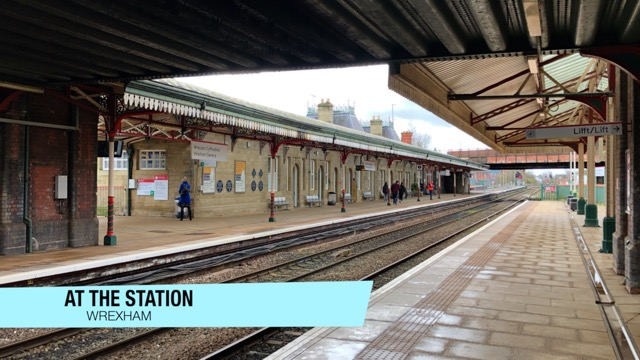
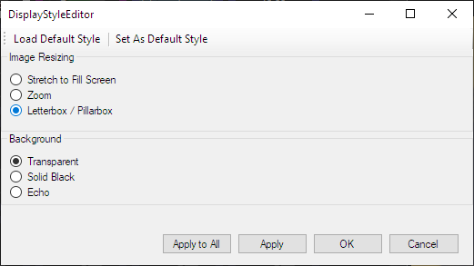

# Creating and using Lower Thirds

When you watch television news and other shows, you often see images with titles and names superimposed in the lower area of the screen to advise the viewer as to who or what exactly is on screen.

An example is shown below:

## Creating Lower Thirds for use with Screen Monkey

The first step is to determine the exact resolution used by the screens you present the media on. For example, many projection systems use the HD TV 1080 resolution. In this case you would create images sized exactly at 1920x1080 pixels.

If you create your image at a different size, Screen Monkey will scale it when it appears and you may not get the result you want. Scaling of images will typically result in degradation of quality.

There are many different applications that may be used to create these images.

Just to name a few of the better known applications:

*   Adobe Photoshop
*   GIMP (Freeware)
*   Microsoft Paint
*   Microsoft PowerPoint

The key to creating these types of images is to ensure most of the screen area is transparent. This means the final image format will generally need to be in .PNG format.

Below is a scaled down sample of a Lower Third in Photoshop to provide a visual to illustrate the concept. Note that the background has been set to transparent.

## Using Lower Thirds in Screen Monkey

Once the images have been created with the necessary settings and at the size that is needed, add them to Screen Monkey as an Image Clip. After they have been added to Screen Monkey, right-click them and choose Display Options.

Ensure the Background Colour area is configured for Transparent. If this option isn't set properly, even though your image background has been configured in the Image Editor as transparent, Screen Monkey won't render it that way.

Before proceeding further, you should have a firm grasp on how [Layers](../../reference/layers.md) work in Screen Monkey. If you aren't sure, take a few moments to read up on them.

When the Lower Thirds are configured in Screen Monkey, you should ensure they are assigned to a layer that is higher and sits above (and thus in front of) the layer you with to superimpose the lower third onto.

For example, if a [Live Video Clip](../../reference/clipTypes/LiveVideoClip.md) is being presented on Layer two, your Lower Third should be assigned to Layer three or Layer four because those layers are in front of Layer two and this would achieve your goal.

Once all this is in operation, it becomes a simple matter to play the lower third clip and then fade in and fade out or clear the layer using the [layers dashboard](../../reference/toolbar/layers.md).