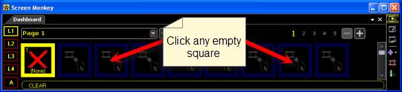
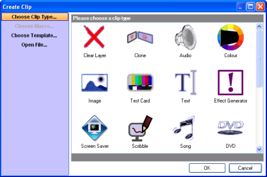
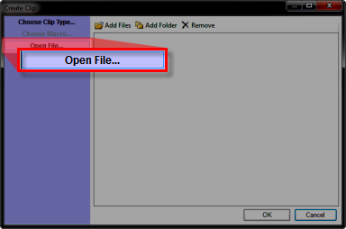
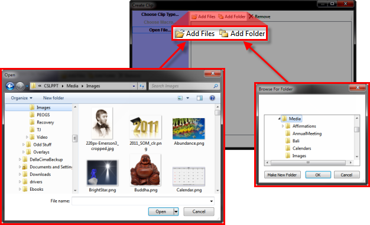
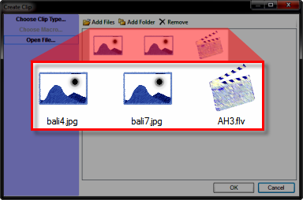

<h1 class="rvps17">Creating Clips</h1>

When you open Screen Monkey 
 for the first time it is very similar to opening PowerPoint. PowerPoint 
 will begin with an empty slide where you then add images, text or other 
 information that the slide will later present. Screen Monkey is very similar. 
 Like PowerPoint, you must add information that you will later present.

The process of adding information 
 to Screen Monkey is called &quot;creating clips&quot;. There are several 
 ways to go about creating a clip.

To create a new clip you first 
 need to click on an empty clip slot. This slot is where your clip will 
 be placed once it is created.

When you click on the empty clip slot the Create 
 Clip window should open. This window contains a list of all the 
 clip types supported on your system. 

Choose the clip type you want to add and click OK. 
 

<table style="margin-left: 12px; border-collapse: separate; border-collapse: separate;" 
		 cellspacing="0" border="1">
	<col>
	<col>
	<tr>
		<td style="vertical-align: top;"></td>
		<td>You may also double click the icon to bypass clicking OK. 
		 &#160;
		 You may want to consider using a <a href="../../reference/clipTypes/ClipTemplates.md">Clip 
		 Template</a> when creating clips.</td>
	</tr>
</table>

Another way of creating clips is to select several media files you want 
 to add and let Screen Monkey work out what clip type should be created. 
 

Click Open File... and the dialog 
 will change to a new mode.

Click Add Files or Add 
 Folder to select multiple files.

When you have selected the files it will indicate what clip type will 
 be created using the clip icon. Click OK to confirm you want to create 
 the clips.

Another way to create clips is to open the Windows file Explorer, locate 
 an image, video, sound clip, PowerPoint or other, then click and drag 
 the resource and drop it onto an empty clip slot.

You may also drop multiple files into Screen Monkey to quickly load 
 lots of clip files. When you drop multiple files Screen Monkey will only 
 load files which it supports. The files will be loaded in adjacent panels 
 unless that panel is already occupied.

&#160;

<h2>Inserting Clips</h2>

Clips are inserted by simply by adding them over the top of an existing 
 clip. When you do this, the clips will be shifted along to make space 
 for the inserted clip.

