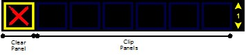
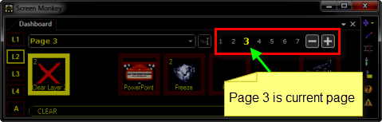

<h1>Creating Your Show</h1>

Creating a show is a simple process. But before you begin creating, 
 there a few principles which you must understand.

<h2>Main Dashboard</h2>

The Main Dashboard is where media clips are stored and ready for playback 
 to the screen. It consists of different panels, the first panel is always 
 a Clear Layer panel. We will learn more about the Clear Layer panel later 
 in the <a class="rvts13" href="..\WorkingWithShows\RunningYourShow.md">Running a Show</a> 
 topic. The other panels may be used to store a variety of clips.

You may create any type of clip into any of the remaining panels. When 
 no clip is present in the panel the border is blue. When a clip is loaded 
 the border turns red.

&#160;

<h2>Clips</h2>

There are many different supported clip types. A clip represents some 
 type of visual or audible output to the screen, speakers or both from 
 simple color or image to video. When you run a clip, the contents of that 
 clip are displayed on the screen or played through the sound system.

A clip may also be configured with a Transition and an Effect which 
 specifies how that clip is first shown on the screen.

&#160;

<h2>Setup a Show</h2>
<ol type="1">
	<li>
Step 1 - 
	 <a href="CreatingClips.md">Create Clips</a>
</li>
	<li>
Step 2 - 
	 <a href="NamingClipsandPages.md">Name the Clip</a>
</li>
	<li>
Step 3 - 
	 Apply a <a href="Transitions.md">Transition</a> or <a href="Effects.md">Effect</a>
</li>
</ol>

&#160;

<h2>Pages</h2>

Screen Monkey offers an unlimited number of pages available for storing 
 clips. This allows you to cue up a vast number of clips in a show. The 
 current page number is shown in the top of the Main Dashboard.

To move to other pages of clip panels click the numbers or click the 
 Plus and Minus symbols.

