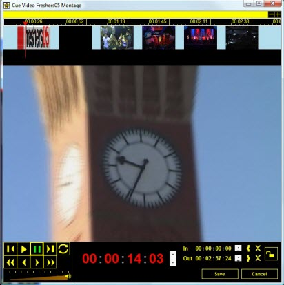
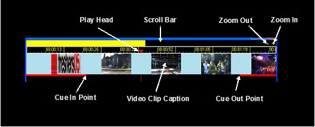
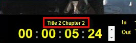
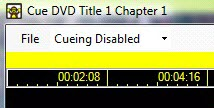
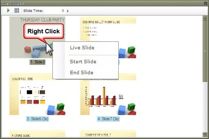
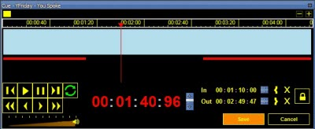

<h1>Editing Clips</h1>

<h2>What is cueing?</h2>

Cueing is the process of configuring a video, audio or DVD clip to play 
 a smaller segment.

Many different types of clips support cueing and the cue window changes 
 depending on the clip type you are working with.

When working with video or audio clips, you often simply wish to play 
 a smaller and specific segment of the media or perhaps you wish to begin 
 playing the media at a specific spot. This is where clip cueing helps. 
 It allows you to specify a start time and stop time for Video, Audio and 
 DVD clips so you can choose exactly which bit of the media to present.

There are several different ways you can open the Edit 
 / Cue window for a clip.

<ol type="1">
	<li>
Right-clicking on an Audio, DVD or Video clip and selecting 
	 Edit / Cue.
</li>
	<li>
Clicking the toolbar icon 
	 and selecting the desired clip to cue. When you click the toolbar 
	 icon the clips will begin flashing blue to indicate that Screen Monkey 
	 is waiting for a clip to be selected.
</li>
	<li>
Clicking on the clip using the middle mouse button or mouse 
	 scroll wheel. This is a nice shortcut instead of being forced to right-click 
	 and use the menu.
</li>
</ol>

&#160;

<h2>Cue Video Clip</h2>

Once you have selected the clip to cue, the Cue dialog should be presented.

The main part of the clip window displays the video, which will allow 
 you to choose which section of the video you wish to play.

<ol type="1">
	<li>
Playback Controls
</li>
</ol>

	<table cellspacing="0" class="hcp5">
		<tr class="hcp6">
			<td height="33" width="52" class="hcp7">

</td>
			<td height="33" width="136" class="hcp7">
Jump To Start
</td>
			<td height="33" width="364" class="hcp7">
Jumps to the start of the video clip or 
			 if the In Time is locked then jumps to the In Time.
</td>
		</tr>
		<tr class="hcp6">
			<td width="52" class="hcp7">

</td>
			<td width="136" class="hcp7">
Play
</td>
			<td width="364" class="hcp7">
If 
			 the video clip is stopped or paused then will play the video 
			 clip.
</td>
		</tr>
		<tr class="hcp6">
			<td width="52" class="hcp7">

</td>
			<td width="136" class="hcp7">
Pause
</td>
			<td width="364" class="hcp7">
Pauses 
			 the video clip by holding it at its current position
</td>
		</tr>
		<tr class="hcp6">
			<td width="52" class="hcp7">

</td>
			<td width="136" class="hcp7">
Jump 
			 To End
</td>
			<td width="364" class="hcp7">
Jumps 
			 to the end of the video clip or if the Out Time is locked 
			 then jumps to the Out Time.
</td>
		</tr>
		<tr class="hcp6">
			<td height="14" width="52" class="hcp7">

</td>
			<td height="14" width="136" class="hcp7">
Fast Reverse
</td>
			<td height="14" width="364" class="hcp7">
Rewinds the video clip by 10 seconds.
</td>
		</tr>
		<tr class="hcp6">
			<td width="52" class="hcp7">

</td>
			<td width="136" class="hcp7">
Frame 
			 Retard
</td>
			<td width="364" class="hcp7">
Rewinds 
			 the video clip by a single frame and Pauses playback.
</td>
		</tr>
		<tr class="hcp6">
			<td width="52" class="hcp7">

</td>
			<td width="136" class="hcp7">
Frame 
			 Advance
</td>
			<td width="364" class="hcp7">
Moves 
			 the clip forwards by a single frame and Pauses playback.
</td>
		</tr>
		<tr class="hcp6">
			<td width="52" class="hcp7">

</td>
			<td width="136" class="hcp7">
Fast 
			 Forwards
</td>
			<td width="364" class="hcp7">
Moves 
			 the clip forwards by 10 seconds.
</td>
		</tr>
		<tr class="hcp6">
			<td width="52" class="hcp7">

</td>
			<td width="136" class="hcp7">
Loop
</td>
			<td width="364" class="hcp7">
When 
			 selected the video will start playing from the start when 
			 it reaches the end of the clip. This button will be highlighted 
			 green to indicate it is selected.
</td>
		</tr>
	</table>

<ol type="1">
	<li>
Timecode  
	 
	 
	 
	Displays the position of the video clip in Hours : Minutes : Seconds 
	 : MilliSeconds. 
	 
	You can change the current clip position by selecting either hours, 
	 minutes, seconds and milliseconds and incrementing it using the up 
	 and down arrows or typing in a new time. The clip will then move to 
	 the configured time.
</li>
	<li style="font-weight: normal;">
Cue 
	 Controls  
	 
	 
	 
	This is where you set the start and end time of the video for playback 
	 in the main control panel. 
	 
	To set the In time either set the time using the time control in the 
	 same way as you would the main time or go to the point in the media 
	 at which you want to start and then click the Cue In button. 
	 
	To set the Out time either set the time using the time control in the 
	 same way as you would the main time or go to the point in the video 
	 at which you want to end and then click the Cue Out button.
</li>
</ol>

	<table cellspacing="0" class="hcp5">
		<tr class="hcp6">
			<td height="32" width="52" class="hcp7">

</td>
			<td height="32" width="142" class="hcp7">
Cue In
</td>
			<td height="32" width="358" class="hcp7">
Sets the clip start time to the current 
			 position of the video clip.
</td>
		</tr>
		<tr class="hcp6">
			<td width="52" class="hcp7">

</td>
			<td width="142" class="hcp7">
Cue 
			 Out
</td>
			<td width="358" class="hcp7">
Sets 
			 the clip end time to the current position of the video clip.
</td>
		</tr>
		<tr class="hcp6">
			<td width="52" class="hcp7">

</td>
			<td width="142" class="hcp7">
Lock 
			 In and Out Times
</td>
			<td width="358" class="hcp7">
When 
			 locked the clip will play using the specified start and stop 
			 times. If unlocked then the clip will ignore the specified 
			 stop and start times by simply playing from the start of the 
			 video.
</td>
		</tr>
	</table>

When Cueing enabled is selected &#160;the 
 clip will use the cue times during playback in the main control panel. 
 This is automatically enabled when you set the cue times. If you do not 
 want the clip to use the cue times and just want it to play normally, 
 de-select cueing enabled. This option is also shown when you right click 
 on a clip in the control panel by a tick next to &quot;Cue&quot;.

<ol start="3">
	<li>
Timeline  
	 
	 
	 
	The timeline allows you to quickly search through a video clip and 
	 select the cue in and out points. The scroll bar and zoom controls 
	 allow you to view the right point in your video clip. If you need 
	 to see a point in the video that is not in display then you can drag 
	 the scroll bar to the right point. The zoom controls allow you to 
	 zoom in and see the video in more detail. 
	 
	To play a point in the timeline you can drag the play head to the correct 
	 point and select play. The video will now start playing from this 
	 point in the timeline. 
	 
	You set the cue in and out point from directly in the timeline by putting 
	 your mouse over the cue in and out points and dragging it to the required 
	 point in the timeline.
</li>
	<li>
Volume Control  
	 
	 
	 
	Use the volume control to adjust the volume which the clip is played 
	 at. Any volume set here will be used when playing the clip live.
</li>
</ol>

&#160;

<h2>Cue DVD Clip</h2>

Cueing a DVD is similar to cueing a video but the DVD cue window has 
 a few differences. 

The main difference is the support for title and chapter select.

<ol>
	<li>
Chapter Control  
	 
	 
	 
	If you want to jump to a specific chapter or title during cueing, you 
	 may select them from the tree list. The DVD will then jump to the 
	 selected chapter. 
	 
	The current title and chapter are now displayed above the timecode. 
	 
	 
	 
	When a DVD has been cued it will ignore the selected DVD chapter from 
	 the popup menu unless you disable cueing.
</li>
	<li>
Export Cue Settings 
	  
	 
	You can save the current cue settings of the DVD to an xml file which 
	 can be taken and used on a sepperate computer. 
	 
	 
	 
	To export the cue times, click File 
	 &gt; Export Times. You will then be asked where you want to 
	 save the xml file that will contain the cue times. 
	 
	To import the cue settings on another computer, create a DVD clip with 
	 the same DVD. Open the cue DVD dialog for the new DVD clip and click 
	 File &gt; Import Times. Locate 
	 the previously saved xml file and click OK. 
	 The new clip will now be configured using the saved cue times.
</li>
</ol>

&#160;

<h2>Cue PowerPoint</h2>

If you middle click with the mouse button on a PowerPoint clip it will 
 bring up the cue dialog, a nice shortcut instead of going through the 
 menu.

In this dialog you can set several options which saves the need to go 
 back to PowerPoint to edit the file.

<ul type="disc">
	<li>
You can set a slide that is selected to go Live.
</li>
	<li>
You can set a Start Slide if you need a different one to the 
	 prearranged one, and also for the Slide Time.
</li>
	<li>
You can set the End slide for the Slide Time.
</li>
	<li>
You can set a Slide Time in seconds to automatically advance 
	 the desired slides. 
	 
	
</li>
</ul>

The slides which are selected to be displayed are highlighted in blue 
 and the live slide is highlighted in yellow. You can change the selected 
 slides to be displayed by selecting the range of slides and clicking the 
 set slide range button in the top bar.

You can change the live slide by selecting the slide and clicking the 
 play button. If the clip is active then the screen will be updated immediately. 
 You can also set a slide to be live by double clicking on it.

The transition time for slides is set by selecting them and then typing 
 in a new time in the toolbar.

&#160;

<h2>Cue Audio</h2>

The audio clip has a cue control which allows you to specify a start 
 and stop time for the audio clip. The play controls and timeline allow 
 you to navigate the audio to find the in and out points you want. You 
 then select the set In/Out point buttons to play just the clip you want. 
 The loop button can be pressed to create an audio loop.

The thumbnail in an audio clip is now automatically generated from the 
 album art in the ID3 tag. If your MP3 contains album art in the ID3 tag 
 then you will see that image instead of the default audio clip logo.

