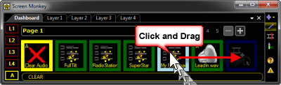
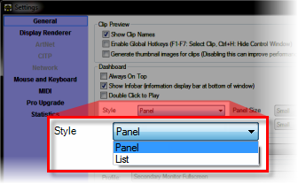
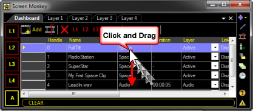

<h1>Moving Clips</h1>

You can move a clip to different slots or between spaces and the main 
 dashboard. Exactly how you move a clip depends on which dashboard view 
 you are in.

&#160;

From the Main Dashboard

To move items in the Main Dashboard you must be in <a href="SelectingMultipleClips.md">multi 
 edit mode</a>. When in this mode you may drag the clip items around to 
 move them to different slots.

You may also click and drag clips from the Main Dashboard to any space 
 clips to move them from the dashboard into the space.

&#160;

From List View

The Main Dashboard offers two different 
 views. Panel and List. The default is Panel but if you prefer, you may 
 open the Screen Monkey Settings and change to List.

In list view click the row containing the clip you want to move and 
 drag it to the row you want to move it to.

You may also click and drag clips from the 
 List View (if editing a space) to move them from the Space List to the 
 Main Dashboard.

