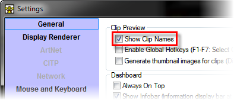
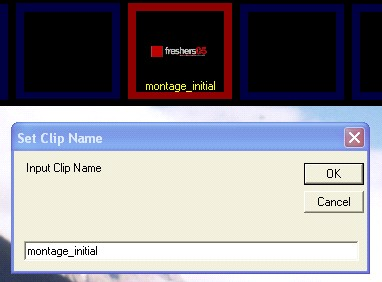

<h1>Naming Clips and Pages</h1>

Each clip has a name that you can use to identify it from other clips. 
 This name is displayed in the bottom of the clip panel if the user <a class="rvts11" href="../../Reference/Setup/Settings/Settings.md">setting 
 is enabled</a>.

When you load a clip the name is set automatically using either the 
 filename or an appropriate description. It is possible to change this 
 name.

Changing the Clip Name

To change the clip name place the mouse over the clip you wish to change 
 and click the right mouse button to bring up the popup menu. From the 
 menu select &quot;Set Name&quot;. This will bring up a dialog in which 
 you can type in a new clip name.

Click OK to change the name.

