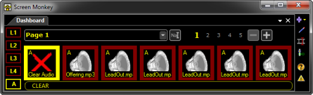
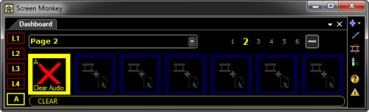
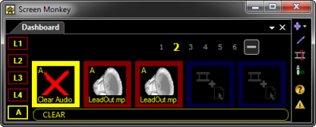
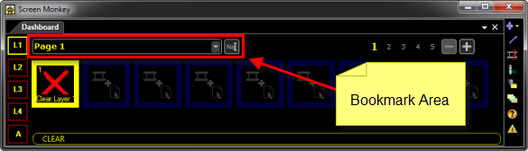
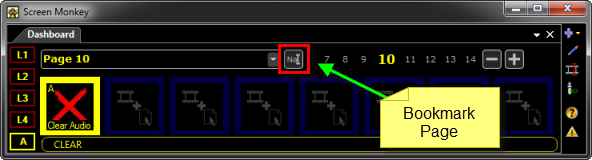
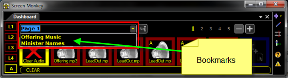

<h1>Organizing Clips</h1>

As you begin working with Screen Monkey, adding clips and playing Shows, 
 you will likely find that you need simpler ways to work.

When you add Clips to the Main Dashboard, you add them to slots. The 
 number of slots you have available depends on a couple of different factors.

<ol type="1">
	<li>
How large the Main Dashboard window is.
</li>
	<li>
Whether Screen Monkey has been configured to use a Large, Medium 
	 or Small Panel size.
</li>
</ol>

The number of slots visible at any time in Screen Monkey is referred 
 to as a &quot;Page&quot;.

For example, in the screen capture below, the Main Screen Monkey Dashboard 
 has been configured so there are only six slots showing. Each slot has 
 an Audio Clip assigned. Collectively, these appear on Page 1. 

And if you notice, the number 1 in the Page Select area is yellow. 

Clicking the numbers 2, 3, 4 or 5 will present those pages. And presently, 
 those pages are empty and have no clips.

But if we resize the main window so that we only see FOUR clips instead 
 of the six, something interesting happens. Page 2 suddenly contains two 
 clips and it was empty before.

This is because Page 1 now only contains four clips. The other two were 
 forced into Page 2. This is similar to the behavior of a chain. If you 
 painted six of the links in the chain red and adjusted your hands so you 
 are only seeing four of the six red links, the two that were visible before 
 are now in a different area that will need to be brought into view.

Realistically, it would be silly to work with your Main Dashboard this 
 small. This was done simply to illustrate the concept of Pages.

You may find that it's helpful to add Clips to specific pages in order 
 to organize them. Perhaps you have a group of several music clips used 
 during offering at a <a href="../../start/UsingForAChurchService.md">church 
 service</a>. You might place all those clips on a specific Page. Perhaps 
 page 10. Or if you are working a <a href="../../start/UsingForAConcert.md">concert</a>, 
 perhaps you want to organize all the information for a specific group 
 on a specific page.

&#160;

<h2>Bookmarking Pages</h2>
<table style="margin-left: 12px; border-collapse: separate; border-collapse: separate;" 
		 cellspacing="0" border="1">
	<col>
	<col>
	<tr>
		<td></td>
		<td>Before choosing to establish Bookmarks, you should ensure you 
		 have configured the Main Dashboard of Screen Monkey to the size 
		 you are comfortable using.</td>
	</tr>
</table>

&#160;

By Bookmarking Pages Screen Monkey makes it easy to find what we need 
 when we need it. And when you think about it, isn't this the primary determining 
 factor of a smooth presentation?

When we look at the Main Dashboard, we see the Bookmark 
 Area.

Next to the drop-down list is the Bookmark 
 Page icon. Click this icon.

The Bookmark dialog is presented. 
 Type your desired name into the field and click OK.

Bookmarks make it a simple and efficient process to organize and navigate 
 to exactly the Clips you need when you need them. You now use familiar 
 names instead of memorizing page numbers.

&#160;

<h2>Space Clips</h2>

Another tool you may wish to use for organizing 
 things is a Space Clip. 

<a href="../../reference/clipTypes/CueListSpaceClip.md">Click 
 here</a> to learn more about Space Clips.

&#160;

<h2 class="rvps3">Enhancement History</h2>

<a href="../../releases/Version_3_7.md#ClearPageBookmarksOnNewShow">Version 
 3.7 - October 2011: Clear Page Bookmarks on New Show</a>

