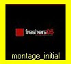

<h1>Playing Clips</h1>

After you have added clips to slots and saved them 
 as a show, you will want to play the show.

<h2>Playing a Clip</h2>

To play a clip, find the clip you want to play 
 and click once on it. The clip border turns yellow to indicate the clip 
 is running.

To play a different clip, click the clip you want 
 to play.

&#160;

<h2>Pausing a Clip</h2>

Clips such as video clips may be paused while they 
 are playing. This will cause the clip to stop playing and freeze at its 
 current frame. To pause a clip, click the clip slot while the clip is 
 running.

This can be an extremely useful feature to help 
 you cue video and have it ready for immediate play. Perhaps you want to 
 start and pause a video right at the beginning so that as soon as it's 
 needed, you are ready to begin playing the video. 

To accomplish this, double-click the clip instead 
 of single clicking. The first click will instruct Screen Monkey to play 
 the video and the second will pause it. This means that when you single-click 
 again the video will begin playing instantly with no delay as the video 
 loads.

&#160;

<h2>Play State Indicators</h2>

Some clip types will display a play state indicator 
 to tell you what the current state of the clip is. A video clip may be 
 on an active layer but be playing, paused or stopped. To tell you which 
 state the video is in a little icon appears in the top right of the clip 
 panel.

	<table style="border-width: 0px; margin-left: 24px;" cellspacing="0">
		<col>
		<col>
		<tr class="hcp3">
			<td height="109" class="hcp4">

</td>
			<td height="109" class="hcp5">
Playing
</td>
		</tr>
		<tr class="hcp3">
			<td height="108" class="hcp4">

</td>
			<td height="108" class="hcp5">
Paused
</td>
		</tr>
		<tr class="hcp3">
			<td class="hcp4">

</td>
			<td class="hcp5">
Stopped
</td>
		</tr>
	</table>

&#160;

<h2>Rewind Clip during Live Playback</h2>

You may wish to rewind a clip back to the beginning 
 while the clip is live. This may happen if you accidentally play the clip 
 early and you want to play the clip from the beginning. Or perhaps the 
 clip has finished playing and you want to play it again.

To rewind a clip, press and hold the Ctrl 
 key while selecting the running clip. The clip will then rewind back to 
 the start, whatever play state it is in.

&#160;

<h2>Clip Forward and Reverse</h2>

You may have added a number of clips and all you 
 want to do is step through them. The Clip Forward function allows you 
 to do this. When you select Clip Forward it will move to the next clip 
 on the layer which is simply the clip in the next slot. This is different 
 from the linked clip. To move back to the previous clip, select Clip Reverse. 
 

You can either assign hotkeys to the these actions 
 or click the Go button in the <a href="../WorkingWithShows/LayersDashboard.md">Layers 
 Dashboard</a>. By holding down shift and clicking Go, it will move to 
 the previous clip.

&#160;

<h2>Previous Clip</h2>

The previous clip action can be assigned to a keyboard 
 key or MIDI command and will stop the current clip and re-run the last 
 clip to be played.

