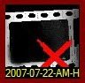
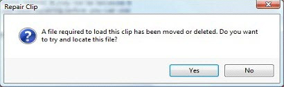

<h1>Repairing Clips</h1>

Sometimes your clip media will be on a removable drive or you may have 
 had to move the media files. If this occurs, when Screen Monkey loads 
 it will fail to find the files required to load a clip. When this happens 
 you can use repair clip to tell Screen Monkey where the files have been 
 moved to.

If a file or folder has been moved, renamed or deleted, the clip will 
 fail to load. This is indicated by an event in the event log and the clip 
 thumbnail will present an error image as shown below.

If you see this thumbnail it means the clip cannot find the media file 
 it is pointing to and will need repairing before you may use it again.

To repair the clip, click it as if you where going to play it. Screen 
 Monkey should prompt to ask if you want to attempt to repair the clip.

Click yes and the clip will attempt to repair itself. In some cases 
 you are presented with a file browsing dialog that allows you to locate 
 the missing file or folder. The clip type determines the action taken 
 to try and repair a clip.

Once you have repaired the clip it should re-load and be usable as a 
 normal clip again.

<table style="margin-left: 12px; border-collapse: separate; border-collapse: separate;" 
		 cellspacing="0" border="1">
	<col>
	<col>
	<tr>
		<td></td>
		<td>Not all clip types support repairing. If the clip does not 
		 support repairing, Screen Monkey will inform you. </td>
	</tr>
</table>
