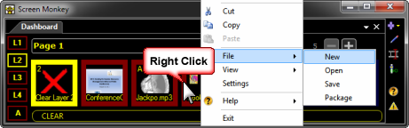
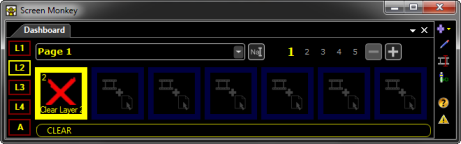

<h1>How do I create a Show?</h1>

Screen Monkey is similar to PowerPoint in that the collection of Clips 
 is referred to as a &quot;Show&quot;. Just as PowerPoint allows you to 
 create a Blank Slide Show, Screen Monkey also allows you to create a Blank 
 Show.

To create a Blank Show in Screen Monkey, right-click the Main Dashboard 
 and choose File &gt; New.

Screen Monkey will issue the following warning:

Click OK and the new empty show 
 is created and waiting for you to <a href="../WorkingWithClips/CreatingClips.md">add 
 Clips</a>.

