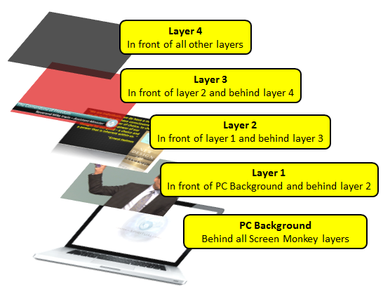
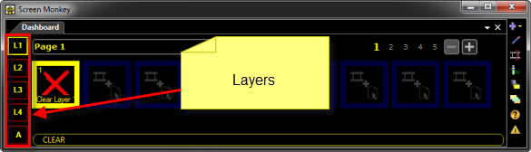
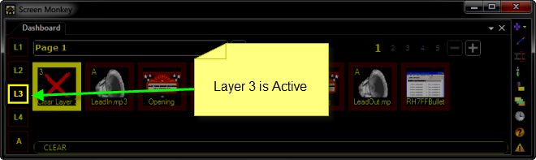
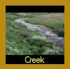
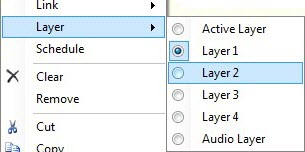
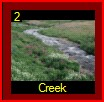

<h1>Display Layers</h1>

Layers are extremely powerful as they allow you to play up to four visual 
 clips at the same time. They may be used to show clips on separate monitors 
 or projectors, overlay text or images or even possibly create a picture 
 in picture effect.

The position and size of the layers is configured using the <a href="../../Reference/Setup/DisplayProfiles.md">display 
 profiles</a>. This section will only discuss how to play a clip on a specific 
 layer.

When playing a clip you have four layers to choose from. If a clip has 
 not been specifically assigned to play on a certain layer, it will play 
 on whatever layer happens to be active at the time it was started. You 
 change the active layer by selecting it in the layer bar. 

The active layer is indicated by the yellow highlight.

It's important to note that layer 4 is on top (or in front) of layer 
 3, layer 3 is on top (or in front) of layer 2, and layer 2 is on top (or 
 in front) of layer 1.

When a clip is playing on a layer that is not the active layer, its 
 border will be orange instead of bright yellow.

Clicking Clear Clip will only 
 clear the clip on the active layer. To clear a clip on a different layer, 
 you first need to set that layer as active, then click Clear Clip.

&#160;

<h2>Assigning Clips to Specific Layers</h2>

To assign a Clip to a specific layer, right click the clip, open the 
 Layer menu and choose which layer 
 the clip will play on.

If a clip has been assigned to play on a specific layer, the layer number 
 it is assigned to appears in the top left corner of the clip panel. The 
 clip below has been assigned to layer 2.

&#160;

<h2>Audio Layer</h2>

The audio layer is provided to play media which contains no video content 
 such as audio files. This layer differs from the other layers in that 
 it does not output to the screen. This means you can play audio alongside 
 video without the audio content affecting the visual output.

When you add audio clips they are automatically assigned to this layer. 
 However, any clip may be manually assigned to this layer. When it plays, 
 it will not present visual output.

&#160;

<h2>Layers and Space Clips</h2>

If you are using <a href="../../reference/clipTypes/CueListSpaceClip.md">Space 
 Clips</a>, each Space Clip allows four individual layers to be configured 
 within the Space Clip. The net result of this is that by using Space Clips, 
 you may actually increase the number of layers being displayed at any 
 given time from four to 16. (4&#160;Space Clips&#160;X 4 layers)

&#160;

<h2>Screen Monkey and PowerPoint</h2>

Screen Monkey has the ability to simply play <a href="../../reference/clipTypes/PowerPointClip.md">PowerPoint</a> 
 presentations on any of its four layers. However, if you use PowerPoint 
 natively to present on the second monitor, this provides a &quot;fifth&quot; 
 layer, in that you may use PowerPoint to present slides on the PC, then 
 use Screen Monkey to present content that overlays the running PowerPoint 
 presentation.

