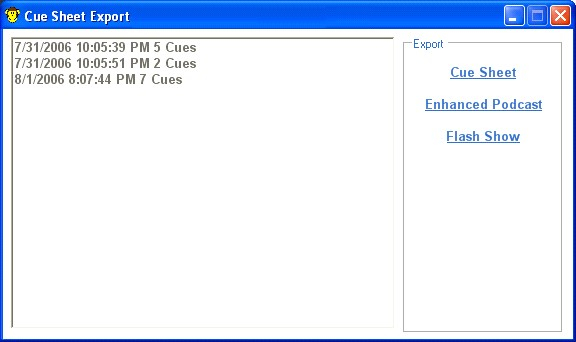
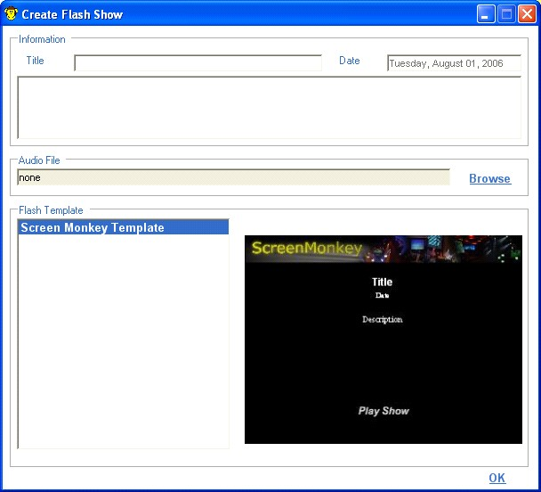

<h1>Flash Show</h1>

You may create a flash show from any PowerPoint presentation run through 
 Screen Monkey. This can then be used on the internet or on a multimedia 
 CD to publish your presentation. Using Screen Monkey you can quickly and 
 easily publish any presentation to flash.

This feature allows you to synchronize the live playback of slides to 
 an audio recording of the presentation. The flash show will then play 
 back the audio file and display the correct slides at the right point 
 in the audio recording.

To create a flash show you need to right click on a PowerPoint clip 
 and select &quot;<a href="CueSheetExport.md">Export Cue Sheet</a>&quot;.

You are presented with a list of possible cue times you can use in your 
 flash show. Select the times you want to use from the list and then click 
 on &quot;Flash Show&quot;. You will then be asked to select which file 
 you want the flash show saved to. After this you will be presented with 
 a dialog that allows you to set certain properties of the flash show.

You can fill in information about the show such as title, date and description. 
 This will be normally shown on the first page of you flash show. You then 
 need to select the audio file that you want to use in your show and which 
 the slides will be synchronized with. You can leave this field blank and 
 add it to the created XML file later.

Finally you need to select the flash template you wish to use for the 
 show. Screen Monkey comes with its own default template but you may wish 
 to add more or create your own. All flash template files should be stored 
 in the templates folder which is under the &quot;{install path}\Templates\&quot;.

When you click OK it will create a zip file containing all the required 
 files for your flash show. You will need to unzip this file to a folder 
 before you can run the show. When you do this just click on &quot;RunShow.swf 
 to see the flash show.

