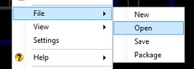
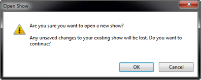
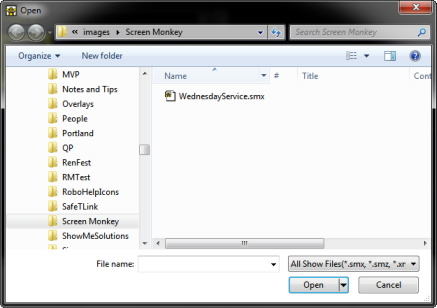
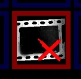
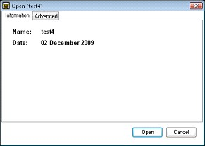

<h1>How do I load a show?</h1>

Screen Monkey is similar to PowerPoint in that the collection of Clips 
 is referred to as a &quot;Show&quot;. Just as PowerPoint allows you to 
 save and later open a Slide Show you have created, Screen Monkey also 
 allows you to save your shows so that you may easily recall them later.

To Open a saved show, right-click any clip slot and select File 
 &gt; Open.

Screen Monkey will issue the following warning:

Click OK and the Open dialog will be presented. Navigate to and choose 
 the folder where you saved the show file. Choose the show and click Open.

In some cases where a media file for a clip has been moved or deleted, 
 the show may not load fully. If this happens you will see the file unavailable 
 icon instead of the clip thumbnail.

The clip can be repaired by locating the original media file. Please 
 see <a class="rvts13" href="../WorkingWithClips/RepairingClips.md">Repairing Clips</a> 
 for more information.

&#160;

<h2>Loading Show Settings</h2>

When you save a show all the current settings are 
 also saved in the show file. This means that when transferring a show 
 between computers you can also transfer the settings. It is not always 
 the case that you want to load all the settings with a show so this must 
 be specified when you open the show. Once you selected a show to load 
 you will be presented with the following window with the name of the show 
 and date it was last modified.

If you click the advanced tab you will also see 
 a number of other items you can load with the show. The Clips should already 
 be selected as this is the default behavior.

Select all the items you wish to load with the show and click Open.

<table style="margin-left: 24px;" cellspacing="0" border="1">
	<col>
	<col>
	<tr>
		<td>
Clips
</td>
		<td>All the standard clips that make up your show.</td>
	</tr>
	<tr>
		<td >
Clip Settings
</td>
		<td >Any additional global clip settings. These will normally be 
		 settings that effect all the clips of a specific type and not 
		 individual clip settings.</td>
	</tr>
	<tr>
		<td >
Interaction 
		 Settings
</td>
		<td >Includes your Mouse and Keyboard hotkey settings as well as 
		 any MIDI settings.</td>
	</tr>
	<tr>
		<td >
Main Settings
</td>
		<td >Any settings which effect Screen Monkey such as show clip 
		 labels.</td>
	</tr>
	<tr>
		<td >
Display 
		 Profiles
</td>
		<td >Any custom display profiles you have created.</td>
	</tr>
</table>
