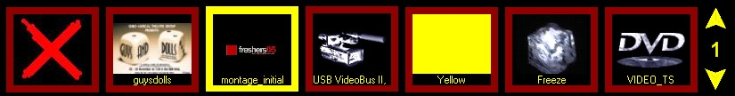
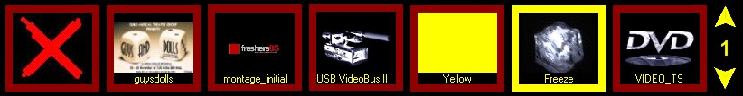

<h1 class="rvps4">Running Your 
 Show</h1>

 

Before running a show you need to ensure that the 
 correct monitor output has been specified in the <a class="rvts12" 
															 href="..\..\reference\setup\DisplayProfiles.md">user 
 settings</a>. If this is wrong then you will see 
 nothing.

 

Play a Clip

 

To play a clip just click on the lip you want to 
 play. The clip will be loaded with the specified effect and the clip border 
 will go yellow to indicate this is the current clip.

 

 

Change the Clip

 

To change the clip just click on the clip you want 
 to change it to. The border of this clip will now turn to yellow and the 
 clip will play.

 

 

Clear Playback

 

To stop the current clip and return the screen 
 to the desktop click on the Clear panel.

 

 

PowerPoint

 

When running a PowerPoint presentation there are 
 a few additional controls.

 

<ol style="text-indent: 0px; margin-left: 0px; list-style-position: inside;">
	<li value="1">Advance Slide - 
	 Left click the mouse on the clip panel or use the right arrow key.</li>
	<li value="2">Previous Slide - 
	 Left arrow key.</li>
	<li value="3">Rewind - 
	 To rewind the clip and start it from the beginning hold down the {Ctrl} 
	 key while playing the clip.</li>
</ol>

 

Video and DVDs

 

When running a Video or a DVD clip if you click 
 on the clip again after running it the Video will be paused. You can then 
 click on the clip again to continue playback.

