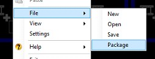

<h1>How do I Package a Show?</h1>

When you are transferring a show from one computer to another you may 
 need to package the show rather 
 than save it. Saving a show only saves the clip settings but not the original 
 files referenced by the clips. 

If you create a show with some video clips and transfer that show to 
 a new computer, the show will not load properly as the video clips will 
 only exist on the original computer. This is where packaging a show comes 
 in as it will store the clip settings along with the original video files 
 so when loading on any computer you will always have the original media 
 files.

To package your show, right-click any clip slot and select 
 File &gt; Package.

Now select where you would like to save the show file and click OK. The show will be saved as a 
 file with an .smz file extension. This is a compressed show file format. 
 You can take this show file to any computer where Screen Monkey is installed 
 and be confident that it will work.

<table style="margin-left: 12px;" cellspacing="0" border="1">
	<col>
	<col>
	<tr>
		<td style="vertical-align: top;"></td>
		<td>Because this format is compressed it might be blocked by some 
		 E-Mail clients. Because of this, sending via E-Mail is not recommended. 
		 Additionally, the size of the file may be too large for E-Mail 
		 use. You are encouraged to use a Flash Drive, External Hard Drive 
		 or a File sharing site to transfer a packaged show.</td>
	</tr>
</table>

&#160;

<h2>Working with a development and a production PC</h2>

Sometimes you have a situation where two PCs are involved and you simply 
 want the environments to be the same. In this case, you need to regularly 
 synchronize the folders on each machine so that they are the same. 

While you could certainly do this using the Package feature, you might 
 also wish to explore alternatives.

&#160;

<h2>SyncToy</h2>

Microsoft offers SyncToy as a free download. SyncToy allows you to easily 
 synchronize two different folders. Perhaps using a USB stick and running 
 SyncToy to ensure the content on the USB stick matches the content in 
 the folder you are synchronizing with. SyncToy is free.

<a href="http://www.microsoft.com/download/en/details.aspx?id=15155" 
		 target="_blank">Click here</a> to visit the SyncToy site.

&#160;

<h2>DropBox</h2>

DropBox is a free service that allows you to synchronize folders and 
 files to the cloud. If you install and use DropBox, whatever you are synchronizing 
 is always available on all PCs using the shared folders and files. DropBox 
 is free for storing up to 2Gb. There are paid options for more data.

<a href="http://www.microsoft.com/download/en/details.aspx?id=15155" 
		 target="_blank">Click here</a> to visit the DropBox site.

