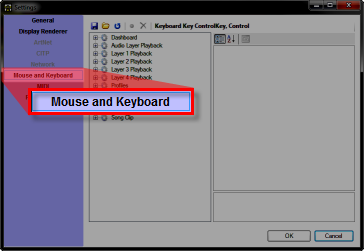
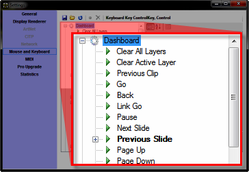
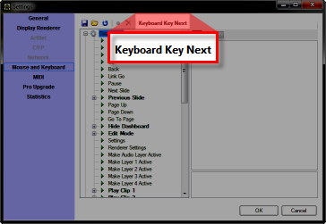
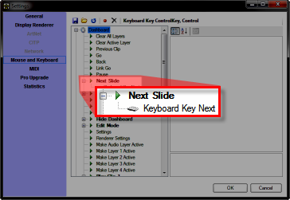

<h1>Use a Remote Pointer with PowerPoint</h1>

There are many Remote Control pointers out there that may be used with 
 PowerPoint. 

These devices work by sending keystroke commands that are used in PowerPoint 
 to operate the presentation. Often, the keystrokes they transmit are Page Up and Page 
 Down.

Typically, these remote systems will have two components:

<ol type="1">
	<li>
A receiver that connects to the PC. Usually connecting via USB 
	 port. 
</li>
	<li>
The actual remote device. The remote device usually has just 
	 a few buttons and may have a laser pointer.
</li>
</ol>

In order for Screen Monkey to work with the remote to operate the presentation, 
 you need to configure the appropriate actions using the <a href="../../Reference/Setup/Settings/MouseandKeyboard.md">Mouse 
 and Keyboard</a> settings.

&#160;

<h2>To configure for a remote</h2>
<ol type="1">
	<li>
Connect the remote device to the computer and test to ensure 
	 it works with PowerPoint generically before introducing Screen Monkey 
	 into the mix.
</li>
	<li>
Right-click Main Dashboard 
	 in Screen Monkey and choose Settings.
</li>
	<li>
Click Mouse and Keyboard. 
	 
	
</li>
	<li>
Expand the Dashboard 
	 category. 
	 
	
</li>
	<li>
Press the button on the remote for Next 
	 Slide and you should see Keyboard 
	 Key Next appear in the Last 
	 Trigger area. 
	 
	
</li>
	<li>
Double-click Next Slide 
	 to assign this trigger to the Next Slide function. 
	 
	
</li>
	<li>
Repeat the process from Step 5 to assign the Previous Slide 
	 function.
</li>
	<li>
Click OK to dismiss 
	 the Settings dialog.
</li>
</ol>
<table style="margin-left: 12px; border-collapse: separate; border-collapse: separate;" 
		 cellspacing="0" border="1">
	<col>
	<col>
	<tr>
		<td></td>
		<td>On Windows 7 64 bit you may find that you need to dismiss the 
		 Settings dialog and re-open it in order to see the changes.</td>
	</tr>
</table>
